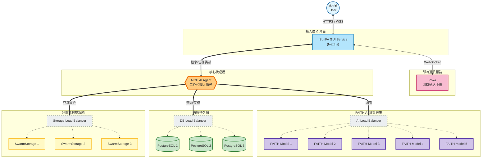

# iSunFA

## 專案核心
**iSunFA** 致力於**解決財務會計與溫室氣體盤查大小事**。透過整合最前沿的加密技術與專為財務領域設計的 AI 推理模型，我們打造了一個值得信賴的自動化會計平台。從自動記帳、薪資管理、稅務申報到符合 ISO 規範的溫室氣體盤查，iSunFA 透過 AI 智能精準優化企業的完整財務與永續管理流程。

## 核心優勢與功能

### 智慧財務管理
- **自動記帳**: 透過 AI 自動識別 .doc/.xls/.pdf/.png 等格式憑證與單據，精準提取關鍵欄位，大幅節省時間與人力成本。
- **會計報表**: 一鍵生成三大會計報表，隨時掌握企業營運狀況。
- **帳務調整**: 提供靈活的帳務調整功能，同時確保會計紀錄的準確性與合規性。
- **出納管理**: 即時掌握現金流向，輕鬆管理日常收支與銀行往來。
- **薪資管理**: 自動計算薪資與扣繳，確保員工薪資發放準確無誤。
- **稅務申報**: 自動生成報稅所需資料，讓稅務申報變得簡單輕鬆。
- **文件簽核**: 安全、合規的數位文件簽署流程，加速審批效率。

### 永續與稽核
- **溫室氣體核算**: 符合 ISO 規範，內建權威機構核定係數庫，自動計算溫室氣體排放。
- **智能稽核**: 具備異常數值偵測能力，並建立數位證據鏈結，確保資料可信度。
- **異質資料整合**: 可串接 ERP、MES 系統，整合企業內部的異質資料。
- **數據追溯**: 提供數據鑽取功能，可從最終報表回溯至原始單據，確保數據具有可追蹤性。

### 先進技術
- **財務專用 AI 模型**: 具備深度理解與推理能力，精準處理複雜會計問題。
- **隱私計算**: 在不解密資料的情況下完成驗證與計算，有效保護隱私並建立共識信任。
- **分散式邊緣運算**: 利用分散式架構實現高效能、低延遲的資料處理與即時同步。

## 系統架構圖

本系統採用微服務導向的分散式架構，整合了 **iSunFA GUI**、**AICH AI Agent**、**FAITH 多模態模型** 與 **SwarmStorage** 分散式存儲。



## 部署辦法 (Deployment)

### 環境需求
- **OS**: Linux / macOS
- **Runtime**: Node.js v20+
- **Container**: Docker & Docker Compose
- **Database**: PostgreSQL 16+

### 快速啟動 (Quick Start)

1.  **複製專案**
    ```bash
    git clone https://github.com/CAFECA-IO/iSunFA.git
    cd iSunFA
    ```

2.  **安裝依賴**
    ```bash
    npm install
    ```

3.  **啟動基礎設施 (Docker)**
    啟動 PostgreSQL 資料庫及其他相依服務：
    ```bash
    docker-compose up -d
    ```

4.  **設定環境變數**
    複製範例設定檔並依據實際環境修改：
    ```bash
    cp .env.example .env
    ```

5.  **初始化資料庫**
    生成 Prisma Client 並同步資料庫結構：
    ```bash
    npx prisma generate
    npx prisma db push
    ```

6.  **啟動開發伺服器**
    ```bash
    npm run dev
    ```
    服務將運行於 http://localhost:3000

7.  **生產環境構建與運行**
    ```bash
    npm run build
    npm start
    # 或使用 Swarm 模式端口 (10020)
    npm run swarm
    ```
