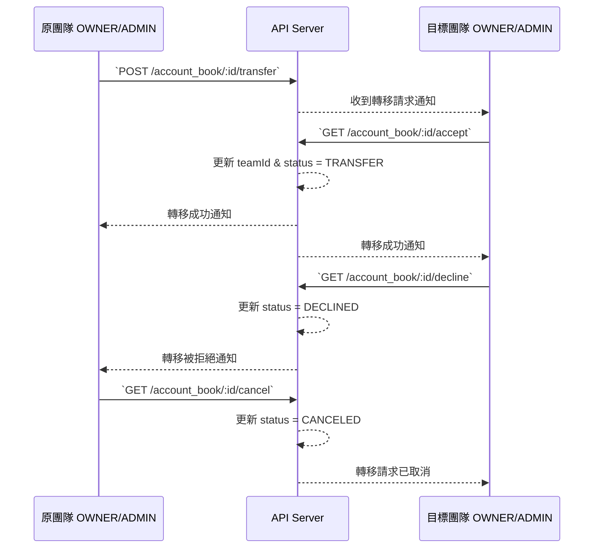

### 🔍 帳本轉移完整 API 設計
**帳本轉移** 需要 4 支 API 來處理 **完整的轉移流程**，確保帳本的 `轉移請求`、`接受`、`拒絕`、`取消` 都能夠被完整管理。

---

## ✅ 1️⃣ `requestTransferAccountBook` (請求轉移帳本)
API 路徑：`POST /api/v2/account_book/:accountBookId/transfer`  
功能：
- 由 `原團隊` 的 `OWNER` 或 `ADMIN` 發起，請求轉移帳本
- 不會立即轉移，而是 建立 `PENDING` 狀態的 `accountBook_transfer`
- 通知 `目標團隊` 的 `OWNER` & `ADMIN`，請他們接受或拒絕
    - 在 `news` table 裡面記錄通知內容
- 前端 UI 上，`目標團隊` 會收到通知，需點擊「接受」或「拒絕」

---

## ✅ 2️⃣ `acceptTransferAccountBook` (接受帳本轉移)
API 路徑：`GET /api/v2/account_book/:accountBookId/accept`  
功能：
- 由 `目標團隊` 的 `OWNER` 或 `ADMIN` 操作
- 確認接受帳本轉移後，將帳本正式轉移
- 更新 `accountBook_transfer.status = TRANSFER`
- 更新 `company.teamId = targetTeamId`
- 通知 `原團隊` 轉移已完成

---

## ✅ 3️⃣ `declineTransferAccountBook` (拒絕帳本轉移)
API 路徑：`GET /api/v2/account_book/:accountBookId/decline`  
功能：
- 由 `目標團隊` 的 `OWNER` 或 `ADMIN` 操作
- 拒絕帳本轉移請求
- 更新 `accountBook_transfer.status = DECLINED`
- 通知 `原團隊` 轉移被拒絕

---

## ✅ 4️⃣ `cancelTransferAccountBook` (取消帳本轉移請求)
API 路徑：`GET /api/v2/account_book/:accountBookId/cancel`  
功能：
- 由 `原團隊` 的 `OWNER` 或 `ADMIN` 操作
- 在對方接受之前，取消帳本轉移請求
- 更新 `accountBook_transfer.status = CANCELED`
- 通知 `目標團隊` 轉移請求已取消

---

## 🚀 完整 API 流程

---

## ✅ API 詳細功能對照表
| API | 誰可以操作 | 主要邏輯 | 影響的 `TransferStatus` |
|-----|------------|------------|--------------------|
| `requestTransferAccountBook` | `原團隊 OWNER / ADMIN` | 發送帳本轉移請求 | `PENDING` |
| `acceptTransferAccountBook` | `目標團隊 OWNER / ADMIN` | 接受帳本轉移，正式轉移 | `TRANSFER` |
| `declineTransferAccountBook` | `目標團隊 OWNER / ADMIN` | 拒絕帳本轉移 | `DECLINED` |
| `cancelTransferAccountBook` | `原團隊 OWNER / ADMIN` | 取消帳本轉移請求 | `CANCELED` |
