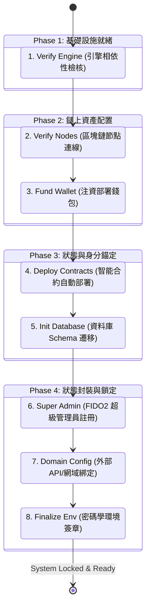
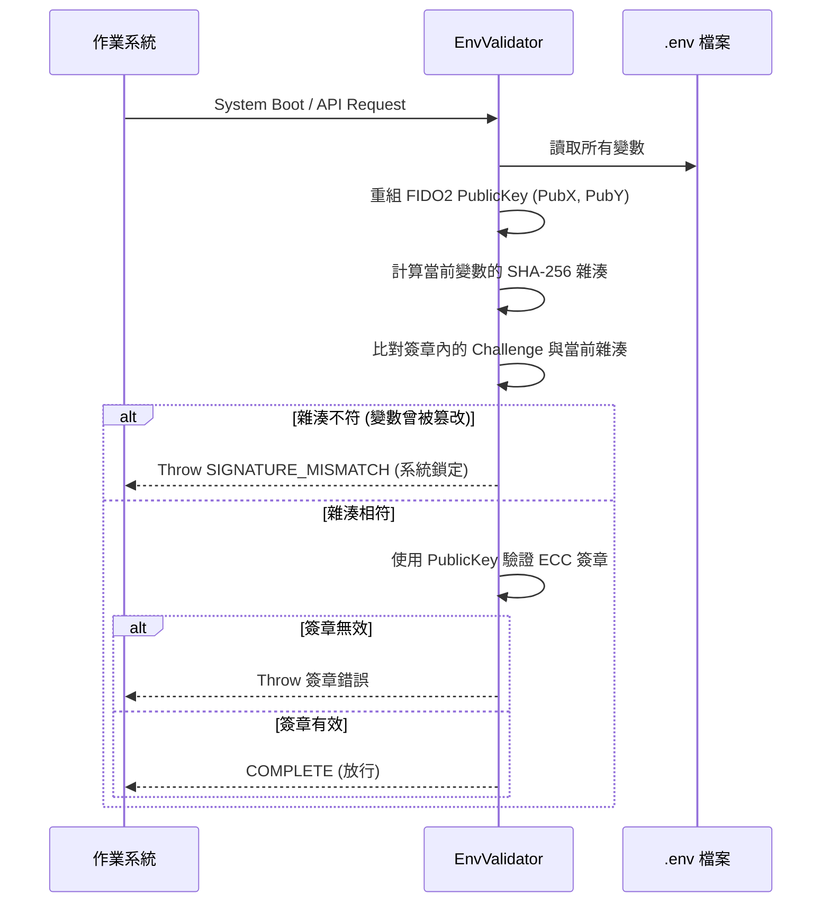

# 第 1 章：架構總覽與設計哲學 (Architecture Overview)

## 1. 核心哲學：零信任與防篡改

iSunFA 系統的核心價值在於提供**國家級防護與四大會計師 (Big 4) 認可的審計標準**。為了達成「零捏造」的目標，系統在最基礎的「初始化階段」(`/admin/setup`) 就完全捨棄了傳統 Web2 依賴開發者手動編輯設定檔的習慣，導入了極其嚴格的「自動化管線」與「密碼學狀態鎖定」機制。

這套架構基於三大原則設計：
1.  **環境動態驗證 (Environment Signature)**：環境變數 (`.env`) 不再只是一份靜態檔案，而是被 FIDO2 硬體金鑰簽署的「密碼學憑證」。
2.  **狀態鎖定 (State Locking)**：任何人工篡改設定的行為，都會因為雜湊值改變而導致系統拒絕啟動，確保底層邏輯的一致性。
3.  **End-to-End 自動化 (E2E Automation)**：從底層資料庫到鏈上智能合約，全數由後端系統非同步建置，排除人為介入帶來的風險。

## 2. 系統初始化總流程圖 (End-to-End Setup Flow)

系統的初始化被精確切割為 8 個自動化防護網段（Stages），如下圖所示：

## 3. 核心機制：防篡改環境簽章 (Environment Signature)

在傳統系統架構中，擁有主機存取權的工程師可以輕易修改 `.env` 檔案來繞過系統限制或更改合約地址，這對「審計系統」而言是致命的資安漏洞。iSunFA 透過實作 **環境簽章 (Environment Signature)** 徹底根絕了這個問題。

### 3.1 簽章封裝運作機制

實作細節位於 `src/validators/env.ts` 與 `src/services/setup.env.service.ts`：

1.  **穩定字串化 (Stable Stringification)**：
    在系統最後封裝階段 (Step 8)，後端會讀取所有即將寫入 `.env` 的變數，**排除**簽章欄位自身後，將所有 Key 按照字母順序排序，組合成一份具有唯一性的「穩定字串 (Stable String)」。
2.  **雜湊挑戰 (Hash Challenge)**：
    將該穩定字串進行 `SHA-256` 雜湊運算，並轉換為 `base64url` 格式。這串雜湊值將成為 FIDO2 WebAuthn 的 **Challenge (挑戰碼)**。
3.  **硬體級簽署 (Hardware Signature)**：
    超級管理員必須使用其註冊的硬體憑證（如 TouchID、YubiKey）對該 Challenge 進行 ECC (P-256) 非對稱加密簽署。
4.  **鎖定 (Locking)**：
    產生的認證 JSON 會被 Base64 編碼，寫入 `.env` 的 `SUPER_ADMIN_SIGNATURE` 欄位中，環境至此完成不可逆的鎖定。

### 3.2 啟動攔截與防篡改驗證 (Tamper-Proof Validation)

每當 iSunFA 伺服器啟動或接受 API 請求時，系統都會執行 `validateEnvDetailed()` 進行嚴格校驗：

**安全結論**：
若任何內部人員（包含具有 SSH 權限的伺服器管理員）企圖竄改資料庫連線密碼、合約地址或 API 金鑰，`.env` 的重新雜湊值將立刻與 `SUPER_ADMIN_SIGNATURE` 內紀錄的挑戰碼不匹配，導致系統觸發 `SIGNATURE_MISMATCH`，強制進入安全鎖定模式 (Locked Mode)，並要求由原超級管理員重新進行實體生物辨識授權，方能解鎖。
