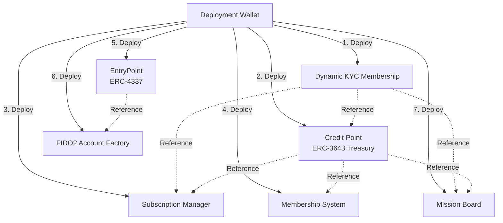

# 第 3 章：鏈上資產與智能合約部署 (Onchain Deployment)

## 1. 部署機制與零信任設計

在 iSunFA 系統初始化的第 3 與第 4 階段中，系統將透過動態且自動化的方式完成核心智能合約的部署。基於「防篡改」與「零信任」架構，此部署流程完全摒棄傳統 Web2 的手動配置，改由後端非同步進程（由超級管理員授權的 Deployment Thread）自動發起鏈上交易。

### 1.1 動態種子錢包 (Deployment Wallet)
部署合約的 EOA (Externally Owned Account) 帳戶是由 `npm run initial_wallet` 初始化產生，其加密的 Keystore 儲存於 `.env.admin`，解密用的 Seed 則儲存於 `.env.seed`。
部署腳本會在運行時讀取並以 `keccak256(toBytes(seedValue))` 作為密碼解密，提取私鑰來自動化執行部署，完全避免人工接觸私鑰的風險。

## 2. 智能合約拓樸與部署順序

iSunFA 使用了 7 個核心智能合約，這些合約彼此之間具有高度依賴性（Dependency）。系統部署時（`scripts/deploy_contract.ts`）會依循嚴格的拓樸順序，並在部署後進行相互授權配置（Configuration）：

### 2.1 部署流程詳解

#### 步驟 1: Dynamic KYC Membership (動態 KYC 會員憑證)
*   **功能**：管理系統使用者的 KYC 狀態與身份驗證（OnchainID 基礎）。
*   **依賴**：無。
*   **部署參數**：`deployer.address`

#### 步驟 2: Credit Point (ERC-3643 金庫與信用點數)
*   **功能**：發行並管理符合合規標準（ERC-3643）的 `ISC` 信用點數。
*   **依賴**：`Dynamic KYC Membership` 地址。
*   **部署參數**：`deployer.address`, `kycAddress`, `collateralRate` (抵押率，預設為 0.05 ISC/ICP，可於前端設定面板動態調整)。

#### 步驟 3: Subscription Manager (訂閱管理器)
*   **功能**：處理企業客戶的訂閱狀態與扣款邏輯。
*   **依賴**：`Dynamic KYC Membership`, `Credit Point`。
*   **部署參數**：`deployer.address`, `kycAddress`, `treasuryAddress`
*   **授權配置**：部署完成後，腳本會自動調用 `Credit Point` 的 `setSubscriptionManager` 授權此合約。

#### 步驟 4: Membership System (會員系統)
*   **功能**：管理一般會員權限與點數操作。
*   **依賴**：`Credit Point`。
*   **部署參數**：`deployer.address`, `treasuryAddress`
*   **授權配置**：部署完成後，腳本會透過 `grantRole` 將 `Credit Point` 的管理員權限 (0x00) 賦予此系統，並預先注資 (Prefund) 20 ISC 以供初期發放。

#### 步驟 5: EntryPoint (ERC-4337 抽象帳戶入口)
*   **功能**：Account Abstraction (AA) 錢包的核心入口點合約，負責驗證與執行 UserOperation。
*   **依賴**：無。獨立部署。

#### 步驟 6: FIDO2 Account Factory (FIDO2 錢包工廠)
*   **功能**：基於 WebAuthn / FIDO2 生成智慧合約錢包 (Smart Contract Wallet, SCW) 的工廠合約。
*   **依賴**：`EntryPoint` 地址。
*   **部署參數**：`entryPointAddress`

#### 步驟 7: Mission Board (任務看板)
*   **功能**：非同步執行管線 (Worker Pipelines) 中處理憑證萃取與審核任務的鏈上仲裁與發佈看板。
*   **依賴**：`Credit Point`, `Dynamic KYC Membership`。
*   **部署參數**：`treasuryAddress`, `kycAddress`, `minReward` (預設 0.01 ISC), `deployer.address`

## 3. 合約相依性驗證 (Dependency Verification)

為了確保部署後的環境穩健，`/admin/setup` 在完成上述流程後，會主動呼叫 `verifyContractDependencies`（位於 `src/services/deploy.service.ts`）去鏈上逐一 `readContract` 驗證指標是否正確：

1.  **CreditPoint -> KYC**: 驗證 `kycRegistry()` 是否指向正確的 KYC 合約。
2.  **SubscriptionManager -> KYC & Treasury**: 驗證其指向的 KYC 與金庫合約是否吻合。
3.  **MembershipSystem -> Treasury & Role**: 驗證指向金庫合約且確定已獲得 `hasRole(0x00)` 管理員權限。
4.  **MissionBoard -> KYC & Treasury**: 驗證任務面板的 `kycMembership()` 與 `rewardToken()` 配置正確。

只有當所有驗證節點皆返回 `valid: true`，介面才會進入 Step 4 (Deploy Contracts) 的「完成」狀態。

## 4. 容錯與狀態恢復

如果部署過程因網路或節點問題中斷，系統提供「自動續傳」與「部分覆寫」機制：
*   **已部署跳過**：透過檢測 `.env.setup` 中的變數，若某個合約的地址已存在，則 `forceRedeployCore=false` 時會自動 Skip。
*   **核心重啟**：若發現最底層的 `Dynamic KYC Membership` 變更或不存在，系統將自動觸發 `forceRedeployCore = true`，強制向下重新部署所有受依賴的合約，確保鏈上架構完整性。
