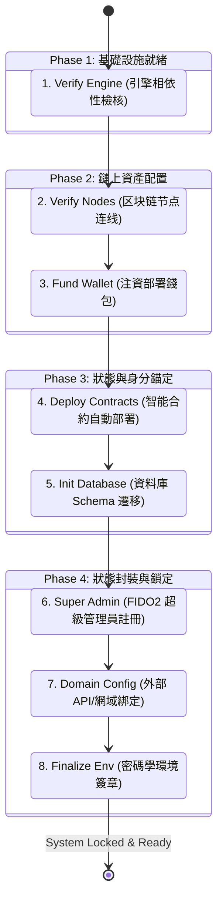
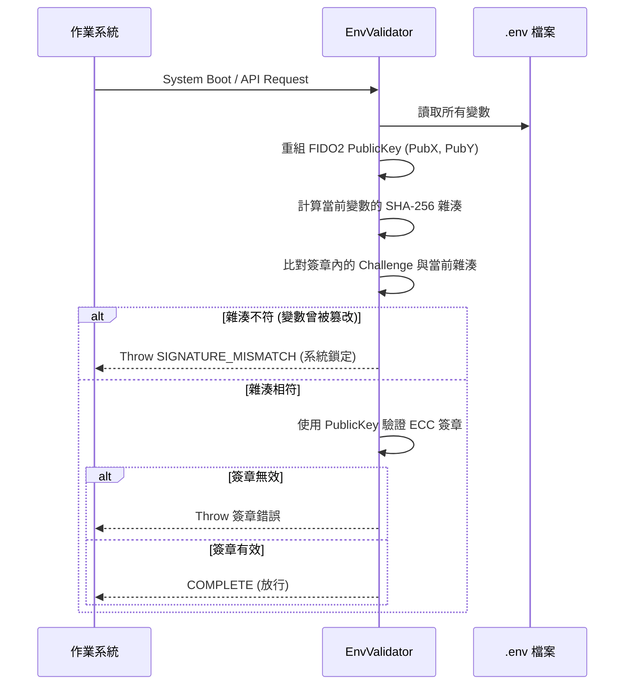
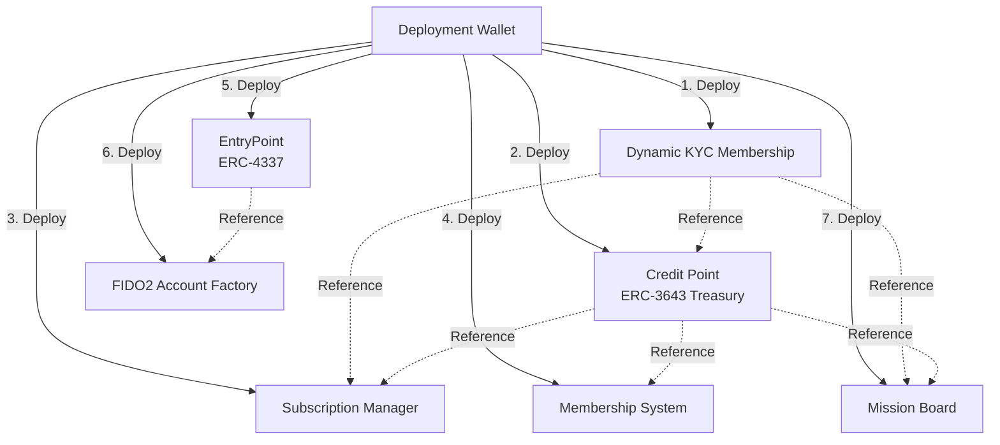

# ⚙️ iSunFA 系統部署與管理員維運白皮書 (System Deployment & Admin Setup)

> **Date**: June 2026
> **Version**: 1.2
> **Status**: Active
> **Context**: 指引系統管理員與開發團隊理解 iSunFA 零信任系統初始化的完整技術細節。

---

## 📖 目錄

1. [第 1 章：架構總覽與設計哲學](#第-1-章架構總覽與設計哲學)
2. [第 2 章：基礎設施與節點驗證](#第-2-章基礎設施與節點驗證)
3. [第 3 章：鏈上資產與智能合約部署](#第-3-章鏈上資產與智能合約部署)
4. [第 4 章：資料錨定與超級管理員核發](#第-4-章資料錨定與超級管理員核發)
5. [第 5 章：環境網域配置與狀態封裝](#第-5-章環境網域配置與狀態封裝)

---

## 第 1 章：架構總覽與設計哲學

### 1. 核心哲學：零信任與防篡改

iSunFA 系統的核心價值在於提供**國家級防護與四大會計師 (Big 4) 認可的審計標準**。為了達成「零捏造」的目標，系統在最基礎的「初始化階段」(`/admin/setup`) 就完全捨棄了傳統 Web2 依賴開發者手動編輯設定檔的習慣，導入了極其嚴格的「自動化管線」與「密碼學狀態鎖定」機制。

這套架構基於三大原則設計：
1. **環境動態驗證 (Environment Signature)**：環境變數 (`.env`) 不再只是一份靜態檔案，而是被 FIDO2 硬體金鑰簽署的「密碼學憑證」。
2. **狀態鎖定 (State Locking)**：任何人工篡改設定的行為，都會因為雜湊值改變而導致系統拒絕啟動，確保底層邏輯的一致性。
3. **End-to-End 自動化 (E2E Automation)**：從底層資料庫到鏈上智能合約，全數由後端系統非同步建置，排除人為介入帶來的風險。

### 2. 系統初始化總流程圖 (End-to-End Setup Flow)

系統的初始化被精確切割為 8 個自動化防護網段（Stages），如下圖所示：



### 3. 核心機制：防篡改環境簽章 (Environment Signature)

在傳統系統架構中，擁有主機存取權的工程師可以輕易修改 `.env` 檔案來繞過系統限制或更改合約地址，這對「審計系統」而言是致命的資安漏洞。iSunFA 透過實作 **環境簽章 (Environment Signature)** 徹底根絕了這個問題。

#### 3.1 簽章封裝運作機制

實作細節位於 `src/validators/env.ts` 與 `src/services/setup.env.service.ts`：

1. **穩定字串化 (Stable Stringification)**：
   在系統最後封裝階段 (Step 8)，後端會讀取所有即將寫入 `.env` 的變數，**排除**簽章欄位自身後，將所有 Key 按照字母順序排序，組合成一份具有唯一性的「穩定字串 (Stable String)」。
2. **雜湊挑戰 (Hash Challenge)**：
   將該穩定字串進行 `SHA-256` 雜湊運算，並轉換為 `base64url` 格式。這串雜湊值將成為 FIDO2 WebAuthn 的 **Challenge (挑戰碼)**。
3. **硬體級簽署 (Hardware Signature)**：
   超級管理員必須使用其註冊的硬體憑證（如 TouchID、YubiKey）對該 Challenge 進行 ECC (P-256) 非對稱加密簽署。
4. **鎖定 (Locking)**：
   產生的認證 JSON 會被 Base64 編碼，寫入 `.env` 的 `SUPER_ADMIN_SIGNATURE` 欄位中，環境至此完成不可逆的鎖定。

#### 3.2 啟動攔截與防篡改驗證 (Tamper-Proof Validation)

每當 iSunFA 伺服器啟動或接受 API 請求時，系統都會執行 `validateEnvDetailed()` 進行嚴格校驗：



**安全結論**：
若任何內部人員（包含具有 SSH 權限的伺服器管理員）企圖竄改資料庫連線密碼、合約地址或 API 金鑰，`.env` 的重新雜湊值將立刻與 `SUPER_ADMIN_SIGNATURE` 內紀錄的挑戰碼不匹配，導致系統觸發 `SIGNATURE_MISMATCH`，強制進入安全鎖定模式 (Locked Mode)，並要求由原超級管理員重新進行實體生物辨識授權，方能解鎖。

---

## 第 2 章：基礎設施與節點驗證

### 1. 基礎設施設計原則

在 iSunFA 的零信任（Zero-Trust）架構中，所有底層依賴模組——包含資料庫、去中心化儲存節點（IPFS）、私有區塊鏈節點（Hardhat/Ganache）以及 API 網關（Nginx）——皆由後端程式動態編排與啟動。

開發團隊或系統管理員**不需要**手動下達 `docker-compose up` 或填寫 `.env` 中的連線密碼，此舉旨在避免人為配置錯誤並阻絕密碼外洩的風險。這一切都收斂在 `/admin/setup` 的 Stage 1 (Verify Engine) 與 Stage 2 (Start Verify Nodes)。

### 2. Stage 1: 引擎與硬體相依性驗證 (Verify Engine)

在系統啟動任何容器或寫入配置之前，系統會先對宿主機 (Host Machine) 進行嚴格的硬體與依賴環境檢查。實作位於 `src/components/admin/setup/verify_engine_step.tsx` 與底層的 `getSystemHardwareInfo()`：

#### 2.1 驗證項目
* **系統層級**：取得 OS 類型 (Type)、發行版本 (Release) 以及系統架構 (Arch，例如 `arm64` 或 `x64`)。
* **運算層級**：擷取 CPU 型號與核心數 (Cores)，確保系統具備處理平行加密運算與 AI 萃取管線的算力。
* **記憶體分配**：計算系統總記憶體 (Total Memory GB)，這是確保 Docker 容器（特別是包含 EVM 節點與資料庫時）不會發生 OOM (Out Of Memory) 的關鍵指標。

#### 2.2 Docker 引擎狀態檢測
系統會依序呼叫 `checkDockerInstalled()` 與 `checkDockerRunning()`。只有當 Docker 守護進程 (Daemon) 處於 Active 且版本符合要求時，介面才會顯示綠色的 `SUCCESS` 並允許進入下一階段。

### 3. Stage 2: 節點自動化編排 (Start Verify Nodes)

當硬體驗證通過後，系統便會透過 `startDockerCompose()` (位於 `src/services/setup.service.ts`) 動態生成密碼並喚醒底層節點。

#### 3.1 動態密碼學注資機制 (Dynamic Credential Injection)

這是 iSunFA 防篡改架構的核心特徵之一。系統**不會**依賴 any 預設密碼：
1. **隨機密碼**：系統透過 Node.js 原生的 `crypto.randomInt`，從安全字元集中生成一組 24 位元的隨機密碼 (`POSTGRES_PASSWORD`)。
2. **變數注入**：將此隨機密碼連同 `POSTGRES_USER` (`isunfa`)、`POSTGRES_DB` (`isunfa`) 寫入 `.env`。
3. **URL 編碼與封裝**：將密碼進行 `encodeURIComponent` 後，組裝成符合 Prisma 規範 of `DATABASE_URL`。

#### 3.2 網路與節點映射 (Network Routing)

後端會為多個子系統指派固定的 Localhost Port，並寫入 `# PART 1: Core Infrastructure` 環境變數區塊：
* **Postgres Database** (`POSTGRES_PORT`): `20021`
* **IPFS/Storage Node** (`STORAGE_DOMAIN`): `http://127.0.0.1:20022`
* **EVM RPC Node** (`NEXT_PUBLIC_RPC_URL`): `http://127.0.0.1:20024` (用以支撐後續的智能合約部署)
* **OSRM Router Node** (`OSRM_ROUTER_URL`): `http://127.0.0.1:20025`

#### 3.3 容器啟動與心跳檢測

完成 `.env` 配置後，系統會透過 `dockerService.composeUp()` 喚醒所有服務，並進入輪詢狀態（Polling）。

在 `start_verify_nodes_step.tsx` 中，前端會呼叫 `getRunningContainers()`，過濾出以下核心容器：
* `gateway` (Nginx/Proxy)
* `database` (PostgreSQL)
* `storage` (IPFS 節點)
* `blockchain` (EVM 私有鏈節點)

只有當這些容器的狀態欄位 (Status) 全數顯示為 `Up` 時，系統才會認定底層區塊鏈與資料庫設施已就緒，自動解鎖進入 Stage 3。這保證了上層邏輯絕不會在下層基礎設施未準備好時產生 Race Condition。

---

## 第 3 章：鏈上資產與智能合約部署

### 1. 部署機制與零信任設計

在 iSunFA 系統初始化的第 3 與第 4 階段中，系統將透過動態且自動化的方式完成核心智能合約的部署。基於「防篡改」與「零信任」架構，此部署流程完全延續後端非同步進程（由超級管理員授權的 Deployment Thread）自動發起鏈上交易。

#### 1.1 動態種子錢包 (Deployment Wallet)
部署合約的 EOA (Externally Owned Account) 帳戶是由 `npm run initial_wallet` 初始化產生，其加密的 Keystore 儲存於 `.env.admin`，解密用的 Seed 則儲存於 `.env.seed`。
部署腳本會在運行時讀取並以 `keccak256(toBytes(seedValue))` 作為密碼解密，提取私鑰來自動化執行部署，完全避免人工接觸私鑰的風險。

### 2. 智能合約拓樸與部署順序

iSunFA 使用了 7 個核心智能合約，這些合約彼此之間具有高度依賴性（Dependency）。系統部署時（`scripts/deploy_contract.ts`）會依循嚴格的拓樸順序，並在部署後進行相互授權配置（Configuration）：



#### 2.1 部署流程詳解

* **步驟 1: Dynamic KYC Membership (動態 KYC 會員憑證)**
  * **功能**：管理系統使用者的 KYC 狀態與身份驗證（OnchainID 基礎）。
  * **依賴**：無。
  * **部署參數**：`deployer.address`

* **步驟 2: Credit Point (ERC-3643 金庫與信用點數)**
  * **功能**：發行並管理符合合規標準（ERC-3643）的 `ISC` 信用點數。
  * **依賴**：`Dynamic KYC Membership` 地址。
  * **部署參數**：`deployer.address`, `kycAddress`, `collateralRate` (抵押率，預設為 0.05 ISC/ICP)。

* **步驟 3: Subscription Manager (訂閱管理器)**
  * **功能**：處理企業客戶的訂閱狀態與扣款邏輯。
  * **依賴**：`Dynamic KYC Membership`, `Credit Point`。
  * **部署參數**：`deployer.address`, `kycAddress`, `treasuryAddress`
  * **授權配置**：部署完成後，腳本會自動調用 `Credit Point` 的 `setSubscriptionManager` 授權此合約。

* **步驟 4: Membership System (會員系統)**
  * **功能**：管理一般會員權限與點數操作。
  * **依賴**：`Credit Point`。
  * **部署參數**：`deployer.address`, `treasuryAddress`
  * **授權配置**：部署完成後，腳本會透過 `grantRole` 將 `Credit Point` 的管理員權限 (0x00) 賦予此系統，並預先注資 (Prefund) 20 ISC。

* **步驟 5: EntryPoint (ERC-4337 抽象帳戶入口)**
  * **功能**：Account Abstraction (AA) 錢包的核心入口點合約，負責驗證與執行 UserOperation。
  * **依賴**：無。獨立部署。

* **步驟 6: FIDO2 Account Factory (FIDO2 錢包工廠)**
  * **功能**：基於 WebAuthn / FIDO2 生成智慧合約錢包 (Smart Contract Wallet, SCW) 的工廠合約。
  * **依賴**：`EntryPoint` 地址。
  * **部署參數**：`entryPointAddress`

* **步驟 7: Mission Board (任務看板)**
  * **功能**：非同步執行管線 (Worker Pipelines) 中處理憑證萃取與審核任務的鏈上仲裁與發佈看板。
  * **依賴**：`Credit Point`, `Dynamic KYC Membership`。
  * **部署參數**：`treasuryAddress`, `kycAddress`, `minReward` (預設 0.01 ISC), `deployer.address`

### 3. 合約相依性驗證 (Dependency Verification)

為了確保部署後的環境穩健，`/admin/setup` 在完成上述流程後，會主動呼叫 `verifyContractDependencies`（位於 `src/services/deploy.service.ts`）去鏈上逐一 `readContract` 驗證指標是否正確：
1. **CreditPoint -> KYC**: 驗證 `kycRegistry()` 是否指向正確的 KYC 合約。
2. **SubscriptionManager -> KYC & Treasury**: 驗證其指向的 KYC 與金庫合約是否吻合。
3. **MembershipSystem -> Treasury & Role**: 驗證指向金庫合約且確定已獲得 `hasRole(0x00)` 管理員權限。
4. **MissionBoard -> KYC & Treasury**: 驗證任務面板的 `kycMembership()` 與 `rewardToken()` 配置正確。

只有當所有驗證節點皆返回 `valid: true`，介面才會進入 Step 4 的「完成」狀態。

### 4. 容錯與狀態恢復

如果部署過程因網路或節點問題中斷，系統提供「自動續傳」與「部分覆寫」機制：
* **已部署跳過**：透過檢測 `.env.setup` 中的變數，若某個合約的地址已存在，則 `forceRedeployCore=false` 時會自動 Skip。
* **核心重啟**：若發現最底層的 `Dynamic KYC Membership` 變更或不存在，系統將自動觸發 `forceRedeployCore = true`，強制向下重新部署所有受依賴的合約，確保鏈上架構完整性。

---

## 第 4 章：資料錨定與超級管理員核發

### 1. 架構定位

在完成區塊鏈智能合約的基礎設施部署後，iSunFA 系統會進入第 5 階段「資料庫初始化 (Init Database)」與第 6 階段「超級管理員核發 (Super Admin)」。
這兩個階段的目標是將「鏈上資產（Smart Contracts）」與「鏈下資料庫（PostgreSQL）」透過一個具備最高權限的密碼學身分（Super Admin）進行無縫且唯一的錨定。

### 2. Stage 5: 資料庫配置與結構同步 (Init Database)

在 iSunFA 的零信任初始化架構中，這一切被封裝在 `src/services/setup.db.service.ts` 中自動執行。

#### 2.1 動態密碼注入與容器同步
在 Stage 2 中，系統已經為 PostgreSQL 生成了一組 24 位元的隨機密碼並寫入 `.env`。在 Stage 5 中，系統會透過 Docker CLI 穿透執行 SQL 指令，強制更新容器內的資料庫密碼，確保 `.env` 與實際運行的 Container 密碼完全一致：
```bash
# 系統底層執行之等效指令 (帶有嚴格的 SQL 跳脫防護)
psql -U isunfa -d isunfa -c "ALTER USER isunfa WITH PASSWORD '<DYNAMIC_PASSWORD>';"
```

#### 2.2 Prisma 結構遷移 (Schema Push)
密碼同步完成後，系統會在背景執行 `npx prisma db push --accept-data-loss`，將 `prisma/schema.prisma` 定義的表結構（Table Schemas）強制推送到資料庫中。介面會即時顯示成功同步的資料表數量（Table Count），並將設定封裝至 `.env.setup` 的 `# PART 3: Database Configuration` 區塊。

### 3. Stage 6: 超級管理員密碼學身分簽發 (Super Admin)

這是 iSunFA 系統中最重要的權限控制核心。系統嚴格禁止透過帳號/密碼 (Password-based) 註冊最高管理員，而是全面採用 FIDO2 (WebAuthn) 與 AA 錢包。實作細節位於 `src/services/setup.service.ts` 的 `createSuperAdminRecord`。

#### 3.1 唯一性降級機制 (Uniqueness Guarantee)
為了防止系統權限泛濫，當註冊新的 Super Admin 時，後端邏輯會強制執行「全局降級」：將資料庫中現存的所有 `SUPER_ADMIN` 降級為一般 `USER`，確保在同一時間，全系統**有且僅有一位**掌握最高私鑰的 Super Admin。

#### 3.2 雙軌金鑰架構 (Dual Key Architecture)

Super Admin 在創建時，系統會同時處理兩組非對稱金鑰，分別負責「前端驗證」與「後端簽署」：

1. **前端硬體金鑰 (FIDO2 / WebAuthn)**
   * **來源**：使用者的實體安全金鑰 (如 YubiKey、Touch ID 或 Windows Hello) 所生成的 P-256 ECC 金鑰對。
   * **儲存**：其 Credential ID (`SUPER_ADMIN_CRED_ID`) 與公鑰座標 (`SUPER_ADMIN_PUB_X`, `SUPER_ADMIN_PUB_Y`) 會被寫入 `.env.setup`。
   * **用途**：用於解鎖系統管理員介面，以及後續生成「環境簽章」防篡改校驗。
2. **後端簽署私鑰 (DeWT Private Key)**
   * **來源**：由 Node.js 後端 `crypto.generateKeyPairSync("ec", { namedCurve: "prime256v1" })` 動態生成的第二把 ECC P-256 金鑰對。
   * **儲存**：私鑰以 PEM 格式寫入 `.env` (`DEWT_PRIVATE_KEY_PEM`)。
   * **用途**：作為發行系統去中心化網路憑證 (Decentralized Web Token, DeWT) 的 Root Key。

#### 3.3 鏈上權限錨定 (On-chain Role Provisioning)
後端管線還會自動為此管理員執行以下區塊鏈操作：
1. **SCW 工廠調用**：使用 FIDO2 公鑰座標向 `Fido2AccountFactory` 生成或取得對應的 Account Abstraction (AA) 智能合約錢包地址。
2. **最高級別 KYC**：呼叫 `setAccountKYCLevel(address, 10)`，依此賦予該地址最高等級的合規通行證。
3. **合約管理員賦權**：呼叫 `grantDefaultAdminRoles(address)`，將各核心合約（如 Credit Point、Membership System）的 `DEFAULT_ADMIN_ROLE (0x00)` 指派給該地址，完成鏈下與鏈上權限的統一。

---

## 第 5 章：環境網域配置與狀態封裝

### 1. 架構定位

在 iSunFA 的自動化初始化流程中，第 7 階段「外部網域與 API 配置 (Domain Config)」與最後的第 8 階段「環境簽章封裝 (Finalize Env)」是系統從「草稿狀態 (Setup Mode)」過渡到「正式鎖定狀態 (Locked Mode)」的關鍵。這兩步確保了系統所有外部依賴皆已就緒，並透過密碼學手段將設定檔永久封裝，達成「零捏造」的最終防護。

### 2. Stage 7: 網域與外部 API 配置 (Domain Config)

系統會將這些外部金鑰統一寫入 `.env.setup` 的 `# PART 5: External API Configuration` 區塊，實作位於 `src/services/setup.env.service.ts` 的 `saveExternalConfig()`。

配置的核心參數包含：
* **基礎應用層**：`NEXT_PUBLIC_APP_URL` (決定 CORS 與 SSO 回撥的基礎網域)。
* **AI 處理管線**：`GEMINI_API_KEY` 與 `MODEL` (預設為 `gemini-2.5-pro`)，這些是支撐「憑證萃取」與「混合決策管線」的心臟。
* **分析與圖資**：`NEXT_PUBLIC_GA_MEASUREMENT_ID` (流量分析) 與 `NEXT_PUBLIC_MAPTILER_KEY` (ESG 軌跡視覺化圖資)。
* **金流整合**：`OEN_ACCESS_TOKEN` 與 `OEN_MERCHANT_ID`，用於支援企業級的法幣/信用卡入金與點數購買。
* **本地儲存目錄**：`REPORT_OUTPUT_DIR`, `MISSION_DIR`, `ISSUE_DIR` (預設為相對目錄 `reports`, `missions`, `issues`)，確保 ESG 報表與審計軌跡的落地位址。

這些參數在寫入時，後端會自動過濾並使用 `updateOrAppendEnv` 確保變數名稱與值的格式正確，避免 `.env` 出現語法錯誤。

### 3. Stage 8: 防篡改環境封裝 (Finalize Environment)

Stage 8 是 iSunFA 零信任架構的最終防線。系統不再將設定檔視為單純的文字檔，而是將其轉換為一份「具備不可否認性」的密碼學憑證。

#### 3.1 封裝與鎖定流程

1. **穩定化處理與雜湊挑戰 (Hash Challenge)**
   當進入 Stage 8 時，後端會呼叫 `getEnvHashChallenge()`，讀取 `.env.setup` 中的所有變數，排除簽章自身的欄位，並將其餘的變數按照字母順序 (Alphabetical Order) 進行排序（Stable Stringification）。
   接著，對此穩定字串進行 `SHA-256` 雜湊計算，將結果轉換為 `base64url` 格式，作為 FIDO2 認證的 **Challenge (挑戰碼)**。
2. **實體硬體簽署 (Hardware Auth)**
   前端介面會呼叫 WebAuthn API，要求 Super Admin 使用在 Stage 6 註冊的實體硬體金鑰（Touch ID、YubiKey 等）對這組 Challenge 進行簽章。這確保了「鎖定環境」的這個動作，是由合法擁有該硬體金鑰的真人所授權的。
3. **簽章寫入 (Write Signature)**
   簽署完成後，後端透過 `verifyAndFinalizeConfig()` 將包含 ClientData 與 AuthenticatorData 的 FIDO2 JSON 物件編碼為 Base64 字串，寫入至 `# PART 6: Configuration Immutable Signature via FIDO2` 區塊的 `SUPER_ADMIN_SIGNATURE` 欄位中。
4. **草稿銷毀與正式覆蓋 (Commit & Cleanup)**
   最後，`finalizeSetupEnvironment()` 會將封裝好的 `.env.setup` 正式重新命名並覆寫為 `.env`，隨後**徹底刪除 `.env.setup` 草稿檔**。
   系統至此進入「鎖定狀態 (Locked Mode)」。

#### 3.2 系統重啟與生效 (System Reboot)

封裝完成後，頁面會跳轉至 `/admin/reboot`。這個動作會對伺服器（PM2 或 Node.js Process）發出重啟信號。
伺服器重啟後，一啟動便會觸發 `validateEnvDetailed()`，它會讀取新的 `.env`，重算雜湊並比對 `SUPER_ADMIN_SIGNATURE`。一旦驗證通過，便代表 iSunFA 系統已經準備好以 Big 4 級別的合規狀態，開始為企業服務。
