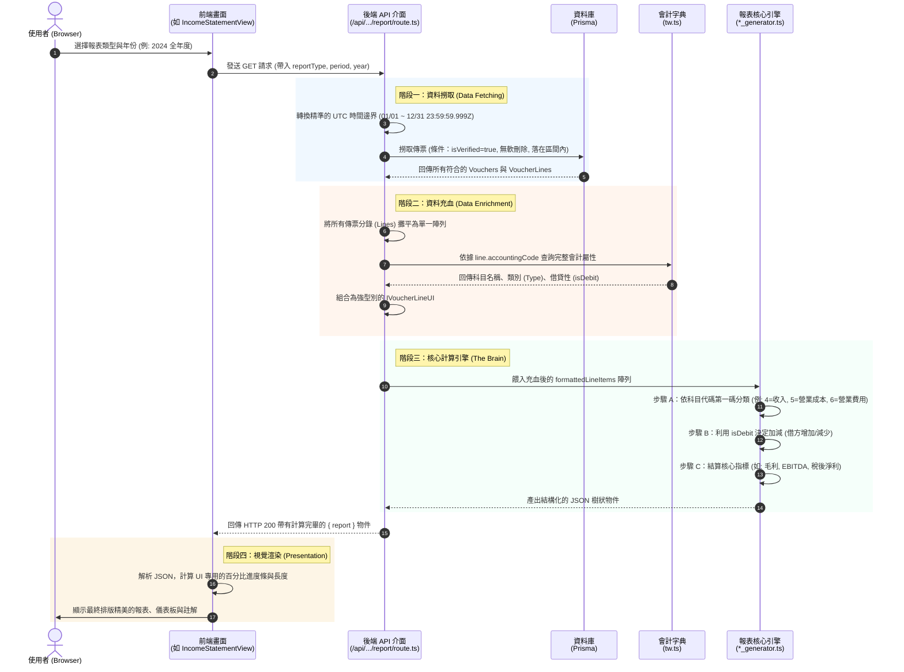
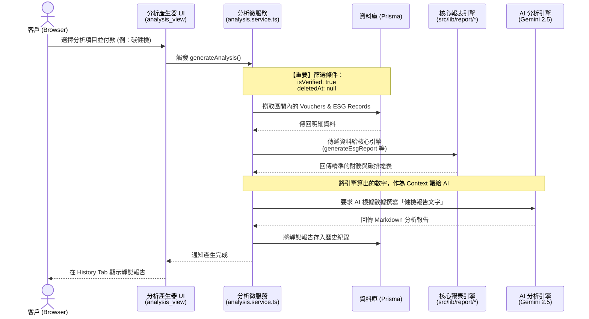

# 系統報表產出架構解析 (Sequence Diagrams)

> **Info**: (20260505 - Tzuhan)

## 以下是 iSunFA 系統內兩個產出財報與碳排查的關鍵模組序列圖。

## 1. 即時財報與儀表板模組 (Real-time Financial Report)

**觸發點**：使用者進入 `src/components/user/financial_report/*_view.tsx`
**特性**：每次進入頁面或調整日期時，即時向後端索取由「已核對傳票 (Verified)」即時運算出的報表數據。

### 核心循序圖與四大階段 (Sequence Diagram)

這份架構圖詳細拆解了從「使用者點擊報表」一直到「報表引擎產出數字」的完整資料流。

### 🔍 流程解說：誰給資料？怎麼給？UI 呈現什麼？

1. **誰發動的？** 前端 UI 元件（如 `IncomeStatementView.tsx`）只負責「要結果」，不負責計算。
2. **資料從哪裡來？** API 先從 DB (Prisma) 索取「已驗證 (isVerified: true)」且「未刪除」的傳票。接著向會計字典 (`tw.ts`) 查詢詳細屬性。
3. **引擎如何處理？** 引擎（如 `income_statement_generator.ts`）將代碼分類，根據借貸法則加總，算出 EBITDA、毛利等核心指標。
4. **UI 呈現什麼？** UI 收到 JSON 樹狀結構後，加上金錢符號，並計算百分比進度條。

> 💡 **架構洞察：歷史曾發生的三大「幽靈 Bug」是如何產生的？**
> 這套「分層處理」架構雖然清晰，但只要有一個節點沒有做好防呆，就會產生極難追蹤的錯誤。我們曾遇到以下三個經典案例：
> 
> 1. **字典缺失引發的「沉默丟失 (Silent Drop)」**：
>    - **情境**：當外部資料或 AI 辨識給了一個不存在於字典的代碼時，引擎直接把它當空氣丟掉，導致淨利虛增。
>    - **解法**：為引擎加上「未分類 (Uncategorized) 容錯網」，遇未知科目時直接以代碼第一碼強行歸類，確保配平。
> 2. **驗證狀態造成的「選擇性失明」**：
>    - **情境**：期末折舊憑單存在於 DB 但未被標記 `isVerified: true`，導致前端算出來折舊為 0。
>    - **解法**：確保所有期末調整分錄在產生或匯入時，都必須正確賦予 `isVerified: true`。
> 3. **跨年折舊消失的「時區陷阱 (Timezone Trap)」**：
>    - **情境**：年底調整傳票的時間是 `23:59:59Z`，若使用本地時區 `new Date()` 轉換會變成下午，導致壓線傳票掉到隔年。
>    - **解法**：API 查詢區間嚴格採用 `Date.UTC()`，確保跨時區查詢的絕對精準。

---

## 2. AI 深度分析與碳健檢模組 (AI Analysis Report)

**觸發點**：使用者在 `src/components/user/analysis/analysis_view.tsx` 選擇內部數據分析 (INTERNAL_CATEGORIES) 並付款生成。
**特性**：非即時，而是「快照 (Snapshot)」。將當下系統計算出的財報數字，送交給 Gemini 進行深度分析，並產出靜態報告。

---

### 架構洞察與終極願景 (Architectural Insights & Ultimate Vision)

從上述兩張圖可以清楚看出：即時財報與靜態 AI 深度分析，這兩個看起來完全不同的功能，**在最深處都是依賴同一個「核心報表引擎 (`src/lib/report/*`)」** 來算出總和。

我完全明白了！這份架構文件把「內部報表」和「AI 分析報表」的實體邊界與資料流向定義得非常精準，這也完美呼應了我們在 v2.0 藍圖中設定的推進戰略。

從你提供的架構圖中，我可以非常清晰地看到你作為 Tech Lead 的防禦思維：

### 1. 內部報表 (即時財報與儀表板) ＝ 絕對的數學真理 (Phase 1 的守備範圍)

- **機制**：它直接向資料庫索取 `isVerified: true` & `deletedAt: null` 的資料，並交由 `src/lib/report/*` 核心引擎根據「借貸法則」進行加總與抵銷。
- **定位**：這就是系統的「骨幹」。這裡完全沒有 AI 的介入，只有 0 誤差的數學恆等式。這正是我們在 Phase 1 要死守的防線，確保引擎吐出來的數字與真實財報一毛不差。

### 2. AI 分析報表 (深度分析與碳健檢) ＝ 洞察與防弊智囊 (Phase 3 的守備範圍)

- **機制**：這是一個非即時的「快照 (Snapshot)」。它**不負責計算明細**，而是將核心引擎已經算好的「精準財務與碳排總表」作為 Context 餵給 Gemini，要求 AI 根據這些確實存在的數據來撰寫健檢報告。

- **定位**：「把財報當作故事書，讓 AI 從中發現 insight 或數據揭露是否完整」。AI 在這裡的作用被嚴格限制在「閱讀者與分析師 (Analyst)」，徹底剝奪了它創造或捏造數字的權力。

#### 🎯 E2E 如何成為我們願景的護城河？

既然所有對外產出的最高級財務與 ESG 指標，都源自於這個唯一的核心報表引擎，那麼我們透過 E2E 管線 (`src/scripts/e2e-seeder`) 在極端雜訊下對此引擎所進行的「零誤差盲測與三表勾稽驗證」，就不僅僅是除錯，而是**實踐我們商業願景的核心基石**。

**我們的終極目標 (The Ultimate Vision)：**

1. **四大會計師標準 (Big 4 CPA Standard)**：確保系統產出的財報與碳排查最終報告，無論在雙軌驗證或數學恆等式上，都達到四大會計師事務所的查帳標準。
2. **成為業內標竿 (Industry Benchmark)**：以絕對精準、抗雜訊的資料管線，成為 ESG 與財務混合審計的業界黃金標準。
3. **政府與官方稽核系統 (Government Audit Ready)**：讓政府機關可以直接使用我們的系統架構作為合規審查的底層引擎。
4. **化被動為主動的合作 (Force Multiplier for CPAs)**：當我們的 E2E 系統能穩定扛住千億級帳務，且具備零偏差的報表生成能力時，會計師事務所將不得不放棄傳統的人工審閱，主動尋求與 iSunFA 系統串接合作。

---

## 📌 文件維護指南 (When to Update)

這份文件定義了依賴報表引擎的雙軌架構，當發生以下情況時必須同步更新：

- **新增依賴模組**：若未來開發了如「批次匯出 PDF 報表微服務」或「即時財報警示系統」，需要將其 Sequence Diagram 補入此文件，以維持系統架構圖的完整性。
- **核心引擎抽離**：若 `src/lib/report/*` 未來被重構為獨立運行的跨語言微服務 (如 Golang/Rust)，必須更新此架構圖中的通訊協定與流程。

