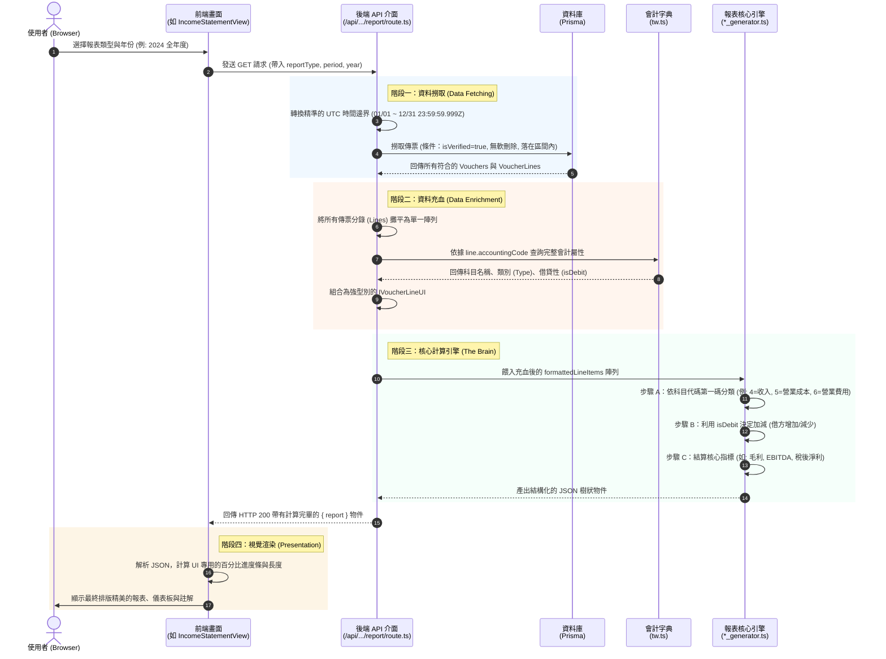

# 📊 iSunFA 報表編製核心流程圖
> **Info**: (20260505 - Tzuhan)

這份架構圖詳細拆解了從「使用者點擊報表」一直到「報表引擎產出數字」的完整資料流。

## 核心循序圖 (Sequence Diagram)

---

## 🔍 流程解說：誰給資料？怎麼給？UI 呈現什麼？

### 1. **誰發動的？問什麼資料？**
- **發動者**：前端 UI 元件（例如 `IncomeStatementView.tsx`）。
- **請求內容**：前端只會簡單地告訴 API：「給我 2024 年全年度的綜合損益表資料」。它不負責計算，只負責「要結果」。

### 2. **資料從哪裡來？誰給的？**
- **原始資料庫 (DB)**：API 收到請求後，第一步是向資料庫 (Prisma) 索取該區間內 **「已驗證 (isVerified: true)」** 且 **「未被刪除」** 的傳票與分錄。
- **會計字典 (Dict)**：從資料庫拿到的只有 `accountingCode` (例如 `6288`)。API 會去向系統的標準會計字典 (`src/constants/accounts/tw.ts`) 查詢這個代碼的詳細身世（它是資產還是費用？它是借方科目還是貸方科目？它的中文名稱是什麼？）。

### 3. **資料怎麼處理？(報表引擎的魔法)**
- **餵給引擎**：API 把「傳票金額」加上「字典屬性」合併後，全部打包丟給核心引擎（例如 `income_statement_generator.ts`）。
- **引擎分類與計算**：
  - 引擎會像分信件一樣，看到 `4` 開頭的代碼就丟進「營業收入」的籃子；看到 `5` 開頭就丟進「營業成本」；看到 `6` 開頭就丟進「營業費用」。
  - 接著，引擎會根據會計原理（例如費用科目遇到「借方」就加，遇到「貸方」就減）加總所有數字。
  - 最後，引擎會親自算好最高級的財務指標（例如 EBITDA、毛利、營業淨利）。

### 4. **UI 呈現多少？**
- **UI 是一張「畫布」**：UI **完全不參與**任何會計邏輯與加減法運算。它收到的就是一份已經被引擎算得清清楚楚的 JSON 樹狀結構（包含每個科目的總計、EBITDA 數字是多少）。
- **UI 只做兩件事**：
  1. 把數字加上金錢符號和千位數逗號（如 `$301,070,300`）。
  2. 計算「 UI 進度條」：例如 UI 會拿「營業費用」除以「營業收入」算成百分比，用來畫出灰色的長條圖。

> 💡 **架構洞察：歷史曾發生的三大「幽靈 Bug」是如何產生的？**
> 這套「分層處理」架構雖然清晰，但只要有一個節點沒有做好防呆，就會產生極難追蹤的錯誤。我們曾遇到以下三個經典案例：
> 
> 1. **字典缺失引發的「沉默丟失 (Silent Drop)」**：
>    - **發生點**：階段二 (Data Enrichment) 與 階段三 (The Brain)。
>    - **情境**：當外部資料或 AI 辨識給了一個不存在於會計字典 (`tw.ts`) 的自創代碼（如水電費 `6161`）時，階段二查無此代碼。如果階段三的報表引擎沒有設計好容錯機制（例如直接 `if (!accounting) return;` 把它當空氣丟掉），這筆龐大的金額就會在系統中無聲無息地蒸發，導致 UI 算出來的淨利虛增，與實際對不起來。
>    - **解法**：為引擎加上「未分類 (Uncategorized) 容錯網」，遇未知科目時直接以代碼第一碼強行歸類，確保資產負債表永遠配平。
> 
> 2. **驗證狀態造成的「選擇性失明」**：
>    - **發生點**：階段一 (Data Fetching)。
>    - **情境**：高達 6.5 億的期末折舊憑單存在於資料庫中，但如果忘記被標記為 `isVerified: true`，API 在第一階段就會將其排除。這會導致最終算出來的 EBITDA 剛好等於淨利（因為折舊被視為 0），且現金流量表上「折舊」這一列會因為餘額為 0 而被 UI 完全隱藏，讓使用者誤以為是前端畫錯。
>    - **解法**：確保所有期末調整分錄在產生或匯入時，都必須正確賦予 `isVerified: true`。
> 
> 3. **跨年折舊消失的「時區陷阱 (Timezone Trap)」**：
>    - **發生點**：階段一 (Data Fetching)。
>    - **情境**：年底調整傳票的時間是 `2024-12-31T23:59:59.000Z` (UTC)。如果 API 在轉換邊界時只使用了本地時區的 `new Date("2024-12-31 23:59:59")`，這在台灣 (+8) 會被轉換為 `2024-12-31T15:59:59Z`。結果這筆 12/31 壓線的折舊憑單，就會因為大於 API 規定的結束時間，而硬生生掉到隔年（2025年），導致整年財報大亂。
>    - **解法**：API 的查詢區間嚴格採用 `Date.UTC(year, 11, 31, 23, 59, 59, 999)`，確保跨時區查詢的絕對精準。

---

## 📌 文件維護指南 (When to Update)
這份架構文件為系統核心資料流的 Single Source of Truth，當發生以下情況時必須同步更新：
- **資料獲取層變更**：若未來引入 Redis 快取，或將 Prisma 抽換為 Raw SQL / 獨立微服務以加速效能，必須更新「階段一」的時序圖。
- **容錯機制升級**：若在「階段三 (The Brain)」引入了全新的未知代碼處理機制（如 AI 自動分類對帳），需在此文件中補齊對應的防禦邏輯。
