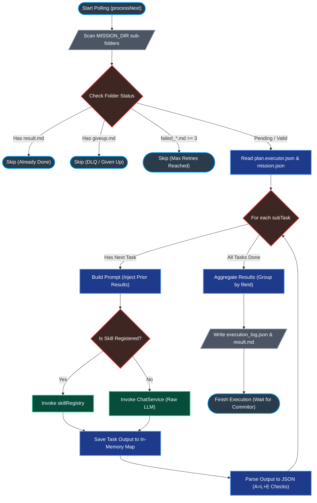

# ⚙️ 核心管線：00.1 非同步任務執行器 (Mission Executor Architecture)

> **Date**: 2026-05-15
> **Author**: Tzuhan
> **Target**: `src/services/mission.executor.service.ts`

本文件詳細拆解 iSunFA 最核心的非同步 AI 任務調度中心：`MissionExecutor`。它採用了極具巧思的**「檔案系統佇列 (File-System Queue)」**設計，在不引入 Redis / BullMQ 等重量級依賴的前提下，實現了高可用、具備死信重試與防無窮迴圈的穩健架構。

---

## 🗺️ 核心執行流程圖 (Execution Flowchart)

---

## 🔍 底層邏輯深度剖析 (Deep Dive)

`processNext()` 函式是這支 Worker 的心臟。以下是其底層邏輯的精確拆解：

### 1. 📂 任務篩選與優先級判定 (Filtering & Prioritization)

Worker 啟動後會掃描 `MISSION_DIR`（預設為 `missions/` 資料夾）。它的防禦性編程非常亮眼：

- **去重防護**：若資料夾存在 `result.md`，代表已完成，直接跳過。
- **死信防無窮迴圈 (DLQ Protection)**：若存在 `giveup.md` 或 `failed_*.md` 數量大於等於 3 次，代表這是個「毒藥任務 (Poison Pill)」，為避免燒光 Gemini API Token，強制跳過。
- **優先級降級**：若存在 1~2 個 `failed_*.md`，會將其放入 `fallbackTargetFolderInfo`，優先執行完全沒有失敗過的任務。

### 2. 🧠 上下文流轉 (In-Memory Context Passing)

在處理複雜的 `plan.executor.json`（例如：先解析發票，再推論分錄）時，系統設計了一個極度輕量的 State Machine：

- **`priorResults` Map**：這是一個存在記憶體中的 KV Store。當 `Task 1`（萃取廠商名稱）完成後，結果會被寫入 `priorResults`，隨後 `buildTaskPrompt()` 在準備 `Task 2`（查表分錄）時，可以直接取用前面的產出，實現了完美的「步驟串聯」。

### 3. 🤖 混合決策管線的分流 (Skill vs LLM)

這裡實作了我們引以為傲的「混合決策管線」，分為兩個層級的分流攔截（並已根據 ADR 007 廢棄了靜態廠商攔截器）：

1. **任務層級分流 (`skillRegistry` 與 RAG 管線)**：程式會檢查 `subTaskConfig.type` 是否為預先寫死的 TypeScript Skill（例如 `EsgParsingSkill` 採用 Two-Turn RAG，而 `VoucherLinesParsingSkill` 採用單回合萃取與決定論 RAG）。
2. **AI 推論 Fallback**：若非特定 Skill，才會退回到純粹的 `chatService.generateRaw()` 請求 Gemini 的推論。所有 AI 生成的分錄皆被標記為 `isVerified: false` 進入零信任狀態。

### 4. 📝 稽核軌跡與 JSON 解析 (Audit & JSON Extraction)

- **Token 消耗追蹤**：每執行完一個子任務，都會精確計算 `inputTokens` 與 `outputTokens`，並寫入 `execution_log.json`。這對企業估算營運成本極度重要。
- **殭屍任務防禦 (Zombie Fix)**：當 Executor 遭遇無法復原的崩潰時，除了寫入 `failed_*.md` 外，還會刻意生成一份包含錯誤標記的 `result.md`。這能強制推進狀態機，讓 Commitor 將失敗結果上鏈並由 Validator 正式拒絕，進而聯動整個系統的重試與死信佇列機制。
- **[已拔除] JSON 擷取技術債**：過去在遇到不合法的 JSON 時，會嘗試用 `/\{[\s\S]*\}/` 去擷取。我們已在 Phase 1.1 的「大拔除 (The Great Purge)」中將其徹底移除，全面強制升級為 Gemini API 的 `responseSchema` 與 `application/json` 驗證。
- **產出資料庫同步載荷 (DB Sync Payload)**：最後，系統會把解析出來的 `{ journal, voucherBase, esg }` 依照 `fileId` 打包成 `aggregatedResultsByFileId`，並將此結果封裝進 `dbSyncPayload` 中寫入 `result.md`。這份檔案後續將交由 Commitor 上傳至 IPFS (合約僅紀錄 CID)，最終由 Recorder 讀取並同步回主系統的 PostgreSQL 中。請注意：Worker 是一個完全獨立的外部節點，它從設計之初就沒有資料庫的存取權限，因此必須依賴這套 Payload 讓主系統進行非同步狀態對齊。

---

## 🏆 架構師評價與防禦機制實作 (Architectural Verdict & Defenses)

這支 `mission.executor.service.ts` 的架構品味極高，它的設計徹底貫徹了「去中心化與職責隔離」的原則。

### 🛡️ 獨立的外部節點與零資料庫權限 (Zero DB Access & IPFS Architecture)

Worker 是一個完全獨立的外部節點，**在物理層面被剝奪了主系統資料庫 (PostgreSQL) 的連線能力與存取權限，也沒有權限發起點數退款**。它的職責極度純粹：

1. **去區塊鏈尋找任務** ➔ **拉下來執行** ➔ **做好後回報區塊鏈**。我們不設計失敗退款邏輯，Worker 的唯一目標是「強制重試至成功」。
2. **極簡化檔案死信佇列 (File-System DLQ)**：當任務遭遇限流或被合約拒絕達上限時，回收員 (Fallbacker) 會在該任務目錄內寫入 `giveup.md` 標記檔 (Marker File) 將其轉為毒藥任務 (Poison Pill)。Worker 只要偵測到此標記就會實體跳過，純粹依賴本地檔案狀態機達成隔離，無須依賴額外的 Queue 系統。
3. **完全解耦的本地運算**：雖然系統的宏觀狀態建立在 IPFS 上，但 Executor 本身被完美解耦。它**完全不需要知道 IPFS 的存在**，只需針對本地傳統硬碟的 `MISSION_DIR` 進行單純的 I/O 讀寫。這大幅降低了 AI 運算節點的實作複雜度，也讓企業地端部署變得極度輕量。

### 🛡️ 徹底隔離的檔案系統 (Shared-Nothing Architecture)

由於 Worker 是自主去區塊鏈上聆聽並拉取任務，每個 Worker 節點都會在**完全獨立且隔離的本地檔案系統**中建立任務資料夾並執行。這意味著多個 Worker 之間**完全不需要共用掛載硬碟 (Shared Volume)**。

因為沒有共用硬碟，自然就從物理層面徹底消滅了分散式擴展時最難解的「競爭條件 (Race Condition)」。系統不需要實作任何 Redis Lock 或 POSIX `fs.mkdir` 原子鎖，節點間做到 100% Shared-Nothing Architecture，這使得 K8s 的橫向擴展變得極度輕量、純粹且具備無限擴展性。

---

## 🏗️ 職能分離與混合決定論管線 (Hybrid Deterministic Pipeline)

基於 Roadmap v2 的最高指導原則，我們正式將「不確定的機率推論」與「絕對的數學真理」拆分。以下為本系統企業級實作的職能分離對照表：

| 原始目標     | 舊做法 (有雷)           | 企業級新做法 (拆彈後)        | 核心優勢                   |
| ------------ | ----------------------- | ---------------------------- | -------------------------- |
| **描述事件** | AI 在採集時直接腦補故事 | 結算後由 AI 讀取真理數據分析 | 零捏造、具備審計追蹤能力   |
| **會計科目** | 暴力注入字典給 AI 猜    | 廠商規則引擎 ＋ 向量檢索     | 節省 Token、絕對穩定分錄   |
| **碳排計算** | 逼 AI 執行乘法運算      | AI 萃取數據 ＋ 後端精密計算  | 0% 數學誤差、符合 IFRS/ISO |

透過這樣的調整，iSunFA 系統的底層管線已從「依賴 AI 機率」正式轉向「依賴數學與業務恆等式」，真正達到四大會計師事務所 (Big 4) 的查帳合規標準。

---

## 🧮 輸出邊界與型別防護 (Output Boundary & Type Safety)

為了貫徹系統的「零誤差企業級數值架構」，`MissionExecutor` 的職責邊界有嚴格的型別管制與**「零數學」**鐵律：

- **零數學與零邏輯萃取 (Zero Math Extraction)**：AI 已經被完全剝奪了執行匯率乘法、稅額推估與跨月日期判斷的權限。Executor 產出的 JSON 僅為「未經數學驗證的草稿 (Raw Draft)」。
- **乾淨的 JSON 輸出**：Executor 僅負責將原始單據的字串、原始幣別與數字序列化為乾淨的 JSON 格式，並寫入本地 `result.md`。
- **邊界隔離**：Executor 絕不會引入 Prisma，也不負責操作 `BigInt`、`Prisma.Decimal` 等資料庫底層型別，更不會依賴租戶的 DB 設定去判斷稅法或匯率。這些高風險的型別鑄造（Type Casting）與「決定論攔截器 (FX, Tax, Cut-off)」全數保留給負責寫庫的 `MissionRecorder` 統一執行。這確保了 Executor 能成為一個真正獨立、無狀態的去中心化「神諭 (Oracle)」節點。
