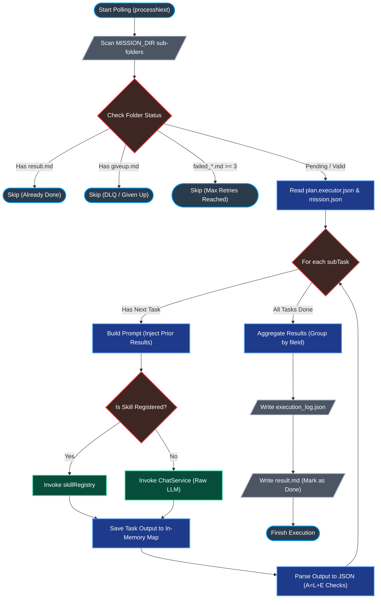

# ⚙️ 核心管線：00. 非同步任務執行器 (Mission Executor Architecture)

> **Date**: 2026-05-10
> **Author**: Tzuhan
> **Target**: `src/services/mission.executor.service.ts`

本文件詳細拆解 iSunFA 最核心的非同步 AI 任務調度中心：`MissionExecutor`。它採用了極具巧思的**「檔案系統佇列 (File-System Queue)」**設計，在不引入 Redis / BullMQ 等重量級依賴的前提下，實現了高可用、具備死信重試與防無窮迴圈的穩健架構。

---

## 🗺️ 核心執行流程圖 (Execution Flowchart)

---

## 🔍 底層邏輯深度剖析 (Deep Dive)

`processNext()` 函式是這支 Worker 的心臟。以下是其底層邏輯的精確拆解：

### 1. 📂 任務篩選與優先級判定 (Filtering & Prioritization)

Worker 啟動後會掃描 `MISSION_DIR`（預設為 `missions/` 資料夾）。它的防禦性編程非常亮眼：

- **去重防護**：若資料夾存在 `result.md`，代表已完成，直接跳過。
- **死信防無窮迴圈 (DLQ Protection)**：若存在 `giveup.md` 或 `failed_*.md` 數量大於等於 3 次，代表這是個「毒藥任務 (Poison Pill)」，為避免燒光 Gemini API Token，強制跳過。
- **優先級降級**：若存在 1~2 個 `failed_*.md`，會將其放入 `fallbackTargetFolderInfo`，優先執行完全沒有失敗過的任務。

### 2. 🧠 上下文流轉 (In-Memory Context Passing)

在處理複雜的 `plan.executor.json`（例如：先解析發票，再推論分錄）時，系統設計了一個極度輕量的 State Machine：

- **`priorResults` Map**：這是一個存在記憶體中的 KV Store。當 `Task 1`（萃取廠商名稱）完成後，結果會被寫入 `priorResults`，隨後 `buildTaskPrompt()` 在準備 `Task 2`（查表分錄）時，可以直接取用前面的產出，實現了完美的「步驟串聯」。

### 3. 🤖 混合決策管線的分流 (Skill vs LLM & Vendor Registry)

這裡實作了我們引以為傲的「混合決策管線」，分為三個層級的分流攔截：

1. **任務層級分流 (`skillRegistry`)**：程式會先檢查 `subTaskConfig.type` 是否為預先寫死的 TypeScript Skill。
2. **業務邏輯攔截 (`VENDOR_RULE_REGISTRY`)**：針對傳票解析，若上一步判定廠商為「中華電信」等已知特例，將直接強行攔截，走決定論查表邏輯，100% 杜絕 LLM 算數學。
3. **AI 推論 Fallback**：若上述兩道防線皆無命中，才會退回到純粹的 `chatService.generateRaw()` 請求 Gemini 的推論。

### 4. 📝 稽核軌跡與 JSON 解析 (Audit & JSON Extraction)

- **Token 消耗追蹤**：每執行完一個子任務，都會精確計算 `inputTokens` 與 `outputTokens`，並寫入 `execution_log.json`。這對企業估算營運成本極度重要。
- **[已拔除] JSON 擷取技術債**：過去在遇到不合法的 JSON 時，會嘗試用 `/\{[\s\S]*\}/` 去擷取。我們已在 Phase 1.1 的「大拔除 (The Great Purge)」中將其徹底移除，全面強制升級為 Gemini API 的 `responseSchema` 與 `application/json` 驗證。
- **回報智能合約 (而非資料庫)**：最後，系統會把解析出來的 `{ journal, voucherBase, esg }` 依照 `fileId` 打包成 `aggregatedResultsByFileId`，並將此結果封裝後，準備回報給區塊鏈上的智能合約。**請注意：Worker 是一個完全獨立的外部節點，它從設計之初就沒有 PostgreSQL 主資料庫的存取權限。**

---

## 🏆 架構師評價與防禦機制實作 (Architectural Verdict & Defenses)

這支 `mission.executor.service.ts` 的架構品味極高，它的設計徹底貫徹了「去中心化與職責隔離」的原則。

### 🛡️ 獨立的外部節點與 IPFS 儲存架構

Worker 是一個完全獨立的外部節點，**沒有權限存取主系統資料庫 (PostgreSQL)，也沒有權限發起點數退款**。它的職責極度純粹：
1. **去區塊鏈尋找任務** ➔ **拉下來執行** ➔ **做好後回報區塊鏈**。我們不設計失敗退款邏輯，Worker 的唯一目標是「強制重試至成功」。
2. **極簡化檔案死信佇列 (File-System DLQ)**：當任務遭遇限流或 JSON 失敗時，Worker 會利用本地 `MISSION_DIR/dlq/` 隔離毒藥任務 (Poison Pill)。這純粹作為 Worker 判斷自身執行狀態的依據，順便提供人類可讀的實體除錯軌跡。
3. **Web3 儲存基礎設施**：Worker 依賴的「檔案系統狀態機」並非傳統單機硬碟，而是建構在 **IPFS** 之上，並透過 **Laria** 進行檔案切塊 (Chunking) 與加密傳輸，底層更搭配 **Software RAID** 確保實體資料的高可用性與抗毀損能力。這種設計徹底取代了 Redis 或 BullMQ，完美達成了傳統意義上的「零依賴 (Zero-Dependency)」，大幅降低了主權雲端 (TWSC) 或大型企業地端部署的複雜度與資安稽核門檻。

### 🛡️ 徹底隔離的檔案系統 (Shared-Nothing Architecture)

由於 Worker 是自主去區塊鏈上聆聽並拉取任務，每個 Worker 節點都會在**完全獨立且隔離的本地檔案系統**中建立任務資料夾並執行。這意味著多個 Worker 之間**完全不需要共用掛載硬碟 (Shared Volume)**。

因為沒有共用硬碟，自然就從物理層面徹底消滅了分散式擴展時最難解的「競爭條件 (Race Condition)」。系統不需要實作任何 Redis Lock 或 POSIX `fs.mkdir` 原子鎖，節點間做到 100% Shared-Nothing Architecture，這使得 K8s 的橫向擴展變得極度輕量、純粹且具備無限擴展性。

---

## 🏗️ 職能分離與混合決定論管線 (Hybrid Deterministic Pipeline)

基於 Roadmap v2 的最高指導原則，我們正式將「不確定的機率推論」與「絕對的數學真理」拆分。以下為本系統企業級實作的職能分離對照表：

| 原始目標 | 舊做法 (有雷) | 企業級新做法 (拆彈後) | 核心優勢 |
| --- | --- | --- | --- |
| **描述事件** | AI 在採集時直接腦補故事 | 結算後由 AI 讀取真理數據分析 | 零捏造、具備審計追蹤能力 |
| **會計科目** | 暴力注入字典給 AI 猜 | 廠商規則引擎 ＋ 向量檢索 | 節省 Token、絕對穩定分錄 |
| **碳排計算** | 逼 AI 執行乘法運算 | AI 萃取數據 ＋ 後端精密計算 | 0% 數學誤差、符合 IFRS/ISO |

透過這樣的調整，iSunFA 系統的底層管線已從「依賴 AI 機率」正式轉向「依賴數學與業務恆等式」，真正達到四大會計師事務所 (Big 4) 的查帳合規標準。

---

## 🧮 全管線數值型別流轉 (End-to-End Type Flow)

為了貫徹「零誤差企業級數值架構」，本管線嚴格管制數值型別（Computation Types）的生命週期，並於主系統邊界設置防護機制：

1. **AI 萃取期 (Volatile JSON)**：AI 解析輸出的金額為原生的 `number` 或 `string`。此時資料被視為「未受信任 (Untrusted)」，嚴禁執行四捨五入或稅率運算。
2. **型別鑄造 (Type Casting)**：
   - **財務金流**（如 `VoucherLine.amount`）在寫入前，必須強制透過 `BigInt(Math.round(amount))` 轉換為 64-bit 大整數。
   - **ESG 碳排數據**（如活動數據、排放係數）因牽涉高精度小數，必須強制轉換為 `Prisma.Decimal` 實體。
3. **資料庫防護 (Database Boundary Guard)**：主系統的 Prisma 層實作了動態攔截器。若任何模組試圖將原生 `number` 直接寫入 `BigInt` 或 `Decimal` 欄位，將觸發 500 內部錯誤並退回，強制阻斷精度流失地雷。
4. **報表聚合防腐層 (MoneyUtil)**：當從資料庫撈出海量 `BigInt` 進行財報加總或比率計算時，全面統一使用基於 `Decimal.js` 的 `MoneyUtil` 進行安全運算，並以 `String` 型態安全地透過 JSON 傳遞給前端。
