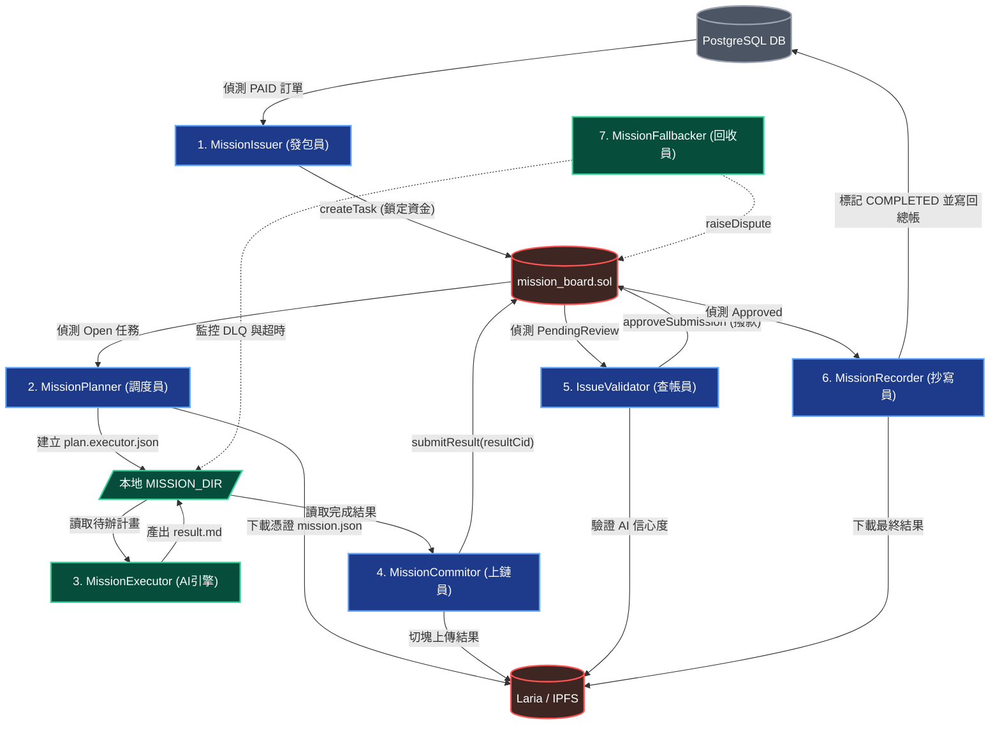

# ⚙️ 核心管線：00. 非同步微服務守護行程總覽 (The 7-Daemon Orchestration)

> **Date**: 2026-05-15
> **Author**: Tzuhan
> **Target**: `src/services/mission.*.service.ts`, `order.*.service.ts`

本文件詳細拆解 iSunFA 最核心的非同步 AI 任務調度架構。我們捨棄了傳統 Web2 的單體式輪詢與重量級依賴 (如 Redis / BullMQ)，轉而設計了一套由 **7 大獨立守護行程 (Daemons)** 組成的微服務架構。這些 Daemons 圍繞著區塊鏈智能合約 (`mission_board.sol`) 與去中心化檔案系統 (`IPFS/Laria`)，透過極具巧思的 **「檔案系統佇列 (File-System Queue)」** 與 **「狀態機接力」**，實現了高可用、具備死信重試與防無窮迴圈的穩健架構。

---

## 🗺️ 七大守護行程接力圖 (The 7-Daemon Ballet Flowchart)

---

## 🎭 角色職責深度解析 (Daemon Roles)

系統的狀態流轉完全交由智能合約接管，Node.js 端的這 7 支微服務**互不認識、不直接呼叫彼此**，只透過聆聽區塊鏈與本機檔案目錄來決定下一步動作 (Event-Driven & Shared-Nothing Architecture)。

### 1. `MissionIssuer` (發包員)
- **職責**：Web2 到 Web3 的實體橋樑。
- **動作**：不斷輪詢資料庫中狀態為 `PAID` 的訂單。找到後，向區塊鏈送出 `Approve` (授權扣款) 與 `createTask` (鑄造 NFT)，將使用者的原始憑證 `contentCid` 永久綁定，完成資金信託 (Escrow)。

### 2. `MissionPlanner` (調度員)
- **職責**：任務準備與在地化。
- **動作**：聆聽智能合約上狀態為 `Open (0)` 的任務。拿到任務後，從 IPFS 下載使用者的原始 `mission.json`，並在本地建立隔離的 `MISSION_DIR`，同時產出供 AI 讀取的 `plan.executor.json`。

### 3. `MissionExecutor` (AI 運算引擎)
- **職責**：系統的算力心臟，執行純粹的 AI 推論與決定論管線。
- **動作**：掃描 `MISSION_DIR`。執行混合決策管線 (Skill vs LLM)，將結果寫成 `result.md`。若發生錯誤，則寫入 `failed_*.md` 供後續重試；若嚴重崩潰，則寫入 `giveup.md` (DLQ)。

### 4. `MissionCommitor` (上鏈員)
- **職責**：產出保護與提交。
- **動作**：掃描本地 `MISSION_DIR` 找出執行完畢的 `result.md`。將其切塊並加密上傳至 Laria (IPFS) 取得 `resultCid`，接著呼叫合約的 `submitResult`，將任務推至 `PendingReview (1)`。

### 5. `IssueValidator` (自動化查帳員)
- **職責**：取代傳統的人工覆核 (HITL)。
- **動作**：聆聽合約上 `PendingReview` 的任務。將 IPFS 上的結果下載後進行規則驗證（例如確認 AI 信心度是否為滿分）。若驗證無誤，發送 `approveSubmission` 交易解鎖資金並放行任務。

### 6. `MissionRecorder` (總帳抄寫員)
- **職責**：將 Web3 的真相寫回 Web2 供使用者檢視。
- **動作**：聆聽合約上 `Approved (2)` 的任務。從 IPFS 抓回最終確定版的產出，安全地寫回 PostgreSQL 總帳本，並將原本的訂單標記為 `COMPLETED`。

### 7. `MissionFallbacker` (爭議與回收員)
- **職責**：處理邊界錯誤與死信佇列 (DLQ)。
- **動作**：負責清理本地目錄的殭屍任務，並在 Validator 拒絕結果或是 AI 產生幻覺時，負責強制重啟執行緒，或是呼叫合約的 `raiseDispute` 進入爭議仲裁賽局。

---

## 🏆 架構師評價與防禦機制實作 (Architectural Defenses)

### 🛡️ 徹底隔離的檔案系統 (Shared-Nothing Architecture)
由於 Planner 與 Executor 依賴的是本地的檔案系統狀態機，這意味著多個 Worker 之間**完全不需要共用掛載硬碟 (Shared Volume)**。
因為沒有共用硬碟，自然就從物理層面徹底消滅了分散式擴展時最難解的「競爭條件 (Race Condition)」。系統不需要實作任何 Redis Lock，K8s 的橫向擴展變得極度輕量、純粹且具備無限擴展性。

### 🏗️ 混合決定論管線 (Hybrid Deterministic Pipeline)
Executor 的內部實作了「不確定的機率推論」與「絕對的數學真理」拆分。
1. **任務層級分流 (`skillRegistry`)**：判斷是否為預先寫死的 TypeScript 技能。
2. **廠商查表防禦 (`VendorRegistry`)**：決定論查表，100% 杜絕 LLM 猜測會計科目。
3. **AI 推論 Fallback**：若皆無命中，才會退回到純粹的 Gemini API 請求。

### 🧮 數值型別防腐層 (Type Flow & Anti-Corruption)
整個管線嚴格管制數值型別：
1. **AI 萃取期 (Volatile JSON)**：視為原生 `number`，未受信任。
2. **型別鑄造 (Type Casting)**：強制轉為 `BigInt` (財務金額) 或 `Decimal` (碳排係數)。
3. **資料庫與聚合防禦**：全面透過基於 `Decimal.js` 的 `MoneyUtil` 防腐層進行後續運算，並受到 Prisma Boundary Guard 的嚴密保護，徹底阻絕浮點數漂移。
