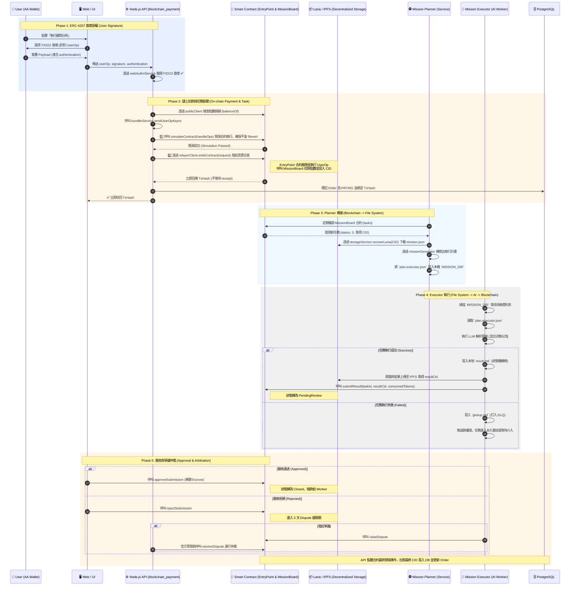

# 05 Consultant Analysis & Payment On-Chain Flow

> **Date**: 2026-05-15
> **Author**: Tzuhan
> **Document Status**: Active (Architectural Blueprint)
> **Core Tech**: ERC-4337, AA Wallet, Escrow, IPFS, Event Sourcing

本文件詳細記錄了從使用者在前端發起「顧問分析 / 憑證解析 (Journal)」開始，經歷「簽章授權」、「訂單扣款」、「非同步任務執行」、「區塊鏈狀態錨定 (On-Chain Anchoring)」，到任務結算與觸發「去中心化爭議仲裁 (Dispute Arbitration)」的完整生命週期序列圖 (Sequence Diagram)。

此流程完美體現了 iSunFA 系統的「零信任架構」與「無退款之強制重試機制 (No-Refund & Retry-Until-Success)」。

## 🔄 核心交易序列圖 (Core Execution Sequence)

以下序列圖涵蓋了前端 (Client)、API 閘道 (Gateway)、資料庫 (DB)、非同步任務處理程序 (Async Worker) 以及區塊鏈智能合約 (Blockchain) 之間的完整交互。

## 🏗️ 關鍵架構防禦點 (Architectural Gotchas & Defenses)

1. **極致去中心化與職責解耦：Blockchain ↔ Planner ↔ Executor ↔ Blockchain ✅ 已實作**：
   系統完全切斷了 API 直接呼叫 AI 的路徑。API 只負責把 UserOp 丟上鏈；`MissionPlanner` 只負責從鏈上抓 CID 下載檔案並寫入本地 `MISSION_DIR`；`MissionExecutor` (Worker) 只負責掃描本地 IPFS/Laria 檔案系統執行 AI。**請注意：Worker 是一個獨立的外部節點，完全沒有存取 PostgreSQL 主資料庫的權限。** 它執行完畢後，會將結果封裝並直接回報給區塊鏈智能合約。
2. **不可否認性 (Non-repudiation) ✅ FIDO2 已實作**：
   所有的「發起解析 / 扣款」動作，都必須在前端使用 FIDO2 進行簽章。後端透過 `webAuthnService` 計算真實 `trueUserOpHash` 比對，確保四大會計師查核時無法被 DBA 竄改。
3. **區塊鏈智能合約扣款 (On-chain ERC-4337 UserOp) ✅ 已實作**：
   呼叫 `bundlerService.sendUserOpAsync` 將 UserOp 發送至 EntryPoint 智能合約前，會先透過 `publicClient.simulateContract` 進行鏈上預演，確保使用者簽章正確且點數足夠扣款，避免發送註定會 Revert 的垃圾交易。確認安全後才呼叫 `writeContract` 發射，並由 `MissionBoard` 合約進行原子扣款並紀錄 CID，達成 Web3 級別的分散式資金流動。
4. **無退款之無限重試防禦 (No-Refund & Retry-Until-Success) ✅ 已實作**：
   有別於傳統 Web2 會因為伺服器錯誤而發動 Saga 退款，我們的 Worker **從設計之初就沒有發起智能合約退款的權限**。當任務遭遇 LLM 限流或異常時，Worker 僅會將其隔離至 `MISSION_DIR/dlq/` (`giveup.md`)。這純粹作為狀態判斷與人類實體除錯軌跡。Worker 的唯一目標是重試至成功，不走妥協的退款機制。
5. **去中心化資金信託與仲裁 (Escrow & Arbitration) ✅ 合約已實作**：
   Worker 上傳結果後，並非直接寫入資料庫，而是呼叫 `submitResult` 將 IPFS CID 與 Token 消耗量寫上鏈，進入 `PendingReview`。發起方確認無誤後呼叫 `approveSubmission` 才會解鎖智慧合約中的 ISC 報酬。若遇爭議則進入 `rejectSubmission` 與 `raiseDispute` 的仲裁賽局，達成任務流程與金流的三位一體。
