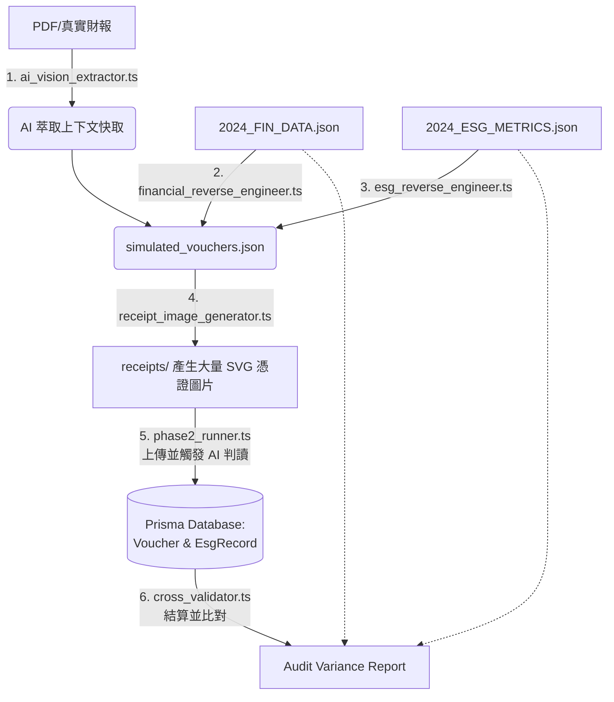

# 🏭 iSunFA E2E 系統工廠設計圖 (Pipeline Blueprint)

> **Date**: May 2026
> **Scope**: `src/scripts/e2e-seeder/*`
> **Info**: (20260505 - Tzuhan)

我們的大型端到端測試工廠（Orchestrator: `run_pipeline.ts`）共由 **六大工作單元 (Working Units)** 所組成。以下是資料流銜接的管線架構：

## 🗺️ 系統架構與管線圖

### 📦 單位功能詳解：
1. **[資料備料] `ai_vision_extractor.ts`**：讀取目標企業的真實背景，產出「背景快取」，決定後續生成資料的「特性」（如供應商名稱、碳排主要來源）。
2. **[財務逆推] `financial_reverse_engineer.ts`**：讀取 Ground Truth (2024_FIN_DATA)，向下拆解成數百筆含有借貸方的 `simulated_vouchers.json`。
3. **[ESG 逆推] `esg_reverse_engineer.ts`**：讀取碳盤查 Ground Truth，將 Scope 1/2 的排放量「掛載」回剛剛產生的水電、差旅傳票上。
4. **[實體加工] `receipt_image_generator.ts`**：把這幾百筆 JSON 傳票，透過 15% 隨機加噪邏輯，轉譯為難以辨識的 `*.svg` 圖片，作為模擬原始憑證。
5. **[上線測試] `phase2_runner.ts`**：模擬 Client 端操作，清空 DB，並將圖片餵給 `VoucherLinesParsingSkill` 與 `EsgParsingSkill`。系統將 AI 的 OCR+Semantic 結果正式入庫。
6. **[品管驗收] `cross_validator.ts`**：從資料庫拉出經過 AI 解析的傳票與 ESG 紀錄，加總後跟最一開始的 Ground Truth 進行「零誤差盲測」，產出 Variance Report。
