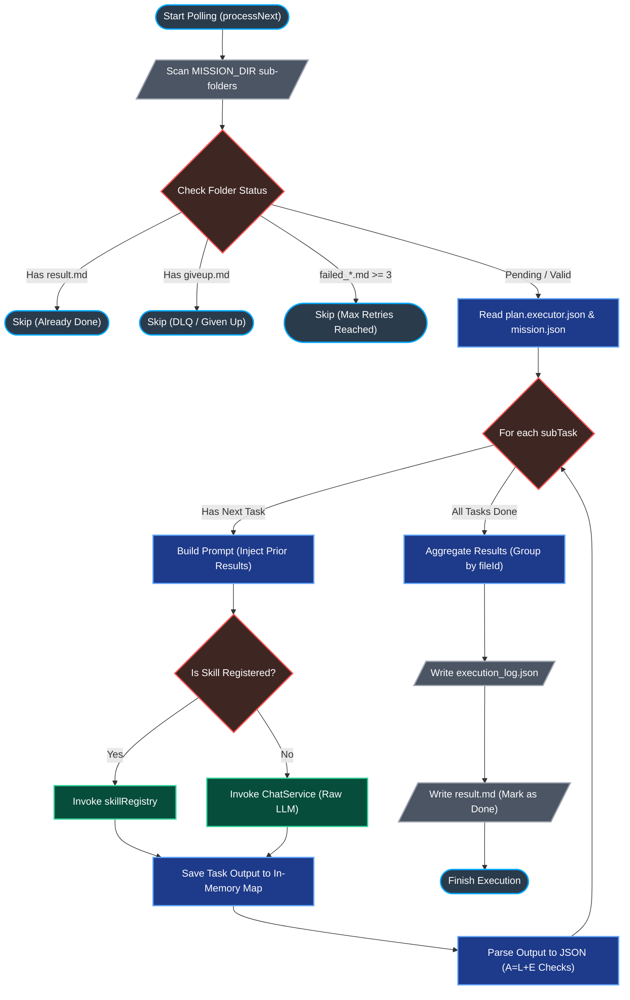

# ⚙️ 核心管線：00. 非同步任務執行器 (Mission Executor Architecture)

> **Date**: 2026-05-10
> **Author**: Tzuhan
> **Target**: `src/services/mission.executor.service.ts`

本文件詳細拆解 iSunFA 最核心的非同步 AI 任務調度中心：`MissionExecutor`。它採用了極具巧思的**「檔案系統佇列 (File-System Queue)」**設計，在不引入 Redis / BullMQ 等重量級依賴的前提下，實現了高可用、具備死信重試與防無窮迴圈的穩健架構。

---

## 🗺️ 核心執行流程圖 (Execution Flowchart)

---

## 🔍 底層邏輯深度剖析 (Deep Dive)

`processNext()` 函式是這支 Worker 的心臟。以下是其底層邏輯的精確拆解：

### 1. 📂 任務篩選與優先級判定 (Filtering & Prioritization)

Worker 啟動後會掃描 `MISSION_DIR`（預設為 `missions/` 資料夾）。它的防禦性編程非常亮眼：

- **去重防護**：若資料夾存在 `result.md`，代表已完成，直接跳過。
- **死信防無窮迴圈 (DLQ Protection)**：若存在 `giveup.md` 或 `failed_*.md` 數量大於等於 3 次，代表這是個「毒藥任務 (Poison Pill)」，為避免燒光 Gemini API Token，強制跳過。
- **優先級降級**：若存在 1~2 個 `failed_*.md`，會將其放入 `fallbackTargetFolderInfo`，優先執行完全沒有失敗過的任務。

### 2. 🧠 上下文流轉 (In-Memory Context Passing)

在處理複雜的 `plan.executor.json`（例如：先解析發票，再推論分錄）時，系統設計了一個極度輕量的 State Machine：

- **`priorResults` Map**：這是一個存在記憶體中的 KV Store。當 `Task 1`（萃取廠商名稱）完成後，結果會被寫入 `priorResults`，隨後 `buildTaskPrompt()` 在準備 `Task 2`（查表分錄）時，可以直接取用前面的產出，實現了完美的「步驟串聯」。

### 3. 🤖 混合決策管線的分流 (Skill vs LLM & Vendor Registry)

這裡實作了我們引以為傲的「混合決策管線」，分為三個層級的分流攔截：

1. **任務層級分流 (`skillRegistry`)**：程式會先檢查 `subTaskConfig.type` 是否為預先寫死的 TypeScript Skill。
2. **業務邏輯攔截 (`VENDOR_RULE_REGISTRY`)**：針對傳票解析，若上一步判定廠商為「中華電信」等已知特例，將直接強行攔截，走決定論查表邏輯，100% 杜絕 LLM 算數學。
3. **AI 推論 Fallback**：若上述兩道防線皆無命中，才會退回到純粹的 `chatService.generateRaw()` 請求 Gemini 的推論。

### 4. 📝 稽核軌跡與 JSON 解析 (Audit & JSON Extraction)

- **Token 消耗追蹤**：每執行完一個子任務，都會精確計算 `inputTokens` 與 `outputTokens`，並寫入 `execution_log.json`。這對企業估算營運成本極度重要。
- **JSON 擷取技術債**：目前程式碼 (約 L196) 在遇到不合法的 JSON 時，會嘗試用 `/\{[\s\S]*\}/` 去擷取。**（注意：此處依據 Roadmap v2 將全面汰換為 `responseMimeType: "application/json"` 與強 Schema 驗證）。**
- **資料庫寫入準備**：最後，系統會聰明地把解析出來的 `{ journal, voucherBase, esg }` 依照 `fileId` 打包成 `aggregatedResultsByFileId`，等待下一步被 Commit 進 Prisma 資料庫。

---

## 🏆 架構師評價 (Architectural Verdict)

這支 `mission.executor.service.ts` 的架構品味極高。它利用**「檔案系統狀態機」**（用不同檔名的檔案代表任務狀態）取代了 Redis，這大幅降低了主權雲端地端部署的複雜度（Zero-Dependency）。結合 `giveup.md` 的防呆機制，這是一套完全夠格稱為 Enterprise-Ready 的非同步引擎。
