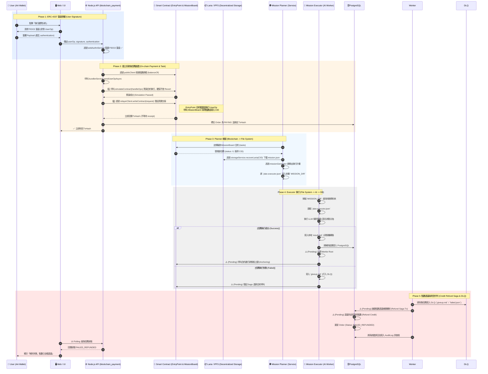

# 05 Consultant Analysis & Payment On-Chain Saga

本文件詳細記錄了從使用者在前端發起「顧問分析 / 憑證解析 (Journal)」開始，經歷「簽章授權」、「訂單扣款」、「非同步任務執行」、「區塊鏈狀態錨定 (On-Chain Anchoring)」，到任務失敗時觸發的「點數退還機制 (Credit Refund Saga)」的完整生命週期序列圖 (Sequence Diagram)。

此流程完美體現了 iSunFA 系統的「零信任架構」與「分散式交易補償機制」。

## 🔄 核心交易序列圖 (Core Saga Sequence)

以下序列圖涵蓋了前端 (Client)、API 閘道 (Gateway)、資料庫 (DB)、非同步任務處理程序 (Async Worker) 以及區塊鏈智能合約 (Blockchain) 之間的完整交互。

## 🏗️ 關鍵架構防禦點 (Architectural Gotchas & Defenses)

1. **極致解耦：Blockchain ↔ Planner ↔ Executor ↔ DB**：
   系統完全切斷了 API 直接呼叫 AI 的路徑。API 只負責把 UserOp 丟上鏈；`MissionPlanner` 只負責從鏈上抓 CID 下載檔案並寫入本地 `MISSION_DIR`；`MissionExecutor` 只負責掃描本地檔案系統執行 AI。這種「零耦合」的 File-System State Machine 架構，讓系統能抵禦極端流量峰值。
2. **不可否認性 (Non-repudiation) ✅ FIDO2 已實作**：
   所有的「發起解析 / 扣款」動作，都必須在前端使用 FIDO2 進行簽章。後端透過 `webAuthnService` 計算真實 `trueUserOpHash` 比對，確保四大會計師查核時無法被 DBA 竄改。
3. **區塊鏈智能合約扣款 (On-chain ERC-4337 UserOp) ✅ 已實作**：
   呼叫 `bundlerService.sendUserOpAsync` 將 UserOp 發送至 EntryPoint 智能合約前，會先透過 `publicClient.simulateContract` 進行鏈上預演，確保使用者簽章正確且點數足夠扣款，避免發送註定會 Revert 的垃圾交易。確認安全後才呼叫 `writeContract` 發射，並由 `MissionBoard` 合約進行原子扣款並紀錄 CID，達成 Web3 級別的分散式資金流動。
4. **⚠️ (Pending) 退款補償機制 (Saga Pattern)**：
   當 LLM 服務中斷被打入 DLQ (`giveup.md`) 時，Executor 必須具備「發起逆向智能合約退款」的 Saga 補償能力，確保使用者點數原機退還。目前僅實作寫入 DLQ。
5. **⚠️ (Pending) 狀態根上鏈 (State Root Anchoring)**：
   任務成功後，除了寫入 DB，Executor 需計算結果的 Merkle Root 寫回區塊鏈智能合約。政府稽核員未來只需比對鏈上 Hash 與本地資料庫 Hash 即可。
