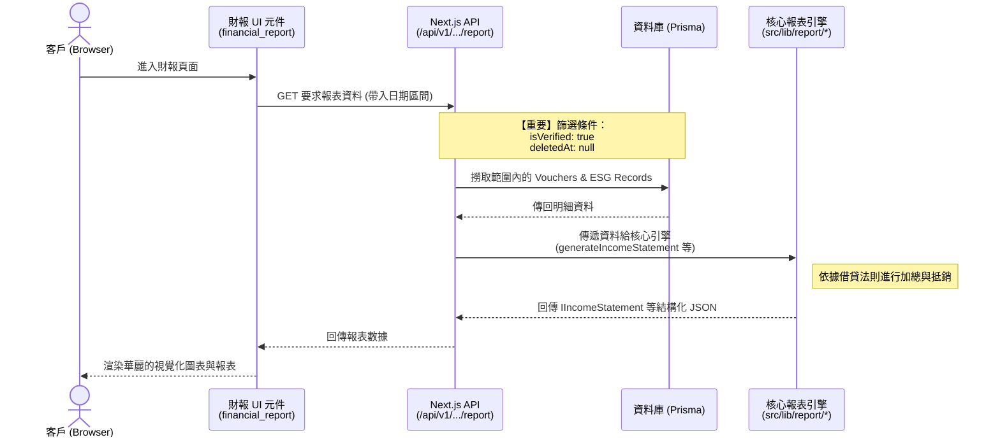
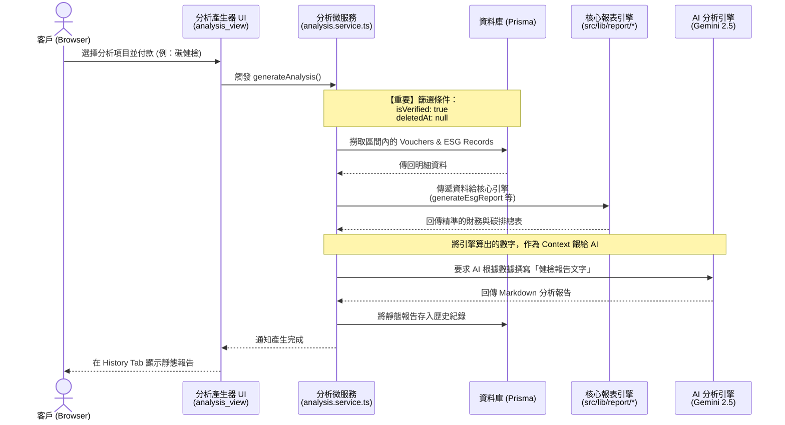

# 系統報表產出架構解析 (Sequence Diagrams)

> **Info**: (20260505 - Tzuhan)

## 以下是 iSunFA 系統內兩個產出財報與碳排查的關鍵模組序列圖。

## 1. 即時財報與儀表板模組 (Real-time Financial Report)

**觸發點**：使用者進入 `src/components/user/financial_report/*_view.tsx`
**特性**：每次進入頁面或調整日期時，即時向後端索取由「已核對傳票 (Verified)」即時運算出的報表數據。

---

## 2. AI 深度分析與碳健檢模組 (AI Analysis Report)

**觸發點**：使用者在 `src/components/user/analysis/analysis_view.tsx` 選擇內部數據分析 (INTERNAL_CATEGORIES) 並付款生成。
**特性**：非即時，而是「快照 (Snapshot)」。將當下系統計算出的財報數字，送交給 Gemini 進行深度分析，並產出靜態報告。

---

### 架構洞察與終極願景 (Architectural Insights & Ultimate Vision)

從上述兩張圖可以清楚看出：即時財報與靜態 AI 深度分析，這兩個看起來完全不同的功能，**在最深處都是依賴同一個「核心報表引擎 (`src/lib/report/*`)」** 來算出總和。

#### 🎯 E2E 如何成為我們願景的護城河？

既然所有對外產出的最高級財務與 ESG 指標，都源自於這個唯一的核心報表引擎，那麼我們透過 E2E 管線 (`src/scripts/e2e-seeder`) 在極端雜訊下對此引擎所進行的「零誤差盲測與三表勾稽驗證」，就不僅僅是除錯，而是**實踐我們商業願景的核心基石**。

**我們的終極目標 (The Ultimate Vision)：**

1. **四大會計師標準 (Big 4 CPA Standard)**：確保系統產出的財報與碳排查最終報告，無論在雙軌驗證或數學恆等式上，都達到四大會計師事務所的查帳標準。
2. **成為業內標竿 (Industry Benchmark)**：以絕對精準、抗雜訊的資料管線，成為 ESG 與財務混合審計的業界黃金標準。
3. **政府與官方稽核系統 (Government Audit Ready)**：讓政府機關可以直接使用我們的系統架構作為合規審查的底層引擎。
4. **化被動為主動的合作 (Force Multiplier for CPAs)**：當我們的 E2E 系統能穩定扛住千億級帳務，且具備零偏差的報表生成能力時，會計師事務所將不得不放棄傳統的人工審閱，主動尋求與 iSunFA 系統串接合作。

---

## 📌 文件維護指南 (When to Update)

這份文件定義了依賴報表引擎的雙軌架構，當發生以下情況時必須同步更新：

- **新增依賴模組**：若未來開發了如「批次匯出 PDF 報表微服務」或「即時財報警示系統」，需要將其 Sequence Diagram 補入此文件，以維持系統架構圖的完整性。
- **核心引擎抽離**：若 `src/lib/report/*` 未來被重構為獨立運行的跨語言微服務 (如 Golang/Rust)，必須更新此架構圖中的通訊協定與流程。
