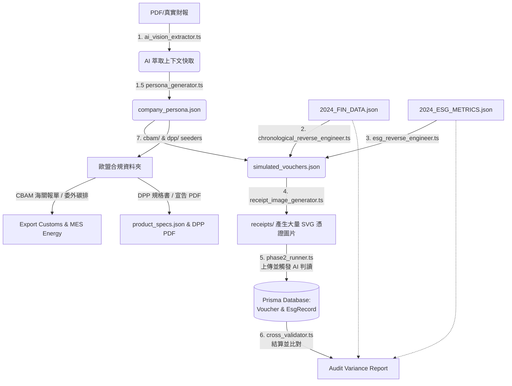

# 🧪 iSunFA E2E 全端測試管線架構解析 (E2E Testing Architecture)

> **Date**: 2026-05-06
> **UpdateAt**: 2026-06-04
> **Author**: Tzuhan
> **Version**: 1.1
> **Scope**: `src/scripts/e2e-seeder/*`
> **Context**: 指引新接手的開發者（人類或 AI）理解 iSunFA 複雜的 E2E 測試腳本生態系。

## 🎯 什麼是 iSunFA 的 E2E 系統？

在多數的軟體專案中，E2E (End-to-End) 測試通常只是用 Cypress 或 Playwright 點擊前端畫面。但 iSunFA 的 E2E 系統 (`src/scripts/e2e-seeder`) 是一個極度龐大的**「對抗式 AI 視覺基準測試 (Adversarial AI Vision Benchmark) 與資料管線壓力測試框架」**。

它不只驗證程式碼會不會報錯，它的核心使命是：**在極端惡劣的資料環境下，驗證我們報表核心引擎 (`src/lib/report/*`) 的絕對正確性。**

---

## 🗺️ 系統架構與管線圖 (Pipeline Blueprint)

整個大型端到端測試工廠（Orchestrator: `run_pipeline.ts`）共由 **六大工作單元 (Working Units)** 所組成，資料流銜接的管線架構如下：

### 📦 工作單元詳解：

1. **[資料備料] `ai_vision_extractor.ts`**：讀取目標企業的真實背景，產出「背景快取」。
1.5. **[對抗式企業畫像] `persona_generator.ts`**：基於背景快取與 Google 搜尋 Grounding，透過 AI 進行 8 次自我對抗（Generator vs Auditor），產生極度擬真的供應商清單、關係人與金額分佈 (`company_persona.json`)。這確保了壓測資料具備產業特徵（如半導體廠會出現 EDA 軟體費）。
2. **[時序性逆推引擎] `chronological_reverse_engineer.ts`**：這是 E2E 管線的心臟。它讀取 Ground Truth (2024_FIN_DATA) 與企業畫像，透過「精確分配演算法 (Exact Sum Allocator)」將千億級財報總額，切割成數萬筆具備真實供應商的憑證，並隨機撒佈於 365 天中。在生成的過程中，它會**每日呼叫報表引擎進行斷言**，確保在第 365 天結束時，A=L+E 完美配平，且總額與 Ground Truth 「一毛不差」。
3. **[ESG 逆推] `esg_reverse_engineer.ts`**：讀取碳盤查 Ground Truth，將 Scope 1/2 的排放量「掛載」回剛剛產生的水電、差旅傳票上。
4. **[實體加工] `receipt_image_generator.ts`**：把這幾百筆 JSON 傳票，透過 15% 隨機加噪邏輯，轉譯為難以辨識的 `*.svg` 圖片，作為模擬原始憑證。
5. **[上線測試] `phase2_runner.ts`**：模擬 Client 端操作，清空 DB，並將圖片餵給 `VoucherLinesParsingSkill` 與 `EsgParsingSkill`。系統將 AI 的 OCR+Semantic 結果正式入庫。
6. **[品管驗收] `cross_validator.ts`**：從資料庫拉出經過 AI 解析的傳票與 ESG 紀錄，加總後跟最一開始的 Ground Truth 進行「零誤差盲測」，產出 Variance Report。
7. **[歐盟合規分支] `cbam/*` & `dpp/*`**：透過 `persona_generator.ts` 產生的畫像，進一步產生 100% 擬真的歐盟 CBAM 前驅物/海關申報資料，以及 DPP (數位產品護照) 要求的生命週期、物理耐久度與化學品宣告信。這是作為攻打大廠供應鏈盡職調查 (DDP) 專案的核心武器。

---

## 🕵️‍♂️ E2E 系統的四大隱藏任務 (The 4 Hidden Missions)

除了驗證會計引擎，這套管線還肩負了以下四大任務：

### 1. 逆向工程與擬真數據產生 (Reverse Engineering & Smart Mocking)

- **核心腳本**：`persona_generator.ts`, `chronological_reverse_engineer.ts`, `esg_reverse_engineer.ts`
- **機制**：多數測試只會隨機塞入假數字。但這組腳本具備**「時序性財報逆推與對抗生成能力」**。它首先透過 8 輪對抗生成該企業的專屬供應商畫像，接著讀取真實上市櫃公司（如台積電、巨大機械）的千億級總營收與總費用，自動「逆向拆解」成數萬筆符合會計借貸法則與真實外觀的擬真傳票分錄。這讓系統能在無需真實發票授權的情況下，進行企業級規模、365 天連續性的極限壓力測試。

### 2. 對抗式 AI 視覺壓力測試 (Adversarial Visual Red-Teaming)

- **核心腳本**：`receipt_image_generator.ts`
- **機制**：我們不提供乾淨的 JSON 給 AI。這個腳本會將假傳票渲染成實體 SVG 圖片，並刻意注入 **15% 的視覺雜訊（如高斯模糊、遺失統編、隨機髒污刮痕）**。這是一種標準的紅隊演練 (Red-Teaming)，目的是逼出外部 LLM (如 Gemini) 在面對受損實體發票時的物理極限與幻覺率 (Hallucination Rate)。

### 3. 管線吞吐量與併發容忍測試 (Throughput & Concurrency Test)

- **核心腳本**：`run_all_enterprises.ts`, `phase2_runner.ts`
- **機制**：當同時送入近百張複雜的發票圖片時，系統會面臨嚴苛的 API Rate Limit (HTTP 429) 挑戰。腳本中實作了 `p-limit` 併發控制，不僅測試外部 API 的穩定性，也測試 Node.js 在高 IO 負載下是否會發生靜默遺失 (Silent Data Loss)。

### 4. 絕對冪等性的狀態管理 (Idempotent State Management)

- **核心腳本**：`export_phase2_db.ts`, `import_phase2_db.ts`, 資料庫清理邏輯
- **機制**：E2E 管線具備了「無損快照與還原」機制。它驗證了系統的**冪等性 (Idempotency)**：無論測試腳本被執行 1 次還是 100 次，資料庫都不應累積殘留的髒資料（例如曾發生過的碳排翻倍 Bug）。每次執行都必須能在絕對乾淨的 Baseline 上重現。

---

## 🧠 核心心法：引擎驗證與「垃圾進，垃圾出」

在閱讀或修改 E2E 腳本時，必須牢記一個架構大前提：**E2E 盲測的核心目的是為了檢驗 `src/lib/report/*` 報表引擎的絕對正確性。**

1. **直接注入資料庫並非漏洞**：
   在 `phase2_runner.ts` 中，腳本會直接將「期末折舊 (ADJ-)」寫入資料庫。在生產環境中這是違反內控的，但在測試環境中這是**必須**的。因為 OCR 無法辨識無實體發票的折舊，如果不手動注入，會計恆等式就無法配平。這證明了：只要資料庫的借貸是平的，核心引擎就 100% 絕對正確。
2. **坦然接受 Garbage In, Garbage Out**：
   當 15% 的雜訊導致 AI 將碳排誤判為 `SCOPE_3`，或網路斷線導致漏單時，產出的報表必定會出現極端誤差（例如營收 -46% 或 Scope 3 暴增 +141%）。這不代表報表引擎壞了，反而證明了引擎**極度誠實且強健**，它完美地反應了基礎設施的管線斷裂，而沒有發生系統崩潰 (Crash)。

---

## 📌 文件維護指南 (When to Update)

- **測試範圍擴展**：未來若 E2E 管線不再依賴純粹的視覺 OCR，而是開始模擬對接「供應商碳排 API」，必須更新此架構文件中的第二點任務。
- **佇列系統導入**：若 Phase 6 正式將 `src/scripts` 整合至正規的 Message Queue (如 BullMQ) 進行非同步併發測試，需更新第三點吞吐量測試的說明。
