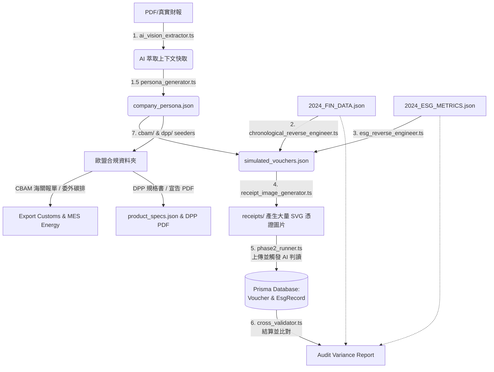

# 🧪 iSunFA 端到端 (E2E) 測試與審計管線指南 (E2E Testing & Audit Pipeline Guide)

> **Date**: June 2026
> **Version**: 1.2
> **Status**: Active
> **Context**: 指引開發者與審計團隊理解 iSunFA 複雜的 E2E 測試與數據生成管線。

---

## 📖 目錄

1. [第 1 章：E2E 測試管線架構解析](#第-1-章e2e-測試管線架構解析)
2. [第 2 章：E2E 管線執行步驟指南](#第-2-章e2e-管線執行步驟指南)
3. [第 3 章：企業導入流程與 CLI 參數 (Onboarding)](#第-3-章企業導入流程與-cli-參數-onboarding)
4. [第 4 章：時序性財務逆推引擎分析](#第-4-章時序性財務逆推引擎分析)
5. [第 5 章：歐盟 CBAM 碳追溯全端生成架構](#第-5-章歐盟-cbam-碳追溯全端生成架構)
6. [第 6 章：E2E 交叉驗證與四大審計指標](#第-6-章e2e-交叉驗證與四大審計指標)
7. [第 7 章：E2E 盲測基準標的與選樣策略](#第-7-章e2e-盲測基準標的與選樣策略)

---

## 第 1 章：E2E 測試管線架構解析

### 1. 什麼是 iSunFA 的 E2E 系統？

在多數的軟體專案中，E2E (End-to-End) 測試通常只是用 Cypress 或 Playwright 點擊前端畫面。但 iSunFA 的 E2E 系統 (`src/scripts/e2e-seeder`) 是一個極度龐大的**「對抗式 AI 視覺基準測試 (Adversarial AI Vision Benchmark) 與資料管線壓力測試框架」**。

它不只驗證程式碼會不會報錯，它的核心使命是：**在極端惡劣的資料環境下，驗證我們報表核心引擎 (`src/lib/report/*`) 的絕對正確性。**

### 2. 系統架構與管線圖 (Pipeline Blueprint)

整個大型端到端測試工廠（Orchestrator: `run_pipeline.ts`）共由 **六大工作單元 (Working Units)** 所組成，資料流銜接的管線架構如下：



#### 2.1 工作單元詳解

1. **[資料備料與 AI 視覺萃取] `ai_vision_extractor.ts`**：
   這是整個管線的基因庫！腳本會直接吞吐 `inputs/raw_reports/` 底下的真實 PDF（例如 `2024_FIN_REPORT.pdf` 與 `2024_ESG_REPORT.pdf`）。透過呼叫 Gemini Vision 模型並轉換為「專業會計師暨 ESG 稽核員」的 Persona，從幾萬字的公開報告中精準萃取出該企業的「真實營運特徵 (Operational Nuances)」——包含真實的碳排來源 (Scope 1/2 大宗)、綠電佈局與供應鏈輪廓，打包成 Context Cache。
   > **💡 跨年度推估機制 (Cross-Year Extrapolation)**：若缺乏目標年份（如 2025 年）的真實報告，本腳本具備歷史回溯能力。AI 會自動錨定舊年度（如 2024 年）的碳排基線與供應鏈輪廓，邏輯推演出目標年份的營運特徵，解決「ESG 報告時間差 (Time-Lag)」的痛點。

1.5. **[對抗式企業畫像] `persona_generator.ts`**：
   基於萃取出的背景快取，透過 AI 進行 8 次自我對抗（Generator vs Auditor），產生極度擬真的供應商清單、關係人與金額分佈 (`company_persona.json`)。這確保了壓測資料**並非憑空捏造，而是深度根植於真實企業的體質**。
   > **💡 總經專家推演 (Macroeconomic Forecaster)**：除了 CPA、ESG 與資安專家，我們特別引入了第四位「總體經濟預測專家」進行 AI 腦力對抗。它會根據真實世界的總經數據（如工業電價調漲、通膨率），對企業未來的營收與碳排提出嚴格的增減挑戰，確保跨年度推估資料具備極高的商業邏輯與「Audit-Ready」說服力。

2. **[時序性逆推引擎] `chronological_reverse_engineer.ts`**：
   這是 E2E 管線的心臟。它讀取 Ground Truth (2024_FIN_DATA) 與企業畫像，透過「精確分配演算法 (Exact Sum Allocator)」將千億級財報總額，切割成數萬筆具備真實供應商的憑證，並隨機撒佈於 365 天中。在生成的過程中，它會**每日呼叫報表引擎進行斷言**，確保在第 365 天結束時，A=L+E 完美配平，且總額與 Ground Truth 「一毛不差」。
3. **[ESG 逆推] `esg_reverse_engineer.ts`**：
   讀取碳盤查 Ground Truth，將 Scope 1/2 的排放量「掛載」回剛剛產生的水電、差旅傳票上。
4. **[實體加工] `receipt_image_generator.ts`**：
   把這幾百筆 JSON 傳票，透過 15% 隨機加噪邏輯，轉譯為難以辨識的 `*.svg` 圖片，作為模擬原始憑證。
5. **[上線測試] `phase2_runner.ts`**：
   模擬 Client 端操作，清空 DB，並將圖片餵給 `VoucherLinesParsingSkill` 與 `EsgParsingSkill`。系統將 AI 的 OCR+Semantic 結果正式入庫。
6. **[品管驗收] `cross_validator.ts`**：
   從資料庫拉出經過 AI 解析的傳票與 ESG 紀錄，加總後跟最一開始的 Ground Truth 進行「零誤差盲測對比」，產出 Variance Report。
7. **[歐盟合規分支] `cbam/*` & `dpp/*`**：
   透過 `persona_generator.ts` 產生的畫像，進一步產生 100% 擬真的歐盟 CBAM 前驅物/海關申報資料，以及 DPP (數位產品護照) 要求的生命週期、物理耐久度與化學品宣告信。這是作為攻打大廠供應鏈盡職調查 (DDP) 專案的核心武器。
   > **💡 核心價值 (Data Genesis)**：系統將「企業畫像」餵給扮演「碳會計師 (Carbon Actuary)」的 AI，嚴格遵守歐盟規範（Cradle-to-Gate），**根據該企業在 ESG 報告中揭露的實際排碳體質，反向拆解、還原出「微觀的單一 SKU 產品」在生產線上的合理分配數據。** 這套用「真實宏觀報告」推演出「微觀 SKU 數據」的邏輯，正是 DPP 數據看起來如此合理、說服力極強的根本原因。

### 3. E2E 系統的四大任務 (The 4 Core Tasks)

1. **逆向工程與擬真數據產生 (Reverse Engineering & Smart Mocking)**
   - **機制**：多數測試只會隨機塞入假數字。但這組腳本具備**「時序性財報逆推與對抗生成能力」**。它首先透過 8 輪對抗生成該企業的專屬供應商畫像，接著讀取真實上市櫃公司的千億級總營收與總費用，自動「逆向拆解」成數萬筆符合會計借貸法則與真實外觀的擬真傳票分錄。這讓系統能在無需真實發票授權的情況下，進行企業級規模、365 天連續性的極限壓力測試。
2. **對抗式 AI 視覺壓力測試 (Adversarial Visual Red-Teaming)**
   - **機制**：我們不提供乾淨的 JSON 給 AI。這個腳本會將假傳票渲染成實體 SVG 圖片，並刻意注入 **15% 的視覺雜訊（如高斯模糊、遺失統編、隨機髒污刮痕）**。這是一種標準的紅隊演練 (Red-Teaming)，目的是驗證外部 LLM (如 Gemini) 在面對受損實體發票時的物理極限與幻覺率 (Hallucination Rate)。
3. **管線吞吐量與併發容忍測試 (Throughput & Concurrency Test)**
   - **機制**：當同時送入近百張複雜的發票圖片時，系統會面臨嚴苛的 API Rate Limit (HTTP 429) 挑戰。腳本中實作了 `p-limit` 併發控制，不僅測試外部 API 的穩定性，也測試 Node.js 在高 IO 負載下是否會發生靜默遺失 (Silent Data Loss)。
4. **絕對冪等性的狀態管理 (Idempotent State Management)**
   - **機制**：E2E 管線具備了「無損快照與還原」機制。它驗證了系統的**冪等性 (Idempotency)**：無論測試腳本被執行 1 次還是 100 次，資料庫都不應累積殘留的髒資料。每次執行都必須能在絕對乾淨的 Baseline 上重現。

### 4. 引擎驗證與「垃圾進，垃圾出」

在閱讀或修改 E2E 腳本時，必須牢記一個架構大前提：**E2E 盲測的核心目的是為了檢驗 `src/lib/report/*` 報表引擎的絕對正確性。**
* **直接注入資料庫並非漏洞**：在 `phase2_runner.ts` 中，腳本會直接將「期末折舊 (ADJ-)」寫入資料庫。在生產環境中這是違反內控的，但在測試環境中這是**必須**的。因為 OCR 無法辨識無實體發票的折舊，如果不手動注入，會計恆等式就無法配平。
* **坦然接受 Garbage In, Garbage Out**：當 15% 的雜訊導致 AI 將碳排誤判或網路斷線導致漏單時，產出的報表必定會出現極端誤差。這不代表報表引擎壞了，反而證明了引擎**極度誠實且強健**，它完美地反應了基礎設施的管線斷裂，而沒有發生系統崩潰 (Crash)。

---

## 第 2 章：E2E 管線執行步驟指南

### 步驟零：環境準備 (啟動資料庫)

因為我們的腳本會需要連接資料庫來核對公司代號是否建檔，並建立下載任務 (Task Queue)，所以在執行任何指令前，**請務必確認您的 Docker 已經開啟，並且資料庫正在運行中**。
```bash
# 啟動包含 Postgres 在內的開發環境容器
docker compose up -d
```

### 步驟一：下載真實世界報告 (Raw Reports)

請使用 `auto_download.ts` 腳本。它會自動幫指定年份與公司建立排程，並在背景喚醒 Worker 去「公開資訊觀測站 (TWSE)」下載真實的財報與 ESG 報告 PDF 檔。

> [!IMPORTANT]
> 請使用具名的參數 flag，**不要直接將數字寫在後方**。
```bash
# 以 2066 世德工業、2025 年份為例：
npx tsx scripts/auto_download.ts --stockId=2066 --year=2025
```
*(執行完畢後，您會在 `data/2066/2025/inputs/raw_reports/` 中看到下載下來的 PDF 檔案。)*

### 步驟二：萃取企業真實特徵 (Context & Persona)

有了真實的 PDF 報告後，我們需要喚醒 Gemini Vision API 去閱讀這些萬字報告，並精煉出該企業的「真實營運特徵 (如碳排源、供應鏈)」，最終建立專屬的企業畫像。
```bash
# 1. 讀取 PDF 進行視覺萃取 (快取至 ai_extracted_context_cache.json)
npx tsx src/scripts/e2e-seeder/ai_vision_extractor.ts 2066 2025

# 2. 根據萃取結果，產出完整的企業畫像 (company_persona.json)
npx tsx src/scripts/e2e-seeder/persona_generator.ts 2066 2025
```

### 步驟三：生成微觀實體數據與數位產品護照 (DPP)

系統會根據前一步的「企業畫像」，推算出符合歐盟法規的微觀數據（BOM表、產品規格、工廠耗能等），並且為三大核心產品生成數位產品護照 (DPP)。
```bash
# 1. 生成 BOM 表與前驅物成分
npx tsx src/scripts/e2e-seeder/cbam/generate_bom_precursors.ts 2066 2024

# 2. 生成產品規格與壽命 (DPP 核心屬性)
npx tsx src/scripts/e2e-seeder/dpp/generate_product_specs.ts 2066 2024

# 3. 執行聚合運算，產出三大核心產品的 DPP Ground Truth JSON
npx tsx src/scripts/e2e-seeder/dpp/generate_dpp_ground_truth.ts 2066 2024

# 生成委外加工資訊 (視需求可選)
npx tsx src/scripts/e2e-seeder/cbam/generate_outsourced_processing.ts 2066 2025

# 生成出口海關報單與物流資訊
npx tsx src/scripts/e2e-seeder/cbam/generate_export_customs.ts 2066 2025

# 生成 DPP 合規宣告信
npx tsx src/scripts/e2e-seeder/dpp/generate_dpp_compliance.ts 2066 2025

# 4. 將 Ground Truth JSON 無縫套版，渲染出最終的視覺化 PDF (DPP 證書)
npx tsx src/scripts/e2e-seeder/dpp/render_dpp_pdf.ts 2066 2024
```

### 步驟四：生成工廠活動日誌與出貨紀錄

為了進行最終的碳盤查勾稽，我們需要模擬工廠內的實體生產活動與用電紀錄。
```bash
# 1. 生成 MES 廠房耗能與生產紀錄 (控制產量與財報營收匹配)
npx tsx src/scripts/e2e-seeder/cbam/generate_mes_energy.ts 2066 2024

# 2. 生成委外加工資訊 (電鍍、熱處理等 Scope 3 紀錄)
npx tsx src/scripts/e2e-seeder/cbam/generate_outsourced_processing.ts 2066 2024

# 3. 生成出貨報關與物流資訊 (海關提單)
npx tsx src/scripts/e2e-seeder/cbam/generate_outbound_logistics.ts 2066 2024
```

### 步驟五：生成一整年的總帳傳票 (Vouchers)

在所有的物理與生產紀錄都就緒後，我們要讓 AI 進行「Bottom-Up 約束滿足」運算，生成一整年完美的財務傳票。這些傳票的總額會 100% 貼合公開財報，且明確指向前述的物理用電與採購。
```bash
# 產出一整年 (365天) 完美配平的財務傳票
npx tsx src/scripts/e2e-seeder/chronological_reverse_engineer.ts 2066 2024 365
```

### 步驟六：CBAM 實體與財務勾稽報告

最後一步，系統會以「傳票 (Vouchers) 作為唯一的信任基礎 (Single Source of Truth)」，讀取剛才生成的傳票，反推回去計算物理活動量與碳排放，並生成最終的 CBAM 碳盤查與財務勾稽報告。
```bash
# 執行勾稽，產出防漂綠的 CBAM 報告
npx tsx src/scripts/e2e-seeder/cbam/cbam_generator.ts 2066 2024
```

---

## 第 3 章：企業導入流程與 CLI 參數 (Onboarding)

要為一家新公司（例如 `2454` 聯發科）啟用我們的 E2E 盲測系統，只需要在專案根目錄下建立 `data/[stock_id]/` 資料夾，並放入以下 **4 個核心基底檔案** 即可啟動：

### 📂 目錄結構與所需檔案
```text
data/[stock_id]/[year]/
├── inputs/
│   ├── golden_data/
│   │   ├── [year]_FIN_DATA.json     (1) 真實財務結構化數據 (Ground Truth)
│   │   └── [year]_ESG_METRICS.json  (2) 真實 ESG 結構化數據 (Ground Truth)
│   ├── raw_reports/
│   │   ├── [year]_FIN_REPORT.pdf    (3) 真實財務報告書 PDF
│   │   └── [year]_ESG_REPORT.pdf    (4) 真實永續報告書 PDF
```

### 🛠️ 管線執行與 CLI 開關 (Pipeline & Flags)

#### 1. 完整測試管線 (The Full E2E Orchestrator)
```bash
npx tsx src/scripts/e2e-seeder/run_pipeline.ts [stock_id] [--clean] [--skip-images]
```
**附加指令參數 (CLI Flags)**：
- `--clean`: **極度重要**。執行前會先清空該公司在 DB 裡的舊傳票與 ESG 紀錄。這確保了系統具備「冪等性 (Idempotency)」，防止反覆測試導致資料量越疊越高，造成財務數據成倍數虛增。
- `--skip-images`: **開發加速器**。跳過第四階段的 `receipt_image_generator.ts`。如果你只是修改了某些財務逆推邏輯，加上這個 Flag 可以省下大量時間。

### ⚡ 秒速核心引擎測試 (Fast Verify)

除了完整的 `run_pipeline.ts`，我們還設計了一支獨立的專用腳本：`fast_verify.ts`。
```bash
npx tsx src/scripts/e2e-seeder/fast_verify.ts [stock_id]
```
- **使用時機**：當你只修改了**「核心運算引擎」**（如：`balance_sheet_generator.ts`, `income_statement_generator.ts` 裡的會計科目歸類）。
- **優勢**：它完全跳過耗時且極其耗費 API Token 的「AI 圖片辨識階段 (Phase 2)」。它會直接將 `simulated_vouchers.json` 寫入 Database 中，並立刻觸發 `cross_validator.ts` 計算最後誤差。

---

## 第 4 章：時序性財務逆推引擎分析

`chronological_reverse_engineer.ts` 是 E2E 管線的心臟。它的核心職責是將「宏觀的真實財報數字 (Ground Truth)」，結合「微觀的工廠生產紀錄 (MES / Outsourced Logs)」，透過演算法逆推並打碎成「具備極高商業擬真度、且完美符合會計恆等式」的數萬張傳票。

### 1. 核心架構與實作亮點 (Deep Dive)

* **跨年度推估與動態參數 (Cross-Year Extrapolation)**：系統支援傳入動態的 CLI `year` 參數 (`process.argv[3]`)。這使得系統能夠配合特定年份的 PoC 展演。AI 會根據年份動態計算出精準的 `dayIndex`，讓產出的傳票具備正確的時序與推估邏輯。
* **物理與財務的深度綁定 (Physical-Financial Binding)**：系統會精準讀取 `mes_work_orders.csv` 與 `outsourced_processing_logs.csv`：
  - **製造費用分攤**：系統會根據每天工廠實際耗用的 `EnergyConsumed_kWh` 推算電費，產生 `1310 在製品` 與 `2170 應付帳款 - 台電` 傳票。
  - **原物料採購**：根據工廠每天投入的鋼材重量 (`InputWeight_kg`)，精準反推 `1301 進項原料` 採購，並且會從 BOM 表中抓取對應的供應商。
* **ERP 級別單位與量綱 (Dimensional & Unit Mapping)**：系統內建了 `getUnitForAccount` 字典，針對不同會計科目動態賦予 ERP 系統中常見的物理單位（如：度、KG、PCS）。
* **進階稅務與應計基礎結算 (Advanced VAT & Settlement)**：
  - **加值型營業稅 (VAT)**：系統會自動計算 5% 營業稅，拆分出 `1423 進項稅額` 或 `2214 銷項稅額`，並將含稅總額計入應收與應付帳款。
  - **雙月營業稅結算**：在 365 天的分配迴圈末段，實作了每單數月 15 日自動結清銷項與進項稅額，並透過 `1101 繳納營業稅` 或 `1424 留抵稅額` 完美配平。
  - **自動沖銷延遲 (Settlement Days)**：支援 30 天或 60 天的自動付款與收款傳票生成，完美還原了製造業「應計基礎 (Accrual Basis)」的金流閉環。
* **精確分配與漸進式配平斷言 (Exact Sum & Progressive Assertion)**：
  - 透過 `Prisma.Decimal` 的 `allocateExactAmounts` 演算法，確保無論總額被切碎成幾萬筆，最終加總絕對「毫無尾差」。
  - 透過 `assertReportIntegrity` 每日嚴格檢驗 `A = L + E`，並且確保現金流量表期末餘額與資產負債表的現金科目必須完美吻合。一旦配平失敗，系統會立即 Fail Fast。

---

## 第 5 章：歐盟 CBAM 碳追溯全端生成架構

為了支援歐盟 CBAM 的嚴苛規範，系統不能只有簡單的「年度碳排總量」。我們必須能夠追溯到具體產品的**前驅物 (Precursors)**、**工廠機台耗電 (MES Energy)**、**委外加工碳排 (Outsourced Processing)**，最終彙整至**海關出口報單 (Customs Declaration)**。

### 1. 核心腳本與用途說明

* **`generate_bom_precursors.ts`**：產生產品的物料清單 (BOM) 與 CBAM 定義的前驅物碳排。針對金屬扣件 (如 SCM440 合金鋼) 自動產生化學元素佔比 (Fe, C, Cr)，涵蓋了 CBAM 的直接排放與上游原料的 Scope 3 數據。
* **`generate_mes_energy.ts`**：模擬工廠 MES (製造執行系統) 的機台耗電與能耗分攤。將總體電費與溫室氣體盤查量，精準分攤到特定產線與機台（例如：熱處理爐、成型機），產出製造能耗 (Scope 2) 數據。
* **`generate_outsourced_processing.ts`**：模擬委外表面處理（如電鍍、熱處理）加工廠的 Scope 3 碳排流轉，補齊 CBAM 申報中最難追蹤的「間接排放」缺口。
* **`generate_export_customs.ts`**：產生海關出口報單 (Export Customs Declaration)，將產品碳排、重量、HS Code 打包。
* **`cbam_generator.ts` (最終勾稽核心)**：它讀取 E2E 管線中產生的財務傳票 (`simulated_vouchers.json`)，透過分析「會計科目」與「供應商」，**反推回物理量的消耗**。例如：從台電的電費傳票反推用電度數 (kWh) 並計算 Scope 2 碳排；從鋼材進貨傳票反推鋼材重量。這證明了系統在「財務金流」與「物理碳排量」上的絕對守恆 (Single Source of Truth) 與防防漂綠能力。

---

## 第 6 章：E2E 交叉驗證與四大審計指標

`cross_validator.ts` 是 iSunFA E2E 測試管線的最終防線與驗收工具。在經過高強度的對抗式視覺干擾與資料庫寫入後，它會將 DB 中的千萬筆明細動態聚合，並與原始真實財報 (Ground Truth) 進行對比。

### 1. 四大審計指標維度 (The 4 Audit Dimensions)

在每次執行 E2E 盲測後，`audit_variance_report.json` 會印出四大維度的驗證結果：

* **Dimension 1: 財務總量對齊 (Financial Variance)**：
  - **營業收入 (Revenue) & 營業費用 (Operating Expenses)**：系統實施 **零容忍 (Zero Tolerance)** 政策，要求 **絕對的 0 誤差**。
  - **折舊 (Depreciation)**：要求 **絕對的 0 誤差**，確保後端攤銷引擎不受前端雜訊影響。
* **Dimension 2: 碳排總量對齊 (ESG Variance)**：
  - Scope 1 (直接排放)、Scope 2 (間接能源排放)、Scope 3 (其他間接排放) 總噸數。同步實施 **零容忍 (Zero Tolerance)** 政策，不允許任何小數點流失。
* **Dimension 3: 三表勾稽恆等式 (Internal Articulation)**：
  - **會計恆等式**：要求資產負債表的 `資產 (Asset) = 負債 (Liability) + 權益 (Equity)` 絕對配平。
  - **淨利連動性**：`損益表 (IS) 的淨利` = `資產負債表 (BS) 的保留盈餘增加` = `現金流量表 (CF) 的營業活動淨利起點` 必須三方一致。
  - **現金連動性**：`現金流量表 (CF) 的期末現金` = `資產負債表 (BS) 的期末現金`。
* **Dimension 4: 系統防禦與覆蓋率 (System Defense & Coverage)**：
  - **COA Coverage Rate (科目覆蓋率)**：驗證測試資料集是否涵蓋 `>= 50` 種不同的會計科目。
  - **Suspense Guard (懸記防護)**：驗證當系統遭遇「無法辨識之極端憑證」或「量綱不符之碳排數據」時，是否確實將其打入 `1471(暫付款)` 或 `6288(虛擬隔離區)` 以防範漂綠數據。

---

## 第 7 章：E2E 盲測基準標的與選樣策略

為了確保 iSunFA 系統的核心財報引擎與 AI 萃取管線具備「全產業泛用性」，我們精心挑選了 10 家代表性的台灣上市櫃公司作為 E2E 壓力測試的基準標的：

1. **`2330` 台灣積體電路製造 (台積電)**
   * **測試目的**：財報極厚、CapEx 龐大、供應商網絡複雜。測試 AI 能否精準抽取出關鍵比例，並壓測資料庫儲存上限。
2. **`8110` 華東科技**
   * **測試目的**：測試半導體中下游的折舊策略（`depreciationStrategy`）與廠房營運能耗佔比。
3. **`4147` 中裕新藥**
   * **測試目的**：測試「研發費用極高」但早期實體產線較少的輕資產偏誤防範。
4. **`1720` 生達化學製藥**
   * **測試目的**：製藥業特點，最適合用來做 ESG 綠色支出與財報的「憑證級交叉比對」。
5. **`3645` 達邁科技**
   * **測試目的**：化學材料製造高耗能特性，檢驗水電費佔比 (`utilitiesRatio`)。
6. **`4583` 台灣精銳科技**
   * **測試目的**：高階減速機製造，折舊攤提與製造費用非常典型。
7. **`1539` 巨庭機械**
   * **測試目的**：傳統木工機具製造，測試較為傳統的財務報表格式與 AI 視覺擷取的適應度。
8. **`6234` 高僑自動化**
   * **測試目的**：自動化設備商，可測試出顯著的差旅費比例（`travelExpenseRatio`）。
9. **`6830` 汎銓科技**
   * **測試目的**：半導體檢測分析，設備極度昂貴但耗材少，測試折舊策略的解析精準度。
10. **`6642` 富致科技**
    * **測試目的**：保護元件廠，資本額相對較小，作為中小型製造業基準線。
