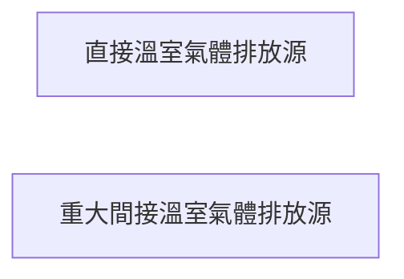

# 結構圖只剩一兩個節點:素材被章節切分稀釋

> **狀態**:🟡 部分完成 2026-08-04 —— 處置 1、3 已做;處置 2(跨節取材)**刻意不做**。依據:`2026-08-04_retrospective.md`

**Labels**: bug, carbon, P2
**發現**: 2026-08-03 第四輪實測

---

## 現象

匯入後的結構圖幾乎都退化成單節點:




治理架構圖(1.4)只有一個節點,範疇對應圖(2.3)只有兩個。
邊界圖(1.5)與量化流程圖(3.3)這輪正常。

## 原因不在畫圖,在素材

**圖沒有壞,是那一節的內容太少。** 1.4 節這輪匯入到的全部內容是:

```
1.4 溫室氣體盤查推行委員會
```

一行標題。原文裡的委員會成員(主任委員、副主任委員、管理代表)這輪被切到別節去了
——先前的輪次 1.4 節還帶有 1.6.3~1.6.7 的內容,這輪沒有。

節點文字必須能在**該段原文**中找到(這是刻意的護欄,防止模型自己編人名),
所以段落內容一少,圖自然就空。護欄運作正常,問題在上游。

2.3 節同理:內容只剩兩行敘述,表2.2 雖然在同一節,但那是原文表格區塊,
`generateParagraphDiagram` 傳入的是 `item.content`(敘述),不含表格。

## 三個可能的處置(需先決定方向)

1. **把同節的原文表格一併當素材。** 2.3 的範疇對應圖真正的素材就是表2.2 ——
   目前傳的是敘述,等於把最有結構的部分排除在外。改動小,對 2.3 直接見效。
2. **允許跨節取材(限定白名單)。** 治理架構的成員散在 1.4 與 1.6,
   但跨節取材會讓「節點文字必須在該段原文找到」這條護欄的定義變模糊,
   需要重新定義「該段」的範圍,風險較高。
3. **節點過少即不畫,並說明原因。** 目前單節點的圖比沒有圖更糟 ——
   它看起來像「這個組織的治理架構只有一個委員會」,那是錯的訊息。
   最低限度應該加下限(如少於 3 個節點即改為說明文字)。

**建議先做 1 與 3**:1 直接補上真正的素材,3 防止素材不足時輸出誤導性的圖。
2 牽動護欄定義,另議。

## 驗收

- 2.3 的範疇對應圖能從表2.2 取得類別與排放源的層級
- 1.4 素材不足時不畫單節點圖,改為說明「原文該節資訊不足以繪製治理架構」

---

## 處置(2026-08-04,commit 8023cd5c8)

**1 與 3 已做,2 仍未做。**

- 1:`withSourceTables` 把同節的 `sourceTables`(caption + markdown)接在敘述後面
  一起送進 `generateParagraphDiagram`。護欄未放寬 —— 節點文字仍須能在傳入的原文找到,
  只是「原文」從敘述擴到同節逐字表格。
  結構圖補位 effect 走的是落地後的完整段落內容,本來就含表格,不需另外處理。
- 3:新增 `CARBON_DIAGRAM_MIN_NODES = 3` 與 `TOO_FEW_NODES`,少於三節點輸出說明文字。
  下限放在 timeline 分支之後(timeline 以「有時間標籤的事件數」為準,用節點總數會誤放行)。
- 2(跨節取材)未做,理由不變:會讓「該段」的定義變模糊,風險高於收益。

**尚待實測確認**:1.4 治理架構的成員本來就散在 1.4 與 1.6,
補了同節表格也未必救得回來 —— 那正是 2 要解的問題。
本次處置能確定的是:救不回來時不再畫出誤導性的單節點圖。
