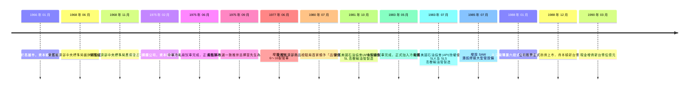
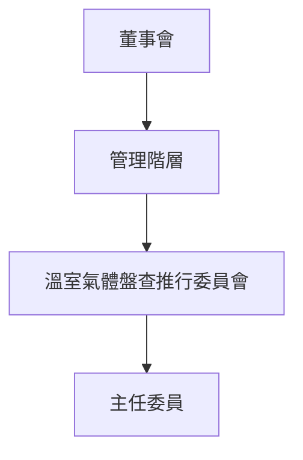
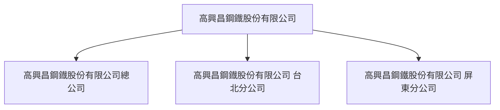
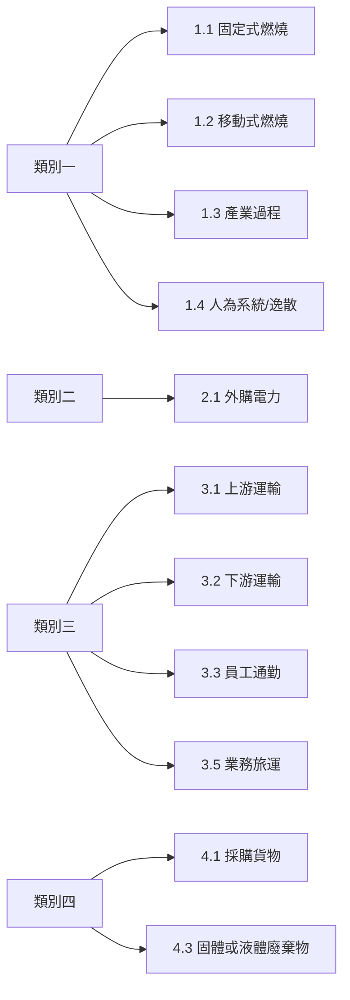

# 8/7.test4

> _報告狀態：草稿(內容由 AI 逐段生成，經人工查核後方可定稿)_

---

### 第一章 組織與治理概況(導論)

第一章 組織概況
隨著地球暖化，國際間配合 2050 全球淨零碳排目標，為了因應氣候變遷的變化，
本公司為維護地球，以永續發展為目標進行相關措施。
本公司透過 ISO 14064：2018 溫室氣體盤查的標準及要求，將盤查結果統計分
析，並提供日後策劃及實施改善計畫的參考；本公司將持續推動節能減碳、致力於環
境保護，恪盡地球公民的責任。

---

### 1.1 公司簡介與財務報告邊界

1.1 本公司簡介
1.1.1 公司名稱： 高興昌鋼鐵股份有限公司
1.1.2 員工人數：約 217 人
1.1.3 服務項目：基本金屬製造業
1.1.4 負責人：呂泰榮
1.1.5 地址：
總公司：高雄市鼓山區中華一路 318 號
屏東分公司：屏東縣枋寮鄉永翔路 2 號
台北分公司：台北市大同區涼州街 62 號 1,2F
1.1.6 經營沿革：
1.1.7 發展目標：將致力於溫室氣體盤查作業，以利本公司清楚溫室氣體排放狀況，並
根據盤查結果，進行節能、減量規劃等活動。
1.2 相關事項
1966 年 01 月 公司創立於高雄市，資本額新台幣捌拾萬元，以產製鋼管、鋼板及馬口鐵等項產品
為主，是時推選呂特興先生為董事長。
1968 年 06 月 榮獲經濟部中央標準局鍍鋅鋼管正字標記。
1968 年 11 月 榮獲經濟部中央標準局黑鋼管正字標記。
1975 年 02 月 合併高興鋼鐵公司，資本額新台幣貳億元。
1975 年 06 月 中華冷軋廠試車完成，正式產製冷軋鋼捲。
1975 年 09 月 董監事改選一致推崇呂擇賞先生為董事長。
1977 年 06 月 增設 API 6"～16"製管車。
1980 年 07 月 榮獲經濟部商品檢驗局首家頒予「品管分等檢驗甲等」；改建鍍鋅設備自動化；完
成機械製造之機械廠工程。
1981 年 10 月 榮獲美國石油協會(API)授權使用 5L 高壓輸油管製造。
1983 年 05 月 永安廠試車完成，正式加入冷軋鋼捲生產。
1983 年 07 月 榮獲美國石油協會(API)授權使用 5LX 及 5LS 高壓輸油管製造。
1985 年 07 月 增設 SAW 潛弧焊接大型管設備，可產製 18"～60"鋼管。
1988 年 01 月 永安廠購置六段式冷軋及調質設備。
1988 年 12 月 公司股票正式掛牌上市，資本額新台幣壹拾陸億元。
1990 年 03 月 現金增資新台幣伍億元，資本額新台幣貳拾參億肆仟萬元。
1993 年 03 月 鋼管廠聚乙烯(PE)包覆鋼管正式生產。
1993 年 07 月 購買屏南工業區土地 32.228 公頃，供中華廠遷廠之用。
1996 年 01 月 鋼管廠榮獲國際標準品質保證制度 ISO 9001 認可登錄。
1996 年 05 月 永安廠冷軋產品榮獲國際標準品質保證制度 ISO 9001 認可登錄。
1996 年 09 月 董監事全面改選，一致推崇呂擇賞先生為董事長。
1997 年 08 月 籌建廢輪胎資源回收廠。
1998 年 02 月 屏南廠榮獲美國石油協會(API)授權使用 5LX 及 5LS 高壓輸油管製造。
1999 年 05 月 永安廠通過 ISO 14001 驗證。
1999 年 06 月 董監事改選，一致推崇呂擇賞先生為董事長，呂恩彰先生為副董事長。
2002 年 06 月 董監事改選，一致推舉呂泰榮先生為董事長，聘請呂榮峰先生為總經理，推崇呂擇
賞先生為名譽董事長。
2005 年 06 月 董監事改選，一致推舉呂泰榮先生為董事長。
2007 年 04 月 永安廠冷軋張力整平機市試俥完成。
2007 年 05 月 屏南廠申請美國石油協會 API-5CT 油井管授權核准。
2008 年 04 月 永安廠冷軋產品榮獲 ISO 9001、ISO 14001 及 OHSAS 18001 認證。
2012 年 06 月 永安廠暫停生產。
2013 年 12 月 現金減資 35%，減資後實收資本額新臺幣 2,754,872,930 元。

<!-- carbon-diagram:MILESTONE_TIMELINE:start -->



<!-- carbon-diagram:MILESTONE_TIMELINE:end -->

---

### 1.2 報告目的與主要使用者

1.2.1 報告目的：本公司為因應國際趨勢及金管會要求，確保公開揭露之溫室氣體排放
量之準確性，進行本次盤查溫室氣體作業。
1.2.2 預期使用者：本公司預期使用者為內部管理階層需求、ESG 永續報告書、金管會
及利害相關者。

---

### 1.3 氣候與永續政策聲明

1.3 政策聲明
本公司為善盡企業對環境保護之責任，降低本公司因溫室氣體排放對地球暖化所造成環
境與氣候之衝擊，將致力於以下事項：
 致力於溫室氣體盤查
 持續推動節能減碳措施

---

### 1.4 氣候治理架構與職責

本公司為有效監督氣候相關風險與機會，已建立由上而下之治理架構。(待補: 說明董事會如何透過特定委員會或全體會議，監督氣候相關議題)。董事會定期(待補: 說明報告頻率，如每季或每半年)聽取管理階層關於溫室氣體盤查結果、減量進度及氣候風險評估之報告，並將相關資訊納入(待補: 說明如何納入公司重大決策、策略規劃與風險管理流程)。在管理階層方面，公司成立「溫室氣體盤查推行委員會」，作為溫室氣體盤查與控管之主要執行單位，負責推動盤查作業、鑑別重大間接排放源及製作報告書。該委員會由主任委員領導，負責指派內部查證並核准最終報告，其盤查成果亦作為管理階層決策之參考。(待補: 說明委員會之詳細組成、主席層級及向董事會之匯報路徑)。

<!-- carbon-diagram:GOVERNANCE_TREE:start -->



<!-- carbon-diagram:GOVERNANCE_TREE:end -->

---

### 1.5 組織邊界設定方法

1.5.1 盤查範圍：本次盤查組織邊界採用控制權法，邊界設定以「高興昌鋼鐡股份有限公司總公司、高興昌鋼鐡股份有限公司 台北分公司、高興昌鋼鐵股份有限公司 屏東分公司」為盤查範圍，包含所有設施。1.5.2 盤查地址： 總公司：高雄市鼓山區中華一路 318 號 台北分公司：台北市大同區涼州街 62 號 1,2F 屏東分公司：屏東縣枋寮東海村永翔路 2 號1.5.3 盤查溫室氣體種類：CO2、N2O、CH4、HFCs、PFCs、SF6、NF3

<!-- carbon-diagram:BOUNDARY_MAP:start -->



<!-- carbon-diagram:BOUNDARY_MAP:end -->

---

### 1.6 報告涵蓋期間與重大財務連結

1.6.1 本報告書涵蓋時間為 2023 年 01 月 01 日至 2023 年 12 月 31 日，於總公司報告邊界範圍內產生之所有溫室氣體為盤查範圍。1.6.2 報告書製作頻率：每年一次。1.6.3 報告書負責單位：由溫室氣體盤查推行委員會負責製作及提供報告書相關資訊等工作。1.6.4 本報告書完成後，將經由「環境管理系統 ISO 14001」內部查證程序進行查證，並修正缺失後，進行內部發行。1.6.5 本報告書完成經過外部查證並修正缺失完畢，進行公告後生效，以確保其正確性。1.6.6 本報告書依公司之規定進行制訂、修訂等作業。1.6.7 本報告書盤查範圍後續若有任何變動時，本報告書將一併進行修正並重新發行。

---

### 第二章 報告邊界(導論)

第二章 報告邊界

---

### 2.1 基準年與歷史碳數據追蹤

2.1 基準年
2023 年為依據 ISO14064-1：2018 盤查的第一年，故設立 2023 年為基準年。
2.1.1 報告書涵蓋期間為 2023 年 01 月 01 日至 2023 年 12 月 31 日，查證保證期間為 2023 年 01 月 01 日至 2023 年 12 月 31 日。
2.1.2 基準年排放量重新計算機制：盤查年度之差異性超出基準年放量達 3%以上。
(1) 報告邊界或組織邊界之變化（合併、收購、分割，例如：擴建或縮編規模、廠址變動）。
(2) 計算方法或排放係數的變化。
(3) 數據累積錯誤。

---

### 2.2 溫室氣體排放源鑑別

2.2 溫室氣體排放源
2.2.1 類別一溫室氣體排放源類別及排放量：
(1) 高興昌鋼鐡股份有限公司 總公司：
針對直接來自於公司所擁有或控制的排放源。包含固定式燃燒源（如：緊急發電機）、移動式燃燒源（如：公務車）、逸散排放源（如：公務車空調、冰水主機、冰箱、冷氣機、化糞池 、滅火器）等三大項類別。
(2) 高興昌鋼鐡股份有限公司 台北分公司：
針對直接來自於公司所擁有或控制的排放源。包含移動式燃燒源（如：公務車）、逸散排放源（如：冰箱、冷氣機、滅火器）等二大項類別。
(3) 高興昌鋼鐵股份有限公司 屏東分公司：
針對直接來自於公司所擁有或控制的排放源。包含固定式燃燒源（如：加熱爐、緊急發電機、鍋爐、除草機&吹葉機）、移動式燃燒源（如：堆高機）、生產製造過程（如：CO2 鋼瓶、丙烷鋼瓶、乙炔切割/、混合氣體(內含 CO2)、電銲(焊條)）、逸散排放源（如：冰水主機、冰箱、冷氣機、化糞池 、工業冷凍、冷藏裝備，包括食品加工及冷藏、滅火器、飲水機、高壓斷路器）等四大項類別。
2.2.2 類別二至類別六溫室氣體排放源類別及排放量：
本公司之重大性排放評估準則，依據預期用途、滿足預期使用者之需求及控制權之標準，由「溫室氣體盤查推行委員會」依「環境管理系統 ISO 14001」及 ISO 14064-1：2018 附錄 B 逐項進行討論。
(1) 高興昌鋼鐡股份有限公司 總公司
重大性排放源評估準則內選擇為 15 分以上為重大性排放，評估鑑別項目如下：
A. 類別二間接排放：
組織使用由組織邊界外部所提供能源所產生的溫室氣體排放：
a. 外購電力
B. 類別三、類別四、類別五間接排放：
由其他公司擁有但因組織活動所產生之間接排放，包含運輸使用、組織使用產品、使用來自組織產品產生之排放量及其他類別等間接排放。
因考量其控制權予以鑑別及量化說明，本公司選擇以下五項進行盤查：
a. 正職員工
b. 員工差旅(高鐵)
c. 員工差旅(自用車)
d. 台電上游電力輸配
(2) 高興昌鋼鐡股份有限公司 台北分公司
重大性排放源評估準則內選擇為 15 分以上為重大性排放，評估鑑別項目如下：
B. 類別二間接排放：
組織使用由組織邊界外部所提供能源所產生的溫室氣體排放：
a. 外購電力
C. 類別三、類別四、類別五間接排放：
由其他公司擁有但因組織活動所產生之間接排放，包含運輸使用、組織使用產品、使用來自組織產品產生之排放量及其他類別等間接排放。
因考量其控制權予以鑑別及量化說明，本公司選擇以下五項進行盤查：
a. 正職員工
b. 員工差旅(高鐵)
c. 員工差旅(計程車)
d. 自來水
e. 台電上游電力輸配
(3) 高興昌鋼鐵股份有限公司 屏東分公司
重大性排放源評估準則內選擇為 15 分以上為重大性排放，評估鑑別項目如下：
C. 類別二間接排放：
組織使用由組織邊界外部所提供能源所產生的溫室氣體排放：
a. 外購電力
D. 類別三、類別四、類別五間接排放：
由其他公司擁有但因組織活動所產生之間接排放，包含運輸使用、組織使用產品、使用來自組織產品產生之排放量及其他類別等間接排放。
因考量其控制權予以鑑別及量化說明，本公司選擇以下九項進行盤查：
a. 鋼捲運輸(陸)
b. 產品運輸(陸)
c. 正職員工
d. 員工差旅(高鐵)
e. 員工差旅(計程車)
f. 員工差旅(自用車)
g. 台電上游電力輸配
h. 一般廢棄物焚燒
i. 所有廢棄物運輸

<!-- carbon-source-table:表2.1:start -->
**表2.1 重大性間接溫室氣體排放準則評估表**（原文照錄 p.10–11）

| 排放類別 | 排放項目 | A.幅度(數量) | B.影響程度 | C.風險與機會 | D.利害相關者關切事項 | E.員工參與 | F.活動資料可取得度 | G.排放係數可取得度 | H.發生頻率 | 各項評分加總 | 判定 |
|---|---|---|---|---|---|---|---|---|---|---|---|
| 類別二：輸入能源的間接溫室氣體排放量 | 2.1 外購電力 外購電力 | 2 | 3 | 3 | 3 | 2 | 2 | 3 | 3 | 21 | ✓ |
| 類別三：運輸產生的間接溫室氣體排放 | 3.1 上游運輸 產品運輸(海) | 1 | 1 | 1 | 1 | 1 | 1 | 1 | 1 | 8 | |
| | 3.1 上游運輸 產品運輸(陸) | 1 | 1 | 1 | 1 | 1 | 1 | 1 | 1 | 8 | |
| | 3.2 下游運輸 產品運輸(海) | 1 | 1 | 1 | 1 | 1 | 1 | 1 | 1 | 8 | |
| | 3.2 下游運輸 產品運輸(陸) | 1 | 1 | 1 | 1 | 1 | 1 | 1 | 1 | 8 | |
| | 3.3 員工通勤 正職員工 | 2 | 2 | 1 | 1 | 3 | 2 | 3 | 3 | 17 | ✓ |
| | 3.5 業務旅運 員工差旅(自用車) | 2 | 3 | 3 | 1 | 3 | 3 | 3 | 2 | 20 | ✓ |
| | 3.5 業務旅運 員工差旅(計程車) | 1 | 2 | 1 | 1 | 2 | 1 | 3 | 2 | 13 | |
| | 3.5 業務旅運 員工差旅(高鐵) | 2 | 3 | 3 | 1 | 3 | 3 | 3 | 2 | 20 | ✓ |
| 類別四：組織使用產品的間接溫室氣體排放 | 4.1 採購貨物 台電上游電力輸配 | 2 | 1 | 3 | 1 | 1 | 3 | 3 | 2 | 16 | ✓ |
| | 4.1 採購貨物 自來水 | 2 | 1 | 1 | 1 | 1 | 3 | 3 | 2 | 14 | |
| 類別五：使用產品的間接溫室氣體排放 | 5.1 由產品使用階段產生之排放或移除 | - | 1 | 1 | 1 | 1 | 1 | 1 | 1 | 1 | 8 | |
| | 5.2 由下游承租的資產產生之排放 | - | 1 | 1 | 1 | 1 | 1 | 1 | 1 | 1 | 8 | |
| | 5.3 由產品生命中止階段產生之排放 | - | 1 | 1 | 1 | 1 | 1 | 1 | 1 | 1 | 8 | |
| | 5.4 由投資產生之排放 | - | 1 | 1 | 1 | 1 | 1 | 1 | 1 | 1 | 8 | |
| 類別六：其他來源的間接溫室氣體排放 | 6 由其他來源產生的間接溫室氣體排放 | - | 1 | 1 | 1 | 1 | 1 | 1 | 1 | 1 | 8 | |
<!-- carbon-source-table:表2.1:end -->

---

### 2.3 排放範疇與類別劃分

2.3 排放源範疇及類別
本次盤查之報告邊界中直接溫室氣體排放源及重大間接溫室氣體排放源所涵蓋項目，如下：

<!-- carbon-source-table:表2.2:start -->
**表2.2 排放源範疇及類別**（原文照錄 p.15–17）

| 類別 | 設備別（排放源） |
|---|---|
| 類別一 | 1.1 固定式燃燒<br>緊急發電機柴油、LPG(鍋爐、加熱爐)、汽油(除草機)（CO2、CH4、N2O） |
| | 1.2 移動式燃燒<br>公務車車用汽油、柴油引擎(堆高機)（CO2、CH4、N2O） |
| | 1.3 產業過程<br>點焊設施(焊條、二氧化碳、其他切割設施、混合氣（CO2）)、乙炔、其他熔融設施丙烷(瓦斯鋼瓶)（CO2、CH4、N2O） |
| | 1.4 人為系統/逸散<br>冰水機 HCFC-22，CHF2Cl、家用冷凍、冷藏裝備 HFC-134a/R-134a，四氟乙烷 HFC-134a/R-1、住宅及商業建築冷氣機冷媒－R410a，R32/125（50/50）、冰水機冷媒－R410a，R32/125（50/50）、公務車 HFC-134a/R-134a，四氟乙烷 HFC-134a/R-1、工業冷凍、冷藏裝備，包括食品加工及冷藏 HCFC-22，CHF2Cl、家用冷凍、冷藏裝備 R-600A，異丁烷 (CH3)CHCH3、家用冷凍、冷藏裝備冷媒、住宅及商業建築冷氣機 HCFC-22，CHF2Cl、住宅及商業建築冷氣機 HFC-32/R-32 二氟甲烷，CH2F2、冰水機 HFC-134a/R-134a，四氟乙烷 HFC-134a/R-1、工業冷凍、冷藏裝備，包括食品加工及冷藏冷媒－R407c，R32/125/134a（23/25/52）、工業冷凍、冷藏裝備，包括食品加工及冷藏冷媒－R404a，R125/143a/134a（44/52/4）（HFCS）、滅火器 乾粉（CO2、CH4、N2O）、化糞池水肥（CH4）、用電設施設備高壓斷路器（SF6） |
| 類別二 | 2.1 外購電力<br>用電設施設備電力（CO2、CH4、N2O） |
| 類別三 | 3.1 上游運輸<br>原物料運輸（陸運）里程（CO2、CH4、N2O） |
| | 3.2 下游運輸<br>產品運輸（陸運）里程（CO2、CH4、N2O） |
| | 3.3 員工通勤<br>運輸作業車輛車用汽油、運輸作業車輛柴油、運輸作業車輛其他、運輸作業車輛一般電動機車、運輸作業車輛人力車（CO2、CH4、N2O） |
| | 3.5 業務旅運<br>員工出差（自行開車）里程、員工出差（計程車）里程、員工出差（高鐵）里程、員工出差（計程車）車用汽油（CO2、CH4、N2O） |
| 類別四 | 4.1 採購貨物<br>其他未歸類設施使用電力、其他未歸類設施自來水（CO2、CH4、N2O） |
| | 4.3 固體或液體廢棄物<br>一般事業廢棄物焚燒重量、一般事業廢棄物運輸里程（CO2、CH4、N2O） |
<!-- carbon-source-table:表2.2:end -->

<!-- carbon-diagram:SCOPE_CATEGORY_MAP:start -->



<!-- carbon-diagram:SCOPE_CATEGORY_MAP:end -->

---

### 3.1 溫室氣體排放量計算說明(含導論)

第三章 溫室氣體排放
3.1 溫室氣體排放量計算說明
3.1.1 如表 3.1，依據類別一、類別二、類別三、類別四、類別五及類別六，分別列出在組織邊界中各項排放源並列出可能產生的溫室氣體種類。

<!-- carbon-source-table:表3.1:start -->
**表3.1 溫室氣體排放鑑別表**（原文照錄 p.17–19）

| 設施/活動 | 溫室氣體源 | 可能產生溫室氣體種類 | 備註 | 
| :--- | :--- | :--- | :--- | 
| | | CO2 | CH4 | N2O | HFCs | PFCs | NF3 | SF6 | （類別） | 
| 緊急發電機 | 柴油 | V | V | V | | | | | 類別一 | 
| 桶裝瓦斯 | 液化石油氣 | V | V | V | | | | | | 
| 柴油引擎 | 柴油 | V | V | V | | | | | | 
| 公務車 | 車用汽油 | V | V | V | | | | | | 
| 公務車 | HFC-134a/R-134a ，四氟乙烷 HFC-134a/R-1 | | | | V | | | | | 
| 點焊設施 | 焊條 | V | | | | | | | | 
| 點焊設施 | 二氧化碳 | V | | | | | | | | 
| 其他熔融設施 | 丙烷 | V | | | | | | | | 
| 其他切割設施 | 乙炔 | V | | | | | | | | 
| 點焊設施 | 混合氣 | V | | | | | | | | 
| 冰水機 | HCFC-22， CHF2Cl | | | | V | | | | | 
| 家用冷凍、冷藏裝備 | HFC-134a/R-134a ，四氟乙烷 HFC-134a/R-1 | | | | V | | | | | 
| 住宅及商業建築冷 氣機 | 冷媒－R410a， R32/125（50/50） | | | | V | | | | | 
| 滅火器 | 乾粉 | | | | | | | | | 
| 冰水機 | 冷媒－R410a， R32/125（50/50） | | | | V | | | | | 
| 化糞池 | 水肥 | | V | | | | | | | 
| 工業冷凍、冷藏裝 備，包括食品加工及 冷藏 | HCFC-22， CHF2Cl | | | | V | | | | | 
| 家用冷凍、冷藏裝備 | R-600A，異丁烷 (CH3)CHCH3 | | V | | | | | | | 
| 家用冷凍、冷藏裝備 | 冷媒 | | | | | | | | | 
| 住宅及商業建築冷 氣機 | HCFC-22， CHF2Cl | | | | V | | | | | 
| 住宅及商業建築冷 氣機 | HFC-32/R-32 二氟 甲烷，CH2F2 | | | | V | | | | | 
| 冰水機 | HFC-134a/R-134a ，四氟乙烷 HFC-134a/R-1 | | | | V | | | | | 
| 工業冷凍、冷藏裝 備，包括食品加工及 冷藏 | 冷媒－R407c， R32/125/134a （23/25/52） | | | | V | | | | | 
| 用電設施設備 | 高壓斷路器 | | | | | | | V | | 
| 工業冷凍、冷藏裝 備，包括食品加工及 冷藏 | 冷媒－R404a， R125/143a/134a （44/52/4） | | | | V | | | | | 
| 用電設施設備 | 電力 | V | | | | | | | 類別二 | 
| 原物料運輸（陸運） | 里程 | V | | | | | | | 類別三 | 
| 產品運輸（陸運） | 里程 | V | | | | | | | | 
| 運輸作業車輛 | 車用汽油 | V | | | | | | | | 
| 運輸作業車輛 | 柴油 | V | | | | | | | | 
| 運輸作業車輛 | 其他 | V | | | | | | | | 
| 運輸作業車輛 | 一般電動機車 | V | | | | | | | | 
| 員工出差（自行開 車） | 里程 | V | | | | | | | | 
| 員工出差（計程車） | 里程 | V | | | | | | | | 
| 員工出差（高鐵） | 里程 | V | | | | | | | | 
| 員工出差（計程車） | 車用汽油 | V | | | | | | | | 
| 其他未歸類設施 | 使用電力 | V | | | | | | | 類別四 | 
| 其他未歸類設施 | 自來水 | V | | | | | | | | 
| 一般事業廢棄物焚 燒 | 重量 | V | | | | | | | | 
| 一般事業廢棄物運 輸 | 里程 | V | | | | | | | |
<!-- carbon-source-table:表3.1:end -->

---

### 3.2 活動數據與排放係數選擇層級

3.2 溫室氣體排放或移除數據之選擇
3.2.1 排放係數選取原則：
(1) 內部量測數據
(2) 質量平衡計算所得係數
(3) 同製程/設備經驗係數
(4) 製造廠提供係數
(5) 區域性排放係數
(6) 國家排放係數
(7) 若無適用之排放係數時則採用國際公告之適用係數。
3.2.2 本次選用之溫室氣體排放係數以 IPCC、環境部或相關主管機關所公佈之最新排放係數資料為主。
3.2.3 各排放係數說明
(1) 緊急發電機柴油"：環境部-溫室氣體排放係數管理表 6.0.4
(2) 公務車車用汽油"：環境部-溫室氣體排放係數管理表 6.0.4
(3) 公務車 HFC-134a/R-134a，四氟乙烷 HFC-134a/R-1"：環境部-溫室氣體排放係數管理表 6.0.4
(4) 冰水機 HCFC-22，CHF2Cl"：環境部-溫室氣體排放係數管理表 6.0.4
(5) 家用冷凍、冷藏裝備 HFC-134a/R-134a，四氟乙烷 HFC-134a/R-1"：環境部-溫室氣體排放係數管理表 6.0.4
(6) 住宅及商業建築冷氣機冷媒－R410a，R32/125（50/50）"：環境部-溫室氣體排放係數管理表 6.0.4
(7) 滅火器乾粉"："質量平衡法乾粉 ABC 不產生 CO2
(8) 冰水機冷媒－R410a，R32/125（50/50）"：環境部-溫室氣體排放係數管理表 6.0.4
(9) 化糞池水肥"：環境部-溫室氣體排放係數管理表 6.0.4
(10) 工業冷凍、冷藏裝備，包括食品加工及冷藏 HCFC-22，CHF2Cl"：環境部-溫室氣體排放係數管理表 6.0.4
(11) 用電設施設備電力"："臺灣－經濟部能源局公告
(12) 運輸作業車輛車用汽油"：產品碳足跡資訊網
(13) 運輸作業車輛柴油"：產品碳足跡資訊網
(14) 運輸作業車輛其他"："自定
(15) 運輸作業車輛一般電動機車"：台灣綜合研究院-電動車對電力需求之探討
(16) 員工出差（自行開車）里程"：產品碳足跡資訊網
(17) 員工出差（計程車）里程"：產品碳足跡資訊網
(18) 員工出差（高鐵）里程"："高速鐵路運輸服務碳足跡
(19) 其他未歸類設施使用電力"：產品碳足跡資訊網
(20) 其他未歸類設施自來水"：產品碳足跡資訊網
(21) 員工出差（計程車）車用汽油"：產品碳足跡資訊網
(22) 桶裝瓦斯液化石油氣"：產品碳足跡資訊網
(23) 柴油引擎 柴油"：產品碳足跡資訊網
(24) 點焊設施 焊條"："質量平衡法
(25) 點焊設施 二氧化碳"："質量平衡法
(26) 其他熔融設施丙烷"："質量平衡法
(27) 其他切割設施 乙炔"："質量平衡法
(28) 點焊設施 混合氣"："質量平衡法
(29) 家用冷凍、冷藏裝備 R-600A，異丁烷(CH3)CHCH3"：環境部-溫室氣體排放係數管理表 6.0.4
(30) 家用冷凍、冷藏裝備冷媒"：環境部-溫室氣體排放係數管理表 6.0.4
(31) 住宅及商業建築冷氣機 HCFC-22，CHF2Cl"：環境部-溫室氣體排放係數管理表 6.0.4
(32) 住宅及商業建築冷氣機 HFC-32/R-32 二氟甲烷，CH2F2"：環境部-溫室氣體排放係數管理表 6.0.4
(33) 冰水機 HFC-134a/R-134a，四氟乙烷 HFC-134a/R-1"：環境部-溫室氣體排放係數管理表 6.0.4
(34) 工業冷凍、冷藏裝備，包括食品加工及冷藏冷媒－R407c，R32/125/134a（23/25/52） "：環境部-溫室氣體排放係數管理表 6.0.4
(35) 用電設施設備高壓斷路器"：1
(36) 工業冷凍、冷藏裝備，包括食品加工及冷藏冷媒－R404a，R125/143a/134a （44/52/4）"：環境部-溫室氣體排放係數管理表 6.0.4
(37) 原物料運輸（陸運）里程"：產品碳足跡資訊網
(38) 產品運輸（陸運）里程"：產品碳足跡資訊網
(39) 一般事業廢棄物焚燒重量"：產品碳足跡資訊網
(40) 一般事業廢棄物運輸里程"：產品碳足跡資訊網

<!-- carbon-source-table:表3.2:start -->
**表3.2 溫室氣體排放係數管理表**（原文照錄 p.21–26）

| 設施/活動 | 排放源 | 溫室 氣體 種類 | 排放係數 | 資料來源 | 
| :--- | :--- | :--- | :--- | :--- | 
| | | | 數值 | 單位 | 
| 緊急發電機 | 柴油 | CO2 | 2.6060328000 | kgCO2/L | 溫室氣體排放係數 管理表 6.0.4 版（燃 料熱值） | 
| | | CH4 | 0.0001055074 | kgCH4/L | 溫室氣體排放係數 管理表 6.0.4 版（燃 料熱值） | 
| | | N2O | 0.0000211015 | kgN2O/L | 溫室氣體排放係數 管理表 6.0.4 版（燃 料熱值） | 
| 桶裝瓦斯 | 液化石油氣 | CO2 | 1.7528812758 | kgCO2/L | 溫室氣體排放係數 管理表 6.0.4 版（燃 料熱值） | 
| | | CH4 | 0.0000277794 | kgCH4/L | 溫室氣體排放係數 管理表 6.0.4 版（燃 料熱值） | 
| | | N2O | 0.0000027779 | kgN2O/L | 溫室氣體排放係數 管理表 6.0.4 版（燃 料熱值） | 
| 柴油引擎 | 柴油 | CO2 | 2.2631310000 | kgCO2/L | 溫室氣體排放係數 管理表 6.0.4 版（燃 料熱值） | 
| | | CH4 | 0.0000979711 | kgCH4/L | 溫室氣體排放係數 管理表 6.0.4 版（燃 料熱值） | 
| | | N2O | 0.0000195942 | kgN2O/L | 溫室氣體排放係數 管理表 6.0.4 版（燃 料熱值） | 
| 緊急發電機 | 柴油 | CO2 | 2.6060317920 | kgCO2/L | 溫室氣體排放係數 管理表 6.0.4 版（燃 料熱值） | 
| 公務車 | 車用汽油 | CO2 | 2.2631328720 | kgCO2/L | 溫室氣體排放係數 管理表 6.0.4 版（燃 料熱值） | 
| | | CH4 | 0.0008164260 | kgCH4/L | 溫室氣體排放係數 管理表 6.0.4 版（燃 料熱值） | 
| | | N2O | 0.0002612563 | kgN2O/L | 溫室氣體排放係數 管理表 6.0.4 版（燃 料熱值） | 
| | | HFCS | 0.2000000000 | kgHFCS/kg | 溫室氣體排放係數 管理表 6.0.4 版（逸 散排放源） | 
| | | CO2 | 2.2631310000 | kgCO2/L | 溫室氣體排放係數 管理表 6.0.4 版（燃 料熱值） | 
| 柴油引擎 | 柴油 | CO2 | 2.6060317920 | kgCO2/L | 溫室氣體排放係數 管理表 6.0.4 版（燃 料熱值） | 
| | | CH4 | 0.0001371596 | kgCH4/L | 溫室氣體排放係數 管理表 6.0.4 版（燃 料熱值） | 
| | | N2O | 0.0001371596 | kgN2O/L | 溫室氣體排放係數 管理表 6.0.4 版（燃 料熱值） | 
| 點焊設施 | 焊條 | CO2 | 3.6666666667 | tCO2/t | 質量平衡法 | 
| | | CO2 | 1.0000000000 | tCO2/t | 質量平衡法 | 
| 其他熔融設施 | 丙烷 | CO2e | 3.0000000000 | tCO2e/t | | 
| 其他切割設施 | 乙炔 | CO2 | 3.3850000000 | tCO2/t | 質量平衡法 | 
| 點焊設施 | 混合氣 | CO2 | 1.0000000000 | tCO2/t | 質量平衡法 | 
| 冰水機 | HCFC-22，CHF2Cl | HFCS | 0.0900000000 | kgHFCS/kg | 溫室氣體排放係數 管理表 6.0.4 版（逸 散排放源） | 
| 家用冷凍、冷藏 裝備 | HFC-134a/R-134a， 四氟乙烷 HFC-134a/R-1 | HFCS | 0.0030000000 | kgHFCS/kg | 溫室氣體排放係數 管理表 6.0.4 版（逸 散排放源） | 
| 住宅及商業建 築冷氣機 | 冷媒－R410a， R32/125（50/50） | HFCS | 0.0300000000 | kgHFCS/kg | 溫室氣體排放係數 管理表 6.0.4 版（逸 散排放源） | 
| 滅火器 | 乾粉 | CO2e | 0.0000000000 | kgCO2e/kg | 溫室氣體排放係數 管理表 6.0.4 版（逸 散排放源） | 
| 冰水機 | 冷媒－R410a， R32/125（50/50） | HFCS | 0.0900000000 | kgHFCS/kg | 溫室氣體排放係數 管理表 6.0.4 版（逸 散排放源） | 
| 化糞池 | 水肥 | CH4 | 0.0035572500 | tCH4/每人˙每年 | 屏南廠 9 小時/總 公司常日班/台北 常日班 | 
| 工業冷凍、冷藏 裝備，包括食品 加工及冷藏 | HCFC-22，CHF2Cl | HFCS | 0.0550000000 | kgHFCS/kg | 溫室氣體排放係數 管理表 6.0.4 版（逸 散排放源） | 
| 化糞池 | 水肥 | CH4 | 0.0052793000 | tCH4/每人˙每年 | 總公司加班(年度 總時數) | 
| | | CH4 | 0.0011857500 | tCH4/每人˙每年 | 屏南廠清潔員 | 
| | | CH4 | 0.0046537500 | tCH4/每人˙每年 | 總公司守衛 (日)/ (晚) /(大夜) | 
| 家用冷凍、冷藏 裝備 | R-600A，異丁烷 (CH3)CHCH3 | HFCS | 0.0030000000 | kgHFCS/kg | 溫室氣體排放係數 管理表 6.0.4 版（逸 散排放源） | 
| | | HFCS | 0.0030000000 | kgHFCS/kg | 溫室氣體排放係數 管理表 6.0.4 版（逸 散排放源） | 
| 住宅及商業建 築冷氣機 | HCFC-22，CHF2Cl | HFCS | 0.0300000000 | kgHFCS/kg | 溫室氣體排放係數 管理表 6.0.4 版（逸 散排放源） | 
| | | HFCS | 0.0300000000 | kgHFCS/kg | 溫室氣體排放係數 管理表 6.0.4 版（逸 散排放源） | 
| 冰水機 | HFC-134a/R-134a， 四氟乙烷 HFC-134a/R-1 | HFCS | 0.0900000000 | kgHFCS/kg | 溫室氣體排放係數 管理表 6.0.4 版（逸 散排放源） | 
| 工業冷凍、冷藏 裝備，包括食品 加工及冷藏 | 冷媒－R407c， R32/125/134a （23/25/52） | HFCS | 0.1600000000 | kgHFCS/kg | 溫室氣體排放係數 管理表 6.0.4 版（逸 散排放源） | 
| 化糞池 | 水肥 | CH4 | 0.0031620000 | tCH4/每人˙每年 | 屏南廠 8 小時/守 衛(日)/(晚) | 
| | | CH4 | 0.0014917500 | tCH4/每人˙每年 | 屏南廠守衛(假日 早班)/ (假日晚班) | 
| 用電設施設備 | 高壓斷路器 | SF6 | 1.0000000000 | kgSF6/kg | | 
| 工業冷凍、冷藏 裝備，包括食品 加工及冷藏 | 冷媒－R404a， R125/143a/134a （44/52/4） | HFCS | 0.1600000000 | kgHFCS/kg | 溫室氣體排放係數 管理表 6.0.4 版（逸 散排放源） | 
| | | HFCS | 0.1600000000 | kgHFCS/kg | 溫室氣體排放係數 管理表 6.0.4 版（逸 散排放源） | 
| 化糞池 | 水肥 | CH4 | 0.0433715200 | tCH4/每人˙每年 | 屏南廠加班(年度 總時數) | 
| 用電設施設備 | 電力 | CO2e | 0.4940000000 | kgCO2e/KWh | 電力排碳係數（所 有年度） | 
| 原物料運輸（陸 運） | 里程 | CO2e | 0.1310000000 | kgCO2e/tkm | 產品碳足跡排放係 數 | 
| 產品運輸（陸 運） | 里程 | CO2e | 0.1310000000 | kgCO2e/tkm | 產品碳足跡排放係 數 | 
| 運輸作業車輛 | 車用汽油 | CO2e | 0.1150000000 | kgCO2e/pkm | 產品碳足跡排放係 數 | 
| | 柴油 | CO2e | 0.0951000000 | kgCO2e/pkm | 產品碳足跡排放係 數 | 
| | 電力 | CO2e | 0.0575000000 | kgCO2e/pkm | 產品碳足跡排放係 數 | 
| | | CO2e | 0.0540000000 | kgCO2e/pkm | 產品碳足跡排放係 數 | 
| | | CO2e | 0.0000000000 | 每人˙每年 CO2e/pkm | | 
| | | CO2e | 0.0000181792 | tCO2e/pkm | | 
| | | CO2e | 0.0000000000 | 每人˙每年 CO2e/pkm | | 
| 員工出差（自行 開車） | 里程 | CO2e | 0.1150000000 | kgCO2e/pkm | 產品碳足跡排放係 數 | 
| 員工出差（計程 車） | 里程 | CO2e | 0.1330000000 | kgCO2e/pkm | 產品碳足跡排放係 數 | 
| 員工出差（高 鐵） | 里程 | CO2e | 1.0000000000 | kgCO2e/kg | | 
| 員工出差（計程 車） | 車用汽油 | CO2e | 0.1330000000 | kgCO2e/pkm | 產品碳足跡排放係 數 | 
| 員工出差（高 鐵） | 里程 | CO2e | 1.0000000000 | kgCO2e/kg | 產品碳足跡排放係 數 | 
| 員工出差（自行 開車） | 里程 | CO2e | 0.0951000000 | kgCO2e/pkm | 產品碳足跡排放係 數 | 
| 其他未歸類設 施 | 使用電力 | CO2e | 0.0973000000 | kgCO2e/KWh | 產品碳足跡排放係 數 | 
| | | CO2e | 0.2330000000 | kgCO2e/m3 | 產品碳足跡排放係 數 | 
| | | CO2e | 0.0948000000 | kgCO2e/m3 | 產品碳足跡排放係 數 | 
| 一般事業廢棄 物焚燒 | 重量 | CO2e | 360.0000000000 | kgCO2e/t | 產品碳足跡排放係 數 | 
| 一般事業廢棄 物運輸 | 里程 | CO2e | 0.1310000000 | kgCO2e/tkm | 產品碳足跡排放係 數 | 
| | | CO2e | 0.5870000000 | kgCO2e/tkm | 產品碳足跡排放係 數 |
<!-- carbon-source-table:表3.2:end -->

---

### 3.3 量化方法學與 GWP 基礎

3.3 量化方法
本公司溫室氣體排放量之計算主要依據排放係數法。
3.3.1 排放係數法，計算方法如下：
活動數據 × 排放係數 × 全球暖化潛勢（GWP）＝二氧化碳排放當量（CO2e）
3.3.2 計算說明
(1) 依據「質量平衡法、溫室氣體排放係數管理表 6.0.4 版（燃料熱值）、溫室氣體排放係數管理表 6.0.4 版（逸散排放源）、產品碳足跡排放係數、電力排碳係數（所有年度）」選擇排放係數後，計算出之數值再依 IPCC 公告之各種溫室氣體之全球暖化潛勢（GWP），將所有之計算結果轉換為二氧化碳排放當量（CO2e），單位為公噸/年。
(2) 使用 IPCC(AR6)所發布 GWP 值，若第六次評估報告無數值，則採用第五次(2013)評估報告數值。
※參考台灣環境部冷媒方案且 R22 非報告邊界七類氣體，故不納入計算項目。
3.3.3 本公司活動數據種類如表 3.4。

<!-- carbon-source-table:表3.3:start -->
**表3.3 IPCC 公告物質之 GWP 值**（原文照錄 p.27）

| 物質名稱 | 預設 GWP 值 IPCC(AR6) | 
| :--- | :--- | 
| CO2 二氧化碳 | 1 | 
| CH4 甲烷 | 27.9 | 
| N2O 氧化亞氮 | 273 | 
| HFC-134a/R-134a，1,1,1,2-四 氟乙烷，C2H2F4 | 1530 | 
| 只盤查不計算(R600a、R22) | 0 | 
| R-410A，HFC-32/HFC-125 (50.0/50.0) | 2256 | 
| HFC-32/R-32 二氟甲烷，CH2F2 | 771 | 
| R-407C， HFC-32/HFC-125/HFC-134a (23.0/25.0/52.0) | 1908 | 
| R-404A， HFC-125/HFC-143a/HFC-134a (44.0/52.0/4.0) | 4728 | 
| HFC-23/R-23 三氟甲烷，CHF3 | 14600 | 
| SF6，六氟化硫 | 23500 | 
| 二氧化碳 | 1 |
<!-- carbon-source-table:表3.3:end -->

<!-- carbon-source-table:表3.4:start -->
**表3.4 本公司活動數據種類**（原文照錄 p.28–32）

| 排放類型 | 活動或設施 | 排放源 | 年活動數據資訊 | | | 
| :--- | :--- | :--- | :--- | :--- | :--- | 
| | | | 數據來源表單名稱 | 保存單位 | 活動數據種類 | 
| 1.1 固定式燃燒 | 緊急發電機 | 柴油 | 發電機試運轉表單 | 測試單位 | 自行評估 | 
| 1.2 移動式燃燒 | 公務車 | 車用汽油 | 差旅費報告表 | 管理部 | 財務會計評估 | 
| 1.2 移動式燃燒 | 公務車 | HFC-134a/R-134a， 四氟乙烷 HFC-134a/R-1 | 公務車銘牌或供應商之 佐證 | 管理部 | 財務會計評估 | 
| 1.4 人為系統/逸散 | 冰水機 | HCFC-22，CHF2Cl | 2023 冰水機 | 管理部 | 財務會計評估 | 
| 1.4 人為系統/逸散 | 家用冷凍、冷藏裝 備 | HFC-134a/R-134a， 四氟乙烷 HFC-134a/R-1 | 廠商標示銘牌 | 管理部 | 財務會計評估 | 
| 1.4 人為系統/逸散 | 住宅及商業建築 冷氣機 | 冷媒－R410a， R32/125（50/50） | 設備銘牌或供應商之佐 證 | 管理部 | 財務會計評估 | 
| 1.4 人為系統/逸散 | 滅火器 | 乾粉 | 滅火器採買或更換憑證 | 管理部 | 財務會計評估 | 
| 1.4 人為系統/逸散 | 冰水機 | 冷媒－R410a， R32/125（50/50） | 設備銘牌 | 管理部 | 財務會計評估 | 
| 1.4 人為系統/逸散 | 化糞池 | 水肥 | 人員出勤統計 | 管理部 | 財務會計評估 | 
| 1.4 人為系統/逸散 | 工業冷凍、冷藏裝 備，包括食品加工 及冷藏 | HCFC-22，CHF2Cl | 廠商提供 | 管理部 | 財務會計評估 | 
| 1.4 人為系統/逸散 | 化糞池 | 水肥 | 人員出勤 | 管理部 | 財務會計評估 | 
| 2.1 外購電力 | 用電設施設備 | 電力 | 電費單 | 鋼管部 | 財務會計評估 | 
| 3.3 員工通勤 | 運輸作業車輛 | 車用汽油 | 依人事資料卡及 google map | 鋼管部 | 自行評估 | 
| 3.3 員工通勤 | 運輸作業車輛 | 柴油 | 依人事資料卡及 google map | 鋼管部 | 自行評估 | 
| 3.3 員工通勤 | 運輸作業車輛 | 其他 | 依人事資料卡及 google map | 鋼管部 | 自行評估 | 
| 3.3 員工通勤 | 運輸作業車輛 | 一般電動機車 | 依人事資料卡及 google map | 鋼管部 | 財務會計評估 | 
| 3.5 業務旅運 | 員工出差（自行開 車） | 里程 | 差旅費報告表 | 管理部 | 財務會計評估 | 
| 3.5 業務旅運 | 員工出差（計程 車） | 里程 | 差旅費報告表 | 管理部 | 財務會計評估 | 
| 3.5 業務旅運 | 員工出差（高鐵） | 里程 | 車票,出差申請單 | 管理部 | 財務會計評估 | 
| 4.1 採購貨物 | 其他未歸類設施 | 使用電力 | 電費單 | 管理部 | 定期(間歇)量測 | 
| 4.1 採購貨物 | 其他未歸類設施 | 自來水 | 自來水費單 | 管理部 | 定期(間歇)量測 | 
| 1.2 移動式燃燒 | 公務車 | 車用汽油 | 購買證明發票 | 管理部 | 財務會計評估 | 
| 1.4 人為系統/逸散 | 家用冷凍、冷藏裝 備 | HFC-134a/R-134a， 四氟乙烷 HFC-134a/R-1 | 設備銘牌 | 台北分公司營 業課 | 財務會計評估 | 
| 1.4 人為系統/逸散 | 住宅及商業建築 冷氣機 | 冷媒－R410a， R32/125（50/50） | 設備銘牌或供應商提供 之資料 | 管理部 | 財務會計評估 | 
| 1.4 人為系統/逸散 | 滅火器 | 乾粉 | 營業課滅火器更換紀錄 | 營業課 | 財務會計評估 | 
| 1.4 人為系統/逸散 | 公務車 | HFC-134a/R-134a， 四氟乙烷 HFC-134a/R-1 | 設備銘牌或供應商提供 之資料 | 管理部 | 財務會計評估 | 
| 2.1 外購電力 | 用電設施設備 | 電力 | 電費單 | 營業課 | 定期(間歇)量測 | 
| 3.3 員工通勤 | 運輸作業車輛 | 人力車 | 管理部人事單位提供的 人事資料統計表 | 營業課 | 自行評估 | 
| 3.3 員工通勤 | 運輸作業車輛 | 其他 | 管理部人事單位提供的 人事資料統計表 | 營業課 | 自行評估 | 
| 3.3 員工通勤 | 運輸作業車輛 | 車用汽油 | 管理部人事單位提供的 人事資料統計表 | 營業課 | 自行評估 | 
| 3.5 業務旅運 | 員工出差（計程 車） | 車用汽油 | 差旅費報告表 | 管理部 | 財務會計評估 | 
| 3.5 業務旅運 | 員工出差（高鐵） | 里程 | 車票或差旅申請表 | 管理部 | 財務會計評估 | 
| 4.1 採購貨物 | 其他未歸類設施 | 自來水 | 自來水費單 | 管理部 | 定期(間歇)量測 | 
| 4.1 採購貨物 | 其他未歸類設施 | 使用電力 | 電費單 | 管理部 | 定期(間歇)量測 | 
| 1.1 固定式燃燒 | 桶裝瓦斯 | 液化石油氣 | 加熱爐 LPG 使用量 | 鍍鋅課/行政課 | 自行評估 | 
| 1.1 固定式燃燒 | 桶裝瓦斯 | 液化石油氣 | 鍋爐 LPG 使用量 | 鍍鋅課/行政課 | 自行評估 | 
| 1.1 固定式燃燒 | 柴油引擎 | 柴油 | 柴有使用量表單 | 行政課 | 自行評估 | 
| 1.1 固定式燃燒 | 緊急發電機 | 柴油 | 發電機試運轉表單 | 測試單位 | 自行評估 | 
| 1.2 移動式燃燒 | 柴油引擎 | 柴油 | 堆高機 | 物料倉庫 | 自行評估 | 
| 1.3 產業過程 | 點焊設施 | 焊條 | 製成領料單 | 物料倉庫 | 自行評估 | 
| 1.3 產業過程 | 點焊設施 | 二氧化碳 | ERP 及領料單 | 生管課 | 財務會計評估 | 
| 1.3 產業過程 | 其他熔融設施 | 丙烷 | 瓦斯鋼瓶 | 製管課/SAW | 財務會計評估 | 
| 1.3 產業過程 | 其他切割設施 | 乙炔 | 乙炔 | 生管課倉庫 | 財務會計評估 | 
| 1.3 產業過程 | 點焊設施 | 混合氣 | 生產現場領用記錄 | 生管課倉庫 | 財務會計評估 | 
| 1.4 人為系統/逸散 | 家用冷凍、冷藏裝 備 | HFC-134a/R-134a， 四氟乙烷 HFC-134a/R-1 | 冰箱 | 公司同仁所有 | 財務會計評估 | 
| 1.4 人為系統/逸散 | 家用冷凍、冷藏裝 備 | R-600A，異丁烷 (CH3)CHCH3 | 冰箱 | 行政課 | 財務會計評估 | 
| 1.4 人為系統/逸散 | 家用冷凍、冷藏裝 備 | 冷媒 | 冰箱 | 使用單位 | 連續量測 | 
| 1.4 人為系統/逸散 | 家用冷凍、冷藏裝 備 | HFC-134a/R-134a， 四氟乙烷 HFC-134a/R-1 | 飲水機 | 行政課 | 財務會計評估 | 
| 1.4 人為系統/逸散 | 住宅及商業建築 冷氣機 | HCFC-22，CHF2Cl | 冰箱名牌 | 使用單位 | 財務會計評估 | 
| 1.4 人為系統/逸散 | 冰水機 | HCFC-22，CHF2Cl | 2023 冰水機 | 行政課 | 財務會計評估 | 
| 1.4 人為系統/逸散 | 住宅及商業建築 冷氣機 | 冷媒－R410a， R32/125（50/50） | 冷氣名牌 | 使用單位 | 財務會計評估 | 
| 1.4 人為系統/逸散 | 住宅及商業建築 冷氣機 | HFC-32/R-32 二氟甲 烷，CH2F2 | 冷氣名牌 | 使用單位 | 財務會計評估 | 
| 1.4 人為系統/逸散 | 滅火器 | 乾粉 | 滅火器 | 行政課 | 財務會計評估 | 
| 1.4 人為系統/逸散 | 化糞池 | 水肥 | 人員出勤 | 行政課 | 財務會計評估 | 
| 1.4 人為系統/逸散 | 冰水機 | HFC-134a/R-134a， 四氟乙烷 HFC-134a/R-1 | 2024 冰水機 | 行政課 | 連續量測 | 
| 1.4 人為系統/逸散 | 家用冷凍、冷藏裝 備 | HFC-134a/R-134a， 四氟乙烷 HFC-134a/R-1 | 冰箱(R-134a) | 行政課 | 財務會計評估 | 
| 1.4 人為系統/逸散 | 工業冷凍、冷藏裝 備，包括食品加工 及冷藏 | 冷媒－R407c， R32/125/134a （23/25/52） | 銘牌照片 | API 課 | 財務會計評估 | 
| 1.4 人為系統/逸散 | 用電設施設備 | 高壓斷路器 | 高壓斷路器規格表 | 維修課 | 財務會計評估 | 
| 1.4 人為系統/逸散 | 工業冷凍、冷藏裝 備，包括食品加工 及冷藏 | 冷媒－R407c， R32/125/134a （23/25/52） | 名牌 | 成品課 | 財務會計評估 | 
| 1.4 人為系統/逸散 | 住宅及商業建築 冷氣機 | HFC-32/R-32 二氟甲 烷，CH2F2 | 名牌 | 品管課 | 財務會計評估 | 
| 1.4 人為系統/逸散 | 工業冷凍、冷藏裝 備，包括食品加工 及冷藏 | 冷媒－R404a， R125/143a/134a （44/52/4） | 名牌 | 品管課 | 財務會計評估 | 
| 1.4 人為系統/逸散 | 工業冷凍、冷藏裝 備，包括食品加工 及冷藏 | HCFC-22，CHF2Cl | 名牌 | 品管課 | 財務會計評估 | 
| 1.4 人為系統/逸散 | 工業冷凍、冷藏裝 備，包括食品加工 及冷藏 | 冷媒－R407c， R32/125/134a （23/25/52） | 名牌 | 品管課 | 財務會計評估 | 
| 1.4 人為系統/逸散 | 化糞池 | 水肥 | 人員出勤統計 | 行政課 | 財務會計評估 | 
| 2.1 外購電力 | 用電設施設備 | 電力 | 電費單 | 行政課 | 財務會計評估 | 
| 3.1 上游運輸 | 原物料運輸（陸 運） | 里程 | ERP 收料單 | 物料倉庫 | 財務會計評估 | 
| 3.1 上游運輸 | 原物料運輸（陸 運） | 里程 | 原物料廠商提供的裝車 明細表或出貨單 | 鋼管部 | 財務會計評估 | 
| 3.2 下游運輸 | 產品運輸（陸運） | 里程 | 出貨報表 | 鋼管部 | 財務會計評估 | 
| 3.3 員工通勤 | 運輸作業車輛 | 車用汽油 | 車費報告單 | 行政課 | 財務會計評估 | 
| 3.3 員工通勤 | 運輸作業車輛 | 車用汽油 | 管理部人事單位提供的 人事資料統計表 | 管理部 | 財務會計評估 | 
| 3.3 員工通勤 | 運輸作業車輛 | 人力車 | 人事單位提供的人事資 料統計表 | 行政課 | 自行評估 | 
| 3.5 業務旅運 | 員工出差（自行開 車） | 里程 | 差旅費報告表 | 管理部 | 財務會計評估 | 
| 3.5 業務旅運 | 員工出差（計程 車） | 里程 | 差旅費報告表 | 管理部 | 財務會計評估 | 
| 3.5 業務旅運 | 員工出差（高鐵） | 里程 | 差旅費報告表 | 管理部 | 財務會計評估 | 
| 3.5 業務旅運 | 員工出差（自行開 車） | 里程 | 差旅費報告表 | 行政課 | 財務會計評估 | 
| 4.1 採購貨物 | 其他未歸類設施 | 使用電力 | 電費單 | 管理部 | 定期(間歇)量測 | 
| 4.3 固體或液體廢 棄物 | 一般事業廢棄物 焚燒 | 重量 | 廢棄物清運紀錄 | 行政課 | 財務會計評估 | 
| 4.3 固體或液體廢 棄物 | 一般事業廢棄物 運輸 | 里程 | 廢棄物清運紀錄 | 行政課 | 財務會計評估 |
<!-- carbon-source-table:表3.4:end -->

<!-- carbon-diagram:QUANTIFICATION_FLOW:start -->


<!-- carbon-diagram:QUANTIFICATION_FLOW:end -->

---

### 3.4 各類排放量計算細節與推理

3.4 各類排放量計算說明
3.4.1 類別一、直接溫室氣體排放量
(1) 高興昌鋼鐡股份有限公司 總公司
A. 1.1 固定式燃燒
 緊急發電機柴油
a CO2、CH4、N2O 排放量 ＝ 活動數據(依據發電機 KW 值對照發電機油
耗量推估年度使用量) × 排放係數 × GWP
B. 1.2 移動式燃燒
 公務車車用汽油：CO2、CH4、N2O 排放量 ＝ 加油量 × 排放係數 × GWP
C. 1.4 人為系統/逸散
 冰水機、家用冷凍、冷藏裝備、住宅及商業建築冷氣機、工業冷凍、冷藏裝
備，包括食品加工及冷藏之冷媒
a HFCS 排放量 ＝ 冷媒總用量 × 排放係數 × GWP
b 冷媒活動數據為設備銘牌標示使用量、技術手冊使用量或依維修廠商告知
之填充量。
c 排放係數採用溫室氣體排放係數管理表 6.0.4 版中之逸散排放因子的平均
值。
d 參考台灣環保署冷媒方案且 R22 非報告邊界七類氣體，故不納入計算項目；
R600a 無公告 GWP 值，上述兩種冷媒只盤查不計算。
 滅火器
a CO2e 排放量 ＝ 充填總重量 × 排放係數 × GWP
b 活動數據為採購量；以採購紀錄為主，2023 無採購滅火器之紀錄。
 公務車之冷媒
a HFCS 排放量 ＝ 冷媒量 × 排放係數 × GWP
b 冷媒活動數據為設備銘牌標示使用量、技術手冊使用量或依維修廠商告知
之填充量。
c 排放係數採用溫室氣體排放係數管理表 6.0.4 版中之逸散排放因子的平均
值。
d 參考台灣環保署冷媒方案且 R22 非報告邊界七類氣體，故不納入計算項目；
R600a 無公告 GWP 值，上述兩種冷媒只盤查不計算。
 化糞池
a CH4 排放量 ＝月底在職人數 × 排放係數 × GWP
b CH4 排放係數＝BOD 排放因子 × 平均污水濃度 × 工作天數(天) × (每人
每天工作時間(小時) × 每人每小時廢水量(公升/小時)) × 化糞池處理效率
c 0.6*200/1000000000*248*9*15.625*(85/100)=0.00355725(總公司常日
班)
d 活動數據來源為管理部人事提供內部系統之 2023 年每月份人工總時數計
算。
 化糞池
a CH4 排放量 ＝月底在職人數 × 排放係數 × GWP
b CH4 排放係數＝BOD 排放因子 × 平均污水濃度 × 工作天數(天) × (每人
每天工作時間(小時) × 每人每小時廢水量(公升/小時)) × 化糞池處理效率
c 0.6*200/1000000000*365*8*15.625*(85/100)=0.00465375(總公司守衛
日/晚/大夜班)
d 活動數據來源為管理部人事提供內部系統之 2023 年每月份人工總時數計
算。
 化糞池
a CH4 排放量 ＝ 月底在職人數 × 排放係數 × GWP
b CH4 排放係數＝BOD 排放因子 × 平均污水濃度 × 工作天數(天) × (每人
每天工作時間(小時) × 每人每小時廢水量(公升/小時)) × 化糞池處理效率
c 0.6*200/1000000000*248*3*15.625*(85/100)=0.00118575(總公司清潔
員)
d 活動數據來源為管理部人事提供內部系統之 2023 年每月份人工總時數計
算。
 化糞池
a CH4 排放量 ＝ 月底在職人數 × 排放係數 × GWP
b CH4 排放係數＝BOD 排放因子 × 平均污水濃度 × 工作天數(天) × (每人
每天工作時間(小時) × 每人每小時廢水量(公升/小時)) × 化糞池處理效率
c 0.6*200/1000000000*1*3313*15.625*(85/100)=0.00527930(總公司年度
加班時數)
d 活動數據來源為管理部人事提供內部系統之 2023 年每月份人工總時數計
算。
D. 生物排放處理
本公司無生質燃燒及土壤有機物質之好氧及厭氧分解產生。
(2) 高興昌鋼鐡股份有限公司 台北分公司
A. 1.2 移動式燃燒
 公務車車用汽油
a CO2、CH4、N2O 排放量 ＝ 加油量 × 排放係數 × GWP
B. 1.4 人為系統/逸散
 家用冷凍、冷藏裝備、住宅及商業建築冷氣機之冷媒
a HFCS 排放量 ＝ 冷媒總用量 × 排放係數 × GWP
b 冷媒活動數據為設備銘牌標示使用量、技術手冊使用量或依維修廠商告知
之填充量。
c 排放係數採用溫室氣體排放係數管理表 6.0.4 版中之逸散排放因子的平均
值。
d 參考台灣環保署冷媒方案且 R22 非報告邊界七類氣體，故不納入計算項目；
R600a 無公告 GWP 值，上述兩種冷媒只盤查不計算。
 滅火器
a CO2e 排放量 ＝ 藥劑總重量 × 排放係數 × GWP
b 活動數據為採購量；以採購紀錄為主，2023 無採購滅火器之紀錄。
 公務車之冷媒
a HFCS 排放量 ＝ 冷媒量 × 排放係數 × GWP
b 冷媒活動數據為設備銘牌標示使用量、技術手冊使用量或依維修廠商告知
之填充量。
c 排放係數採用溫室氣體排放係數管理表 6.0.4 版中之逸散排放因子的平均
值。
d 參考台灣環保署冷媒方案且 R22 非報告邊界七類氣體，故不納入計算項目；
R600a 無公告 GWP 值，上述兩種冷媒只盤查不計算。
C. 生物排放處理
本公司無生質燃燒及土壤有機物質之好氧及厭氧分解產生。
(3) 高興昌鋼鐵股份有限公司 屏東分公司
A. 1.1 固定式燃燒
 桶裝瓦斯液化石油氣
a CO2、CH4、N2O 排放量 ＝ 年度加熱爐使用量 × 排放係數 × GWP
 桶裝瓦斯液化石油氣
a CO2、CH4、N2O 排放量 ＝ 年度鍋爐使用量（L） × 排放係數 × GWP
 柴油引擎 柴油
a CO2、CH4、N2O 排放量 ＝ 年度柴油總用量（L） × 排放係數 × GWP
 緊急發電機柴油
a CO2、CH4、N2O 排放量 ＝ 柴油耗用量（公升） × 排放係數 × GWP
B. 1.2 移動式燃燒
 柴油引擎 柴油
a CO2、CH4、N2O 排放量 ＝ 年度柴油總用量 × 排放係數 × GWP
C. 1.3 產業過程
 點焊設施 焊條
a CO2 排放量 ＝ 活動數據 × 排放係數 × GWP
b 活動數據為焊條使用量 x 含碳率
c 排放係數為質量平衡法：C+O2→CO2，計算每 1 mole C 產生 1 mole 之
CO2 計算之。
 點焊設施 二氧化碳
a CO2 排放量 ＝ 二氧化碳總使用量 KG × 排放係數 × GWP
 其他熔融設施丙烷
a CO2e 排放量 ＝ 活動數據 × 排放係數 × GWP
b 排放係數為質量平衡法：C3H8 + 5O2 ＝ 3 CO2 + 4 H2O，計算每 1 mole
丙烷產生 1 mole 之 CO2 計算之。
 其他切割設施 乙炔
a CO2 排放量 ＝ 活動數據 × 排放係數 × GWP
b 排放係數為質量平衡法：2C2H2＋5O2→4CO2＋2H2O，計算每 1 mole 乙
炔產生 1 mole 之 CO2 計算之
 點焊設施 混合氣
a CO2 排放量 ＝ 活動數據 × 排放係數 × GWP
b 活動數據為總使用重量 x 含 CO2 之比例。
D. 1.4 人為系統/逸散
 家用冷凍、冷藏裝備、住宅及商業建築冷氣機、冰水機、工業冷凍、冷藏裝
備，包括食品加工及冷藏之冷媒
a HFCS 排放量 ＝ 冷媒總用量 × 排放係數 × GWP
b 冷媒活動數據為設備銘牌標示使用量、技術手冊使用量或依維修廠商告知
之填充量。
c 排放係數採用溫室氣體排放係數管理表 6.0.4 版中之逸散排放因子的平均
值。
d 參考台灣環保署冷媒方案且 R22 非報告邊界七類氣體，故不納入計算項目；
R600a 無公告 GWP 值，上述兩種冷媒只盤查不計算。
 家用冷凍、冷藏裝備之冷媒
a HFCS 排放量 ＝ 總冷媒用量 × 排放係數 × GWP
b 冷媒活動數據為設備銘牌標示使用量、技術手冊使用量或依維修廠商告知
之填充量。
c 排放係數採用溫室氣體排放係數管理表 6.0.4 版中之逸散排放因子的平均
值。
d 參考台灣環保署冷媒方案且 R22 非報告邊界七類氣體，故不納入計算項目；
R600a 無公告 GWP 值，上述兩種冷媒只盤查不計算。
 滅火器
a CO2e 排放量 ＝ 藥劑總重量 × 排放係數 × GWP
b 活動數據為採購量；以採購紀錄為主，2023 無採購滅火器之紀錄。
 化糞池
a CH4 排放量 ＝ 月底在職人數 × 排放係數 × GWP
b CH4 排放係數＝BOD 排放因子 × 平均污水濃度 × 工作天數(天) × (每人
每天工作時間(小時) × 每人每小時廢水量(公升/小時)) × 化糞池處理效率
c 0.6*200/1000000000*248*9*15.625*(85/100)=0.00355725(屏南廠 9 小
時)
d 活動數據來源為行政課人事提供內部系統之 2023 年每月份人工總時數計
算。
 化糞池
a CH4 排放量 ＝月底在職人數 × 排放係數 × GWP
b CH4 排放係數＝BOD 排放因子 × 平均污水濃度 × 工作天數(天) × (每人
每天工作時間(小時) × 每人每小時廢水量(公升/小時)) × 化糞池處理效率
c 0.6*200/1000000000*248*8*15.625*(85/100)=0.00316200(屏南廠 8 小時
/守衛日、夜班)
d 活動數據來源為行政課人事提供內部系統之 2023 年每月份人工總時數計
算。
 化糞池
a CH4 排放量 ＝月底在職人數 × 排放係數 × GWP
b CH4 排放係數＝BOD 排放因子 × 平均污水濃度 × 工作天數(天) × (每人
每天工作時間(小時) × 每人每小時廢水量(公升/小時)) × 化糞池處理效率
c 0.6*200/1000000000*117*8*15.625*(85/100)=0.00149175(屏南廠守衛
假日早、晚班)
d 活動數據來源為行政課人事提供內部系統之 2023 年每月份人工總時數計
算。
 化糞池
a CH4 排放量 ＝月底在職人數 × 排放係數 × GWP
b CH4 排放係數＝BOD 排放因子 × 平均污水濃度 × 工作天數(天) × (每人
每天工作時間(小時) × 每人每小時廢水量(公升/小時)) × 化糞池處理效率
c 0.6*200/1000000000*248*3*15.625*(85/100)=0.00118575(屏南廠清潔
員)
d 活動數據來源為人事部提供內部系統之 2023 年每月份人工總時數計算。
 化糞池
a CH4 排放量 ＝月底在職人數 × 排放係數 × GWP
b CH4 排放係數＝BOD 排放因子 × 平均污水濃度 × 工作天數(天) × (每人
每天工作時間(小時) × 每人每小時廢水量(公升/小時)) × 化糞池處理效率
c 0.6*200/1000000000*1*27213.5*15.625*(85/100)=0.04337152(屏南廠
總加班時數)
d 活動數據來源為人事部提供內部系統之 2023 年每月份人工總時數計算。
 用電設施設備
a SF6 排放量 ＝ 活動數據 × 排放係數 × GWP
b 活動數據為依據規格書中之充填用量，計算時以計算期間有充填之量計算
之。
E. 生物排放處理
本公司無生質燃燒及土壤有機物質之好氧及厭氧分解產生，亦無廢水處理產生
厭氧分解之流程。
3.4.2 類別二、輸入能源的間接溫室氣體排放量
(4) 高興昌鋼鐡股份有限公司 總公司
A. 2.1 外購電力
 用電設施設備電力
a CO2e 排放量 ＝總用電度數 × 排放係數 × GWP
(5) 高興昌鋼鐡股份有限公司 台北分公司
A. 2.1 外購電力
 用電設施設備電力
a CO2e 排放量 ＝ 總用電度數 × 排放係數 × GWP
(6) 高興昌鋼鐵股份有限公司 屏東分公司
A. 2.1 外購電力
 用電設施設備電力
a CO2e 排放量 ＝ 總電度數 × 排放係數 × GWP
3.4.3 類別三、運輸產生的間接溫室氣體排放
(7) 高興昌鋼鐡股份有限公司 總公司
A. 3.3 員工通勤
 運輸作業車輛車用汽油
a CO2e 排放量 ＝ 總人數延人公里 × 排放係數 × GWP
B. 3.5 業務旅運
 員工出差（自行開車）里程
a CO2e 排放量 ＝ 里程 × 排放係數 × GWP
 員工出差（高鐵）里程
a CO2e 排放量 ＝ 碳足跡 kg × 排放係數 × GWP
(8) 高興昌鋼鐡股份有限公司 台北分公司
A. 3.3 員工通勤
 運輸作業車輛人力車
a CO2e 排放量 ＝ 總人數延人公里 × 排放係數 × GWP
B. 3.5 業務旅運
 員工出差（計程車）車用汽油
a CO2e 排放量 ＝ 延人公里 × 排放係數 × GWP
 員工出差（高鐵）里程
a CO2e 排放量 ＝ 碳足跡 Kg × 排放係數 × GWP
(9) 高興昌鋼鐵股份有限公司 屏東分公司
A. 3.1 上游運輸
 原物料運輸（陸運）里程
a CO2e 排放量 ＝ 延噸公里 × 排放係數 × GWP
B. 3.2 下游運輸
 產品運輸（陸運）里程
a CO2e 排放量 ＝ 延噸公里 × 排放係數 × GWP
C. 3.3 員工通勤
 運輸作業車輛車用汽油
a CO2e 排放量 ＝ 總人數延人公里 × 排放係數 × GWP
D. 3.5 業務旅運
 員工出差（自行開車）里程
a CO2e 排放量 ＝ 里程 × 排放係數 × GWP
 員工出差（計程車）里程
a CO2e 排放量 ＝ 公里 × 排放係數 × GWP
 員工出差（高鐵）里程
a CO2e 排放量 ＝ 碳足跡 Kg × 排放係數 × GWP
3.4.4 類別四、組織使用產品的間接溫室氣體排放
(10) 高興昌鋼鐡股份有限公司 總公司
A. 4.1 採購貨物
 其他未歸類設施使用電力
a CO2e 排放量 ＝ 使用度數 × 排放係數 × GWP
(11) 高興昌鋼鐡股份有限公司 台北分公司
A. 4.1 採購貨物
 其他未歸類設施自來水
a CO2e 排放量 ＝ 使用度數 × 排放係數 × GWP
(12) 高興昌鋼鐵股份有限公司 屏東分公司
A. 4.1 採購貨物
 其他未歸類設施使用電力
a CO2e 排放量 ＝ 使用度數 × 排放係數 × GWP
B. 4.3 固體或液體廢棄物
 一般事業廢棄物焚燒重量
a CO2e 排放量 ＝ 廢棄物重量 T × 排放係數 × GWP
 一般事業廢棄物運輸里程
a CO2e 排放量 ＝ 延噸公里 × 排放係數 × GWP

<!-- carbon-data-table:start -->

**排放源明細**

| 排放源 | 範疇 | 活動數據 | 排放係數（來源） | 排放量 (kgCO2e) | 資料來源 |
| --- | --- | --- | --- | ---: | --- |
| (1) 總公司 1.1 | 直接溫室氣體排放 (範疇一) | 原文未提供 | 原文未提供 | 437.5 | 原文照錄(表3.8) |
| (1) 總公司 1.2 | 直接溫室氣體排放 (範疇一) | 原文未提供 | 原文未提供 | 9,075.9 | 原文照錄(表3.8) |
| (1) 總公司 1.3 | 直接溫室氣體排放 (範疇一) | 原文未提供 | 原文未提供 | 0 | 原文照錄(表3.8) |
| (1) 總公司 1.4 | 直接溫室氣體排放 (範疇一) | 原文未提供 | 原文未提供 | 8,336 | 原文照錄(表3.8) |
| (1) 總公司 1.5 | 直接溫室氣體排放 (範疇一) | 原文未提供 | 原文未提供 | 0 | 原文照錄(表3.8) |
| (1) 總公司 2.1 | 能源間接溫室氣體排放 (範疇二) | 原文未提供 | 原文未提供 | 139,485.8 | 原文照錄(表3.8) |
| (1) 總公司 2.2 | 能源間接溫室氣體排放 (範疇二) | 原文未提供 | 原文未提供 | 0 | 原文照錄(表3.8) |
| (1) 總公司 3.3 | 員工通勤 | 原文未提供 | 原文未提供 | 15,437.9 | 原文照錄(表3.8) |
| (1) 總公司 3.5 | 商務差旅 | 原文未提供 | 原文未提供 | 792.9 | 原文照錄(表3.8) |
| (1) 總公司 4.1 | 購買的商品與服務 | 原文未提供 | 原文未提供 | 27,898.5 | 原文照錄(表3.8) |
| (2) 台北分公司 1.1 | 直接溫室氣體排放 (範疇一) | 原文未提供 | 原文未提供 | 0 | 原文照錄(表3.8) |
| (2) 台北分公司 1.2 | 直接溫室氣體排放 (範疇一) | 原文未提供 | 原文未提供 | 1,122.1 | 原文照錄(表3.8) |
| (2) 台北分公司 1.3 | 直接溫室氣體排放 (範疇一) | 原文未提供 | 原文未提供 | 0 | 原文照錄(表3.8) |
| (2) 台北分公司 1.4 | 直接溫室氣體排放 (範疇一) | 原文未提供 | 原文未提供 | 391.2 | 原文照錄(表3.8) |
| (2) 台北分公司 1.5 | 直接溫室氣體排放 (範疇一) | 原文未提供 | 原文未提供 | 0 | 原文照錄(表3.8) |
| (2) 台北分公司 2.1 | 能源間接溫室氣體排放 (範疇二) | 原文未提供 | 原文未提供 | 5,834.4 | 原文照錄(表3.8) |
| (2) 台北分公司 2.2 | 能源間接溫室氣體排放 (範疇二) | 原文未提供 | 原文未提供 | 0 | 原文照錄(表3.8) |
| (2) 台北分公司 3.3 | 員工通勤 | 原文未提供 | 原文未提供 | 188.7 | 原文照錄(表3.8) |
| (2) 台北分公司 3.5 | 商務差旅 | 原文未提供 | 原文未提供 | 500.5 | 原文照錄(表3.8) |
| (2) 台北分公司 4.1 | 購買的商品與服務 | 原文未提供 | 原文未提供 | 1,161.3 | 原文照錄(表3.8) |
| (3) 屏東分公司 1.1 | 直接溫室氣體排放 (範疇一) | 原文未提供 | 原文未提供 | 2,591,861.5 | 原文照錄(表3.8) |
| (3) 屏東分公司 1.2 | 直接溫室氣體排放 (範疇一) | 原文未提供 | 原文未提供 | 13,220.6 | 原文照錄(表3.8) |
| (3) 屏東分公司 1.3 | 直接溫室氣體排放 (範疇一) | 原文未提供 | 原文未提供 | 189,036.3 | 原文照錄(表3.8) |
| (3) 屏東分公司 1.4 | 直接溫室氣體排放 (範疇一) | 原文未提供 | 原文未提供 | 19,958.9 | 原文照錄(表3.8) |
| (3) 屏東分公司 1.5 | 直接溫室氣體排放 (範疇一) | 原文未提供 | 原文未提供 | 0 | 原文照錄(表3.8) |
| (3) 屏東分公司 2.1 | 能源間接溫室氣體排放 (範疇二) | 原文未提供 | 原文未提供 | 3,325,015.2 | 原文照錄(表3.8) |
| (3) 屏東分公司 2.2 | 能源間接溫室氣體排放 (範疇二) | 原文未提供 | 原文未提供 | 0 | 原文照錄(表3.8) |
| (3) 屏東分公司 3.1 | 上游運輸與配送 | 原文未提供 | 原文未提供 | 176,821.1 | 原文照錄(表3.8) |
| (3) 屏東分公司 3.2 | 下游運輸與配送 | 原文未提供 | 原文未提供 | 927,457.5 | 原文照錄(表3.8) |
| (3) 屏東分公司 3.3 | 員工通勤 | 原文未提供 | 原文未提供 | 118,855.8 | 原文照錄(表3.8) |
| (3) 屏東分公司 3.5 | 商務差旅 | 原文未提供 | 原文未提供 | 3,100.2 | 原文照錄(表3.8) |
| (3) 屏東分公司 4.1 | 購買的商品與服務 | 原文未提供 | 原文未提供 | 654,906.8 | 原文照錄(表3.8) |
| (3) 屏東分公司 4.3 | 營運產生的廢棄物 | 原文未提供 | 原文未提供 | 101,684.5 | 原文照錄(表3.8) |

> _註：標示「原文照錄」者為外部報告既有的排放當量，本系統未套用任何活動數據或排放係數，故該兩欄為「原文未提供」；其數字已與原文總量勾稽（見本節對帳說明）。_

**範疇小計**

| 範疇 | 排放量 (kgCO2e) |
| --- | ---: |
| 直接溫室氣體排放 (範疇一) | 2,833,440 |
| 能源間接溫室氣體排放 (範疇二) | 3,470,335.4 |
| 員工通勤 | 134,482.4 |
| 商務差旅 | 4,393.6 |
| 購買的商品與服務 | 683,966.6 |
| 上游運輸與配送 | 176,821.1 |
| 下游運輸與配送 | 927,457.5 |
| 營運產生的廢棄物 | 101,684.5 |
| **總排放量** | **8,332,581.1** |

<!-- carbon-data-table:end -->

---

### 3.5 量化方法與變更說明

3.5 方法及排放係數變更
(1) 量化方法變更
本年度為基準年，未有量化方法變更之情事。
(2) 排放係數變更
本年度為基準年，未有排放係數變更之情事。

---

### 3.6 溫室氣體排放總量匯總表

3.6 溫室氣體排放總量
全公司之溫室氣體排放匯總，如表 3.5、表 3.6、表 3.7；各公司之溫室氣體排放匯總，如表 3.8。以上溫室氣體排放量不包含生質燃料二氧化碳當量，於表 3.5 分開報告。

<!-- carbon-source-table:表3.5:start -->
**表3.5 全公司類別一七大溫室氣體排放量統計表**（原文照錄 p.40）

| | CO2 | CH4 | N2O | HFCS | PFCS | SF6 | NF3 | 類別一七種溫室氣體年總排放 當量 | 生質排放當量 |
| :--- | :--- | :--- | :--- | :--- | :--- | :--- | :--- | :--- | :--- |
| 排放當量(公噸 CO2e/ 年) | 2785.8744 | 21.4275 | 1.6312 | 8.5272 | 0.0000 | 0.0000 | 0.0000 | 2817.4603 | 0.0000 |
| 氣體別占比(%) | 98.88% | 0.76% | 0.06% | 0.30% | 0.00% | 0.00% | 0.00% | 100.00% | - |
<!-- carbon-source-table:表3.5:end -->

<!-- carbon-source-table:表3.6:start -->
**表3.6 全公司溫室氣體各類別排放量統計表 (所在地基準)**（原文照錄 p.41）

| | 類別一 | | | | | 類別二 | 類別三 | 類別四 | 類別 五 | 類別 六 | 總排放 量 |
| :--- | :--- | :--- | :--- | :--- | :--- | :--- | :--- | :--- | :--- | :--- | :--- |
| | 固定排放 | 移動排 放 | 製程排 放 | 逸散排 放 | 總和 | 能源間接 排放 | 運輸間接 排放 | 組織使 用的產 品間接 排放 | 使用 組織 的產 品間 接排 放 | 其他 來源 間接 排放 | |
| 排放當量(公噸 CO2e/年) | 2592.2990 | 23.4186 | 189.0363 | 28.6861 | 2833.4400 | 3470.3354 | 1243.1546 | 785.6511 | 0.0000 | 0.0000 | 8332.581 |
| 氣體別占比(%) | 31.11% | 0.28% | 2.27% | 0.34% | 34.00% | 41.65% | 14.92% | 9.43% | 0.00% | 0.00% | 100.00% |
<!-- carbon-source-table:表3.6:end -->

<!-- carbon-source-table:表3.7:start -->
**表3.7 全公司溫室氣體各類別排放量統計表 (市場基準)**（原文照錄 p.41）

| | 類別一 | | | | | 類別二 | 類別三 | 類別四 | 類別 五 | 類別 六 | 總排放 量 |
| :--- | :--- | :--- | :--- | :--- | :--- | :--- | :--- | :--- | :--- | :--- | :--- |
| | 固定排放 | 移動排 放 | 製程排 放 | 逸散排 放 | 總和 | 能源間接 排放 | 運輸間接 排放 | 組織使 用的產 品間接 排放 | 使用 組織 的產 品間 接排 放 | 其他 來源 間接 排放 | |
| 排放當量(公噸 CO2e/年) | 2592.2990 | 23.4186 | 189.0363 | 28.6861 | 2833.4400 | 3470.3354 | 1243.1546 | 785.6511 | 0.0000 | 0.0000 | 8332.581 |
| 氣體別占比(%) | 31.11% | 0.28% | 2.27% | 0.34% | 34.00% | 41.65% | 14.92% | 9.43% | 0.00% | 0.00% | 100.00% |
<!-- carbon-source-table:表3.7:end -->

<!-- carbon-source-table:表3.8:start -->
**表3.8 各公司溫室氣體各類別排放量統計表**（原文照錄 p.42–44）

(1) 總公司
| 類型 | 報告邊界 | 溫室氣體排放量 (公噸 CO2e/年) | 溫室氣體排放量各類別總和 (公噸 CO2e/年) |
| :--- | :--- | :--- | :--- |
| 類別一 | 1.1 固定式燃燒 | 0.4375 | 17.8494 |
| | 1.2 移動式燃燒 | 9.0759 | |
| | 1.3 產業過程 | 0.0000 | |
| | 1.4 人為系統/逸散 | 8.3360 | |
| | 1.5 土地使用與變更、 林業之排放與移除 | 0.0000 | |
| 類別二 | 2.1 外購電力 | 139.4858 | 139.4858 |
| | 2.2 外購能源 | 0.0000 | |
| 類別三 | 3.1 上游運輸 | NS | 16.2308 |
| | 3.2 下游運輸 | NS | |
| | 3.3 員工通勤 | 15.4379 | |
| | 3.4 客戶與訪客運輸 | NA | |
| | 3.5 業務旅運 | 0.7929 | |
| 類別四 | 4.1 採購貨物 | 27.8985 | 27.8985 |
| | 4.2 資本財 | NA | |
| | 4.3 固體或液體廢棄物 | NA | |
| | 4.4 資產使用 | NA | |
| | 4.5 服務使用 | NA | |
| 類別五 | 5.1 產品使用階段排放 或移除 | NA | NA |
| | 5.2 下游承租資產 | NA | |
| | 5.3 產品生命終止階段 | NA | |
| | 5.4 投資運作 | NA | |
| 類別六 | - | NA | NA |
| 直接與間接溫室氣體總排放量-所在地基準 (公噸 CO2e/年) | | 201.465 | |
| 直接與間接溫室氣體總排放量-市場基準 (公噸 CO2e/年) | | 201.465 | |
(2) 台北分公司
| 類型 | 報告邊界 | 溫室氣體排放量 (公噸 CO2e/年) | 溫室氣體排放量各類別總和 (公噸 CO2e/年) |
| :--- | :--- | :--- | :--- |
| 類別一 | 1.1 固定式燃燒 | 0.0000 | 1.5133 |
| | 1.2 移動式燃燒 | 1.1221 | |
| | 1.3 產業過程 | 0.0000 | |
| | 1.4 人為系統/逸散 | 0.3912 | |
| | 1.5 土地使用與變更、林 業之排放與移除 | 0.0000 | |
| 類別二 | 2.1 外購電力 | 5.8344 | 5.8344 |
| | 2.2 外購能源 | 0.0000 | |
| 類別三 | 3.1 上游運輸 | NA | 0.6892 |
| | 3.2 下游運輸 | NA | |
| | 3.3 員工通勤 | 0.1887 | |
| | 3.4 客戶與訪客運輸 | NA | |
| | 3.5 業務旅運 | 0.5005 | |
| 類別四 | 4.1 採購貨物 | 1.1613 | 1.1613 |
| | 4.2 資本財 | NA | |
| | 4.3 固體或液體廢棄物 | NA | |
| | 4.4 資產使用 | NA | |
| | 4.5 服務使用 | NA | |
| 類別五 | 5.1 產品使用階段排放 或移除 | NA | NA |
| | 5.2 下游承租資產 | NA | |
| | 5.3 產品生命終止階段 | NA | |
| | 5.4 投資運作 | NA | |
| 類別六 | - | NA | NA |
| 直接與間接溫室氣體總排放量-所在地基準 (公噸 CO2e/年) | | 9.1982 | |
| 直接與間接溫室氣體總排放量-市場基準 (公噸 CO2e/年) | | 9.1982 | |
(3) 屏東分公司
| 類型 | 報告邊界 | 溫室氣體排放量 (公噸 CO2e/年) | 溫室氣體排放量各類別總和 (公噸 CO2e/年) |
| :--- | :--- | :--- | :--- |
| 類別一 | 1.1 固定式燃燒 | 2591.8615 | 2814.0773 |
| | 1.2 移動式燃燒 | 13.2206 | |
| | 1.3 產業過程 | 189.0363 | |
| | 1.4 人為系統/逸散 | 19.9589 | |
| | 1.5 土地使用與變更、 林業之排放與移除 | 0.0000 | |
| 類別二 | 2.1 外購電力 | 3325.0152 | 3325.0152 |
| | 2.2 外購能源 | 0.0000 | |
| 類別三 | 3.1 上游運輸 | 176.8211 | 1226.2346 |
| | 3.2 下游運輸 | 927.4575 | |
| | 3.3 員工通勤 | 118.8558 | |
| | 3.4 客戶與訪客運輸 | NA | |
| | 3.5 業務旅運 | 3.1002 | |
| 類別四 | 4.1 採購貨物 | 654.9068 | 756.5913 |
| | 4.2 資本財 | NA | |
| | 4.3 固體或液體廢棄物 | 101.6845 | |
| | 4.4 資產使用 | NA | |
| | 4.5 服務使用 | NA | |
| 類別五 | 5.1 產品使用階段排放 或移除 | NA | NA |
| | 5.2 下游承租資產 | NA | |
| | 5.3 產品生命終止階段 | NA | |
| | 5.4 投資運作 | NA | |
| 類別六 | - | NA | NA |
| 直接與間接溫室氣體總排放量-所在地基準 (公噸 CO2e/年) | | 8121.918 | |
| 直接與間接溫室氣體總排放量-市場基準 (公噸 CO2e/年) | | 8121.918 | |
<!-- carbon-source-table:表3.8:end -->

<!-- carbon-data-table:start -->

**排放源明細**

| 排放源 | 範疇 | 活動數據 | 排放係數（來源） | 排放量 (kgCO2e) | 資料來源 |
| --- | --- | --- | --- | ---: | --- |
| (1) 總公司 1.1 | 直接溫室氣體排放 (範疇一) | 原文未提供 | 原文未提供 | 437.5 | 原文照錄(表3.8) |
| (1) 總公司 1.2 | 直接溫室氣體排放 (範疇一) | 原文未提供 | 原文未提供 | 9,075.9 | 原文照錄(表3.8) |
| (1) 總公司 1.3 | 直接溫室氣體排放 (範疇一) | 原文未提供 | 原文未提供 | 0 | 原文照錄(表3.8) |
| (1) 總公司 1.4 | 直接溫室氣體排放 (範疇一) | 原文未提供 | 原文未提供 | 8,336 | 原文照錄(表3.8) |
| (1) 總公司 1.5 | 直接溫室氣體排放 (範疇一) | 原文未提供 | 原文未提供 | 0 | 原文照錄(表3.8) |
| (1) 總公司 2.1 | 能源間接溫室氣體排放 (範疇二) | 原文未提供 | 原文未提供 | 139,485.8 | 原文照錄(表3.8) |
| (1) 總公司 2.2 | 能源間接溫室氣體排放 (範疇二) | 原文未提供 | 原文未提供 | 0 | 原文照錄(表3.8) |
| (1) 總公司 3.3 | 員工通勤 | 原文未提供 | 原文未提供 | 15,437.9 | 原文照錄(表3.8) |
| (1) 總公司 3.5 | 商務差旅 | 原文未提供 | 原文未提供 | 792.9 | 原文照錄(表3.8) |
| (1) 總公司 4.1 | 購買的商品與服務 | 原文未提供 | 原文未提供 | 27,898.5 | 原文照錄(表3.8) |
| (2) 台北分公司 1.1 | 直接溫室氣體排放 (範疇一) | 原文未提供 | 原文未提供 | 0 | 原文照錄(表3.8) |
| (2) 台北分公司 1.2 | 直接溫室氣體排放 (範疇一) | 原文未提供 | 原文未提供 | 1,122.1 | 原文照錄(表3.8) |
| (2) 台北分公司 1.3 | 直接溫室氣體排放 (範疇一) | 原文未提供 | 原文未提供 | 0 | 原文照錄(表3.8) |
| (2) 台北分公司 1.4 | 直接溫室氣體排放 (範疇一) | 原文未提供 | 原文未提供 | 391.2 | 原文照錄(表3.8) |
| (2) 台北分公司 1.5 | 直接溫室氣體排放 (範疇一) | 原文未提供 | 原文未提供 | 0 | 原文照錄(表3.8) |
| (2) 台北分公司 2.1 | 能源間接溫室氣體排放 (範疇二) | 原文未提供 | 原文未提供 | 5,834.4 | 原文照錄(表3.8) |
| (2) 台北分公司 2.2 | 能源間接溫室氣體排放 (範疇二) | 原文未提供 | 原文未提供 | 0 | 原文照錄(表3.8) |
| (2) 台北分公司 3.3 | 員工通勤 | 原文未提供 | 原文未提供 | 188.7 | 原文照錄(表3.8) |
| (2) 台北分公司 3.5 | 商務差旅 | 原文未提供 | 原文未提供 | 500.5 | 原文照錄(表3.8) |
| (2) 台北分公司 4.1 | 購買的商品與服務 | 原文未提供 | 原文未提供 | 1,161.3 | 原文照錄(表3.8) |
| (3) 屏東分公司 1.1 | 直接溫室氣體排放 (範疇一) | 原文未提供 | 原文未提供 | 2,591,861.5 | 原文照錄(表3.8) |
| (3) 屏東分公司 1.2 | 直接溫室氣體排放 (範疇一) | 原文未提供 | 原文未提供 | 13,220.6 | 原文照錄(表3.8) |
| (3) 屏東分公司 1.3 | 直接溫室氣體排放 (範疇一) | 原文未提供 | 原文未提供 | 189,036.3 | 原文照錄(表3.8) |
| (3) 屏東分公司 1.4 | 直接溫室氣體排放 (範疇一) | 原文未提供 | 原文未提供 | 19,958.9 | 原文照錄(表3.8) |
| (3) 屏東分公司 1.5 | 直接溫室氣體排放 (範疇一) | 原文未提供 | 原文未提供 | 0 | 原文照錄(表3.8) |
| (3) 屏東分公司 2.1 | 能源間接溫室氣體排放 (範疇二) | 原文未提供 | 原文未提供 | 3,325,015.2 | 原文照錄(表3.8) |
| (3) 屏東分公司 2.2 | 能源間接溫室氣體排放 (範疇二) | 原文未提供 | 原文未提供 | 0 | 原文照錄(表3.8) |
| (3) 屏東分公司 3.1 | 上游運輸與配送 | 原文未提供 | 原文未提供 | 176,821.1 | 原文照錄(表3.8) |
| (3) 屏東分公司 3.2 | 下游運輸與配送 | 原文未提供 | 原文未提供 | 927,457.5 | 原文照錄(表3.8) |
| (3) 屏東分公司 3.3 | 員工通勤 | 原文未提供 | 原文未提供 | 118,855.8 | 原文照錄(表3.8) |
| (3) 屏東分公司 3.5 | 商務差旅 | 原文未提供 | 原文未提供 | 3,100.2 | 原文照錄(表3.8) |
| (3) 屏東分公司 4.1 | 購買的商品與服務 | 原文未提供 | 原文未提供 | 654,906.8 | 原文照錄(表3.8) |
| (3) 屏東分公司 4.3 | 營運產生的廢棄物 | 原文未提供 | 原文未提供 | 101,684.5 | 原文照錄(表3.8) |

> _註：標示「原文照錄」者為外部報告既有的排放當量，本系統未套用任何活動數據或排放係數，故該兩欄為「原文未提供」；其數字已與原文總量勾稽（見本節對帳說明）。_

**範疇小計**

| 範疇 | 排放量 (kgCO2e) |
| --- | ---: |
| 直接溫室氣體排放 (範疇一) | 2,833,440 |
| 能源間接溫室氣體排放 (範疇二) | 3,470,335.4 |
| 員工通勤 | 134,482.4 |
| 商務差旅 | 4,393.6 |
| 購買的商品與服務 | 683,966.6 |
| 上游運輸與配送 | 176,821.1 |
| 下游運輸與配送 | 927,457.5 |
| 營運產生的廢棄物 | 101,684.5 |
| **總排放量** | **8,332,581.1** |

<!-- carbon-data-table:end -->

<!-- carbon-reconciliation:start -->
**原文與系統對帳**(來源 表3.8,所在地基準,公噸 CO2e/年)

> 三層加總勾稽通過,已寫入帳本

| 勾稽層級 | 對象 | 原文 | 系統加總 | 差額 | 結果 |
| --- | --- | ---: | ---: | ---: | --- |
| 子項加總 vs 原文類別小計 | (1) 總公司 / CATEGORY_1 | 17.8494 | 17.8494 | 0 | ✓ |
| 子項加總 vs 原文類別小計 | (1) 總公司 / CATEGORY_2 | 139.4858 | 139.4858 | 0 | ✓ |
| 子項加總 vs 原文類別小計 | (1) 總公司 / CATEGORY_3 | 16.2308 | 16.2308 | 0 | ✓ |
| 子項加總 vs 原文類別小計 | (1) 總公司 / CATEGORY_4 | 27.8985 | 27.8985 | 0 | ✓ |
| 類別加總 vs 原文廠址總計 | (1) 總公司 | 201.465 | 201.4645 | -0.0005 | ✓ |
| 子項加總 vs 原文類別小計 | (2) 台北分公司 / CATEGORY_1 | 1.5133 | 1.5133 | 0 | ✓ |
| 子項加總 vs 原文類別小計 | (2) 台北分公司 / CATEGORY_2 | 5.8344 | 5.8344 | 0 | ✓ |
| 子項加總 vs 原文類別小計 | (2) 台北分公司 / CATEGORY_3 | 0.6892 | 0.6892 | 0 | ✓ |
| 子項加總 vs 原文類別小計 | (2) 台北分公司 / CATEGORY_4 | 1.1613 | 1.1613 | 0 | ✓ |
| 類別加總 vs 原文廠址總計 | (2) 台北分公司 | 9.1982 | 9.1982 | 0 | ✓ |
| 子項加總 vs 原文類別小計 | (3) 屏東分公司 / CATEGORY_1 | 2814.0773 | 2814.0773 | 0 | ✓ |
| 子項加總 vs 原文類別小計 | (3) 屏東分公司 / CATEGORY_2 | 3325.0152 | 3325.0152 | 0 | ✓ |
| 子項加總 vs 原文類別小計 | (3) 屏東分公司 / CATEGORY_3 | 1226.2346 | 1226.2346 | 0 | ✓ |
| 子項加總 vs 原文類別小計 | (3) 屏東分公司 / CATEGORY_4 | 756.5913 | 756.5913 | 0 | ✓ |
| 類別加總 vs 原文廠址總計 | (3) 屏東分公司 | 8121.918 | 8121.9184 | 0.0004 | ✓ |
| 廠址加總 vs 表3.6 全公司總量 | 全公司 | 8332.581 | 8332.5812 | 0.0002 | ✓ |

**未納入計算的項目**

- (1) 總公司 3.1:不顯著、未量化(NS)
- (1) 總公司 3.2:不顯著、未量化(NS)
- (1) 總公司 3.4:不適用(NA)
- (1) 總公司 4.2:不適用(NA)
- (1) 總公司 4.3:不適用(NA)
- (1) 總公司 4.4:不適用(NA)
- (1) 總公司 4.5:不適用(NA)
- (1) 總公司 5.1:不適用(NA)
- (1) 總公司 5.2:不適用(NA)
- (1) 總公司 5.3:不適用(NA)
- (1) 總公司 5.4:不適用(NA)
- (1) 總公司 6:不適用(NA)
- (2) 台北分公司 3.1:不適用(NA)
- (2) 台北分公司 3.2:不適用(NA)
- (2) 台北分公司 3.4:不適用(NA)
- (2) 台北分公司 4.2:不適用(NA)
- (2) 台北分公司 4.3:不適用(NA)
- (2) 台北分公司 4.4:不適用(NA)
- (2) 台北分公司 4.5:不適用(NA)
- (2) 台北分公司 5.1:不適用(NA)
- (2) 台北分公司 5.2:不適用(NA)
- (2) 台北分公司 5.3:不適用(NA)
- (2) 台北分公司 5.4:不適用(NA)
- (2) 台北分公司 6:不適用(NA)
- (3) 屏東分公司 3.4:不適用(NA)
- (3) 屏東分公司 4.2:不適用(NA)
- (3) 屏東分公司 4.4:不適用(NA)
- (3) 屏東分公司 4.5:不適用(NA)
- (3) 屏東分公司 5.1:不適用(NA)
- (3) 屏東分公司 5.2:不適用(NA)
- (3) 屏東分公司 5.3:不適用(NA)
- (3) 屏東分公司 5.4:不適用(NA)
- (3) 屏東分公司 6:不適用(NA)

**分類對應的近似之處**

- 6:ISO 類別六為開放類別,無標準對應;暫歸 Cat 15 並於對帳揭露(本案三廠址皆為 NA)
- 3.4:GHG Protocol 無對應類別;歸入 Cat 9 下游運輸與配送,與 3.2 下游運輸合併於同一範疇類別
- 4.5:GHG Protocol Cat 1 同時涵蓋商品與服務;4.5 服務使用與 4.1 採購貨物合併於同一範疇類別
<!-- carbon-reconciliation:end -->

<!-- carbon-chart:IMPORTED_TOP_ITEMS_SANKEY:start -->

**排放去向：全公司 → 前九大排放項目與其他（原文照錄，所在地基準，公噸 CO2e/年）**

```mermaid
sankey-beta

"全公司","2.1 外購電力",3470.3354
"全公司","1.1 固定式燃燒",2592.299
"全公司","3.2 下游運輸與配送",927.4575
"全公司","4.1 採購商品",683.9666
"全公司","1.3 工業製程",189.0363
"全公司","3.1 上游運輸與配送",176.8211
"全公司","3.3 員工通勤",134.4824
"全公司","4.3 固體與液體廢棄物處理",101.6845
"全公司","1.4 逸散排放",28.6861
"全公司","其他(2)",27.8122
```

**未畫出的項目（NA/NS 或為零）**

- (1) 總公司 1.3
- (1) 總公司 1.5
- (1) 總公司 2.2
- (2) 台北分公司 1.1
- (2) 台北分公司 1.3
- (2) 台北分公司 1.5
- (2) 台北分公司 2.2
- (3) 屏東分公司 1.5
- (3) 屏東分公司 2.2

<!-- carbon-chart:IMPORTED_TOP_ITEMS_SANKEY:end -->

<!-- carbon-chart:IMPORTED_EMISSION_SANKEY:start -->

**排放分類:全公司 → 範疇 → 子代碼(原文照錄,所在地基準,公噸 CO2e/年)**

```mermaid
sankey-beta

"全公司","範疇一",2833.44
"全公司","範疇二",3470.3354
"全公司","範疇三",2028.8057
"範疇一","1.1 固定式燃燒",2592.299
"範疇一","1.2 移動式燃燒",23.4186
"範疇一","1.4 逸散排放",28.6861
"範疇二","2.1 外購電力",3470.3354
"範疇三","3.3 員工通勤",134.4824
"範疇三","4.1 採購商品",683.9666
"範疇一","1.3 工業製程",189.0363
"範疇三","3.1 上游運輸與配送",176.8211
"範疇三","3.2 下游運輸與配送",927.4575
"範疇三","4.3 固體與液體廢棄物處理",101.6845
```

**各廠址小計(公噸 CO2e/年,占全公司比)**

- 屏東分公司 8121.9184 (97.5%)
- 總公司 201.4645 (2.4%)
- 台北分公司 9.1982 (0.1%)

**未畫出的項目（NA/NS 或為零）**

- (1) 總公司 1.3
- (1) 總公司 1.5
- (1) 總公司 2.2
- (2) 台北分公司 1.1
- (2) 台北分公司 1.3
- (2) 台北分公司 1.5
- (2) 台北分公司 2.2
- (3) 屏東分公司 1.5
- (3) 屏東分公司 2.2

**占比過小未畫出（公噸 CO2e/年）**

- 3.5 商務旅行 4.3936

**子代碼與 GHG Protocol 類別的對照**

- 1.1 → 直接溫室氣體排放 (範疇一)
- 1.2 → 直接溫室氣體排放 (範疇一)
- 1.3 → 直接溫室氣體排放 (範疇一)
- 1.4 → 直接溫室氣體排放 (範疇一)
- 2.1 → 能源間接溫室氣體排放 (範疇二)
- 3.1 → 上游運輸與配送
- 3.2 → 下游運輸與配送
- 3.3 → 員工通勤
- 3.5 → 商務差旅
- 4.1 → 購買的商品與服務
- 4.3 → 營運產生的廢棄物

<!-- carbon-chart:IMPORTED_EMISSION_SANKEY:end -->

---

### 第四章 數據品質管理(導論)

為確保溫室氣體盤查數據的品質與可信度，本公司依循 ISO 14064-1:2018 所揭示的相關性、完整性、一致性、準確性及透明度等原則，建立數據品質管理程序。此程序已整合至公司現行的「環境管理系統 ISO 14001」之中，作為整體管理體系的一部分，以系統化方式管理碳數據的潛在風險。內部控制措施包括：要求各權責單位明確記錄數據來源，如相關單據或電腦紀錄，並妥善保存以利追蹤查核；成立內部查證小組，負責對數據蒐集、輸入、處理及排放量計算等環節實施品質檢核。透過將碳數據的內部控制與環境管理系統結合，本公司得以(待補: 說明碳數據管理與公司整體風險管理框架的具體連結方式)，確保盤查資訊的準確性，並支持後續的減量決策。

---

### 4.1 溫室氣體內部控制與數據品質管理

4.1 溫室氣體數據品質管理
2023 年 01 月 01 日至 2023 年 12 月 31 日盤查數據之作業係以符合「溫室氣體盤查議定書-企業會計與報告標準」及「ISO 14064-1：2018」之相關性、完整性、一致性、準確性及透明度等原則為目的。在整個盤查過程中為求數據品質之準確度，各權責單位之資料必須明確說明數據來源，例如：相關之請購單據、電腦資料庫紀錄或電腦報表等，凡能證明及佐證數據之可信度都應調查，並將資料保留於權責單位內，以利後續進行查核及追蹤確認。
對於數據處理、文件化與排放之計算（包括確保使用正確的單位換算）等主要項目，須進行嚴謹適中之品質管理。作法如下：
4.1.1 組成內部查證小組：由查證小組負責執行內部查證作業。
4.1.2 實施品質檢核：針對數據蒐集、輸入和處理作業、數據建檔及排放計量過程中，易疏忽而導致誤差產生之一般性錯誤，依據「ISO 14064 環境管理系統 ISO 14001」進行嚴謹適中之品質檢核；另針對盤查邊界之適當性、重新計算作業、特定排放源輸入數據之品質及造成數據不確定性主要原因之定性說明等特定範疇，進行更嚴謹之檢核。
4.1.3 量測儀器校正：本次盤查範圍內輸入電力、汽油使用皆使用外部廠商之量測儀器；冷媒、滅火器、水肥逸散、上下游運輸和配送由廠商提供規格或數據資訊，里程皆由財務會計或自行推估之。

---

### 4.2 估算不確定性與情境風險分析

4.2 不確定性分析
4.2.1 類別一至類別六依據定性及定量評估等級表（表 4.1）評估，決定進行定量或定性分析。2023 年 01 月 01 日至 2023 年 12 月 31 日 日單一排放源之等級評估結果如表 4.2
4.2.2 定量評估
(1) 計算公式，如下（4.1）式及（4.2）式。
單一排放源不確定性＝
排放源 活動數據之不確定性 排放源 排放係數之不確定性 （4.1）
總不確定性＝
排放源 之排放量 排放源 之不確定性 排放源 排放量 排放源 之不確定性
排放源 之排放量 排放源 之排放量 （4.2）
(2) 數據不確定性評估來源：
A. 輸入油量係以引用標準檢驗局之油量計檢定檢查技術規範（CNMV 117, 第 3 版）中 3.12 規範，油量計之檢定公差為檢定油量之±0.5 %，依照 2 個標準差的統計觀念，其檢定公差為 1%做為本數據之不確定性。
B. 輸入電力量係以引用標準檢驗局之電度表檢定檢查技術規範（CNMV 46, 第 6 版）中 8.1.4 規範，由機械式與電子式電度表（瓦時計）外觀標示為「0.5」，其檢定公差量為檢定量之±0.5 %，依照 2 個標準差的統計觀念，其檢定公差為 1 %做為本數據之不確定性。
(3) 依據表 4.3 針對本次排放量之排放源不確定性分析、溫室氣體數據等級評分結果及評分結果依表 4.4 所示。
(4) 本年度溫室氣體不確定性量化評估結果呈現如表 4.5。
4.2.3 定性評估
溫室氣體盤查類別一的逸散排放源、類別三、類別四及類別五，因冷媒數據由銘牌提供；上、下游運輸等數據皆由財務會計及自行推估，而非經由監測儀器量測得知，因此數據皆無不確定性，無法使用定量分析，故使用定性評估不確定性。
(1) 依據表 4.6 針對各排放源評估活動數據、儀器校正及排放係數的等級，並利用計算公式，計算出排放源之不確定等級，依據計算結果判定數據品質評分區間如表 4.7。
(2) 計算公式
排放量之不確定等級（U）＝ 活動數據不確定等級（A1） ×
儀器校正不確定等級（A2） × 排放係數不確定等級（A3）
(3) 定性評估結果呈現如表 4.8。
(4) 本年度溫室氣體數據等級評分結果呈現如表 4.9。

<!-- carbon-source-table:表4.1:start -->
**表4.1 定性及定量評估等級表**（原文照錄 p.46）

| 等級 | 活動數據之<br>不確定性 | CO2 之排放係數<br>不確定性 | 定性/定量 |
| :--- | :--- | :--- | :--- |
| A | 有 | 有 | 定量 |
| B | 無 | 有 | 定性 |
| | 有 | 無 | |
| C | 無 | 無 | 定性 |
<!-- carbon-source-table:表4.1:end -->

<!-- carbon-source-table:表4.2:start -->
**表4.2 分公司類別一至類別六定性及定量分析評估表**（原文照錄 p.46–49）

| (1) 高興昌鋼鐡股份有限公司 總公司 | | | | | |
| :--- | :--- | :--- | :--- | :--- | :--- |
| **類型** | **排放源** | **不確定性** | | **等級** | **定性/定量** |
| | | **活動數據** | **CO2 排放係數** | | |
| 類別一 | 1.1 固定式燃燒 | 柴油 | 有 | 有 | A | 定量 |
| | 1.2 移動式燃燒 | 車用汽油 | 有 | 有 | A | 定量 |
| | 1.4 人為系統/逸散 | HFC-134a/R-134a，<br>四氟乙烷<br>HFC-134a/R-1 | 有 | 無 | B | 定性 |
| | | HCFC-22，CHF2Cl | 有 | 無 | B | 定性 |
| | | HFC-134a/R-134a，<br>四氟乙烷<br>HFC-134a/R-1 | 有 | 無 | B | 定性 |
| | | 冷媒－R410a，<br>R32/125（50/50） | 有 | 無 | B | 定性 |
| | | 乾粉 | 無 | 無 | C | 定性 |
| | | 冷媒－R410a，<br>R32/125（50/50） | 有 | 無 | B | 定性 |
| | | HFC-134a/R-134a，<br>四氟乙烷<br>HFC-134a/R-1 | 有 | 無 | B | 定性 |
| | | 水肥 | 有 | 無 | B | 定性 |
| | | HCFC-22，CHF2Cl | 有 | 無 | B | 定性 |
| | | 水肥 | 有 | 無 | B | 定性 |
| | | 水肥 | 有 | 無 | B | 定性 |
| | | 水肥 | 有 | 無 | B | 定性 |
| 類別二 | 2.1 外購電力 | 電力 | 有 | 有 | A | 定量 |
| 類別三 | 3.3 員工通勤 | 車用汽油 | 有 | 有 | A | 定量 |
| | | 車用汽油 | 有 | 有 | A | 定量 |
| | | 柴油 | 有 | 有 | A | 定量 |
| | | 柴油 | 有 | 有 | A | 定量 |
| | | 其他 | 有 | 無 | B | 定性 |
| | | 一般電動機車 | 有 | 有 | A | 定量 |
| | 3.5 業務旅運 | 里程 | 有 | 有 | A | 定量 |
| | | 里程 | 有 | 有 | A | 定量 |
| | | 里程 | 有 | 有 | A | 定量 |
| 類別四 | 4.1 採購貨物 | 使用電力 | 有 | 有 | A | 定量 |
| | | 自來水 | 有 | 有 | A | 定量 |
| **(2) 高興昌鋼鐡股份有限公司 台北分公司** | | | | | |
| **類型** | **排放源** | **不確定性** | | **等級** | **定性/定量** |
| | | **活動數據** | **CO2 排放係數** | | |
| 類別一 | 1.2 移動式燃燒 | 車用汽油 | 有 | 有 | A | 定量 |
| | 1.4 人為系統/逸散 | HFC-134a/R-134a，<br>四氟乙烷<br>HFC-134a/R-1 | 有 | 無 | B | 定性 |
| | | 冷媒－R410a，<br>R32/125（50/50） | 有 | 無 | B | 定性 |
| | | 乾粉 | 有 | 無 | B | 定性 |
| | | HFC-134a/R-134a，<br>四氟乙烷<br>HFC-134a/R-1 | 有 | 無 | B | 定性 |
| 類別二 | 2.1 外購電力 | 電力 | 有 | 有 | A | 定量 |
| 類別三 | 3.3 員工通勤 | 人力車 | 有 | 無 | B | 定性 |
| | | 其他 | 有 | 無 | B | 定性 |
| | | 車用汽油 | 有 | 有 | A | 定量 |
| | 3.5 業務旅運 | 車用汽油 | 無 | 有 | B | 定性 |
| | | 里程 | 有 | 有 | A | 定量 |
| 類別四 | 4.1 採購貨物 | 自來水 | 有 | 有 | A | 定量 |
| | | 使用電力 | 有 | 有 | A | 定量 |
| **(3) 高興昌鋼鐵股份有限公司 屏東分公司** | | | | | |
| **類型** | **排放源** | **不確定性** | | **等級** | **定性/定量** |
| | | **活動數據** | **CO2 排放係數** | | |
| 類別一 | 1.1 固定式燃燒 | 液化石油氣 | 有 | 有 | A | 定量 |
| | | 液化石油氣 | 有 | 有 | A | 定量 |
| | | 柴油 | 有 | 有 | A | 定量 |
| | | 柴油 | 有 | 有 | A | 定量 |
| | 1.2 移動式燃燒 | 柴油 | 有 | 有 | A | 定量 |
| | 1.3 產業過程 | 焊條 | 有 | 有 | A | 定量 |
| | | 二氧化碳 | 有 | 有 | A | 定量 |
| | | 丙烷 | 有 | 有 | A | 定量 |
| | | 乙炔 | 有 | 有 | A | 定量 |
| | | 混合氣 | 有 | 有 | A | 定量 |
| | 1.4 人為系統/逸散 | HFC-134a/R-134a，<br>四氟乙烷<br>HFC-134a/R-1 | 無 | 無 | C | 定性 |
| | | R-600A，異丁烷<br>(CH3)CHCH3 | 無 | 無 | C | 定性 |
| | | 冷媒 | 無 | 無 | C | 定性 |
| | | HFC-134a/R-134a，<br>四氟乙烷<br>HFC-134a/R-1 | 有 | 無 | B | 定性 |
| | | HCFC-22，CHF2Cl | 無 | 無 | C | 定性 |
| | | HCFC-22，CHF2Cl | 有 | 無 | B | 定性 |
| | | 冷媒－R410a，<br>R32/125（50/50） | 有 | 無 | B | 定性 |
| | | HFC-32/R-32 二氟甲<br>烷，CH2F2 | 有 | 無 | B | 定性 |
| | | 乾粉 | 有 | 無 | B | 定性 |
| | | 水肥 | 有 | 無 | B | 定性 |
| | | HFC-134a/R-134a，<br>四氟乙烷<br>HFC-134a/R-1 | 無 | 無 | C | 定性 |
| | | HFC-134a/R-134a，<br>四氟乙烷<br>HFC-134a/R-1 | 有 | 無 | B | 定性 |
| | | 冷媒－R407c，<br>R32/125/134a<br>（23/25/52） | 有 | 無 | B | 定性 |
| | | 水肥 | 有 | 無 | B | 定性 |
| | | 水肥 | 有 | 無 | B | 定性 |
| | | 水肥 | 有 | 無 | B | 定性 |
| | | 高壓斷路器 | 有 | 無 | B | 定性 |
| | | 冷媒－R407c，<br>R32/125/134a<br>（23/25/52） | 有 | 無 | B | 定性 |
| | | HFC-32/R-32 二氟甲<br>烷，CH2F2 | 有 | 無 | B | 定性 |
| | | 冷媒－R404a，<br>R125/143a/134a<br>（44/52/4） | 有 | 無 | B | 定性 |
| | | HCFC-22，CHF2Cl | 有 | 無 | B | 定性 |
| | | 冷媒－R407c，<br>R32/125/134a<br>（23/25/52） | 有 | 無 | B | 定性 |
| | | 水肥 | 有 | 無 | B | 定性 |
| 類別二 | 2.1 外購電力 | 電力 | 有 | 有 | A | 定量 |
| 類別三 | 3.1 上游運輸 | 里程 | 有 | 有 | A | 定量 |
| | | 里程 | 有 | 有 | A | 定量 |
| | 3.2 下游運輸 | 里程 | 有 | 有 | A | 定量 |
| | 3.3 員工通勤 | 車用汽油 | 有 | 有 | A | 定量 |
| | | 車用汽油 | 有 | 有 | A | 定量 |
| | | 人力車 | 有 | 無 | B | 定性 |
| | 3.5 業務旅運 | 里程 | 有 | 有 | A | 定量 |
| | | 里程 | 有 | 有 | A | 定量 |
| | | 里程 | 有 | 有 | A | 定量 |
| | | 里程 | 有 | 有 | A | 定量 |
| 類別四 | 4.1 採購貨物 | 使用電力 | 有 | 有 | A | 定量 |
| | 4.3 固體或液體廢棄物 | 重量 | 有 | 有 | A | 定量 |
| | | 里程 | 有 | 有 | A | 定量 |
| | | 里程 | 有 | 有 | A | 定量 |
<!-- carbon-source-table:表4.2:end -->

<!-- carbon-source-table:表4.3:start -->
**表4.3 定量數據品質判定表**（原文照錄 p.50）

| 數據精準程度 | 平均值的百分比區間 |
| :--- | :--- |
| 高 | ±5% |
| 好 | ±15% |
| 普 | ±30% |
| 差 | 超過 30% |
<!-- carbon-source-table:表4.3:end -->

<!-- carbon-source-table:表4.4:start -->
**表4.4 排放源量化不確定性分析**（原文照錄 p.51）

| (1) 高興昌鋼鐡股份有限公司 總公司 | | | | | | | | | | | | |
| :--- | :--- | :--- | :--- | :--- | :--- | :--- | :--- | :--- | :--- | :--- | :--- | :--- |
| **排放類型** | **活動<br>或設<br>施** | **排<br>放<br>源** | **活動數據之不確定性** | | **溫室氣體之排放係數不確定性** | | | | | **單一排放源不確定性** | | **數據<br>精準<br>程度** |
| | | | **95%信賴<br>區間之下<br>限** | **95%信賴<br>區間之上<br>限** | **溫室<br>氣體** | **溫室氣體排<br>放當量(噸<br>CO₂ e/年)** | **95%信賴<br>區間之下<br>限** | **95%信賴<br>區間之上<br>限** | **單一溫室氣體不確定<br>性** | **95%信賴<br>區間之下<br>限** | **95%信賴<br>區間之上<br>限** | |
| 1.2 移動式<br>燃燒 | 公務<br>車 | 車<br>用<br>汽<br>油 | 1.00% | 1.00% | CO2 | 9.2274 | -2.60% | 5.34% | -2.79% | 5.43% | -3.41% | 9.09% | 好 |
| 2.1 外購電<br>力 | 用電<br>設施<br>設備 | 電<br>力 | 1.00% | 1.00% | CO2e | 139.4858 | -7.00% | 7.00% | -7.07% | 7.07% | -7.07% | 7.07% | 好 |
| **(2) 高興昌鋼鐡股份有限公司 台北分公司** | | | | | | | | | | | | | |
| **排放類型** | **活動<br>或設<br>施** | **排<br>放<br>源** | **活動數據之不確定性** | | **溫室氣體之排放係數不確定性** | | | | | **單一排放源不確定性** | | **數據<br>精準<br>程度** |
| | | | **95%信賴<br>區間之下<br>限** | **95%信賴<br>區間之上<br>限** | **溫室<br>氣體** | **溫室氣體排<br>放當量(噸<br>CO₂ e/年)** | **95%信賴<br>區間之下<br>限** | **95%信賴<br>區間之上<br>限** | **單一溫室氣體不確定<br>性** | **95%信賴<br>區間之下<br>限** | **95%信賴<br>區間之上<br>限** | |
| 1.2 移動式<br>燃燒 | 公務<br>車 | 車<br>用<br>汽<br>油 | 1.00% | 1.00% | CO2 | 1.1221 | -2.60% | 5.34% | -2.79% | 5.43% | -3.41% | 9.09% | 好 |
| 2.1 外購電<br>力 | 用電<br>設施<br>設備 | 電<br>力 | 1.00% | 1.00% | CO2e | 5.8344 | -7.00% | 7.00% | -7.07% | 7.07% | -7.07% | 7.07% | 好 |
| **(3) 高興昌鋼鐵股份有限公司 屏東分公司** | | | | | | | | | | | | | |
| **排放類型** | **活動<br>或設<br>施** | **排<br>放<br>源** | **活動數據之不確定性** | | **溫室氣體之排放係數不確定性** | | | | | **單一排放源不確定性** | | **數據<br>精準<br>程度** |
| | | | **95%信賴<br>區間之下<br>限** | **95%信賴<br>區間之上<br>限** | **溫室<br>氣體** | **溫室氣體排<br>放當量(噸<br>CO₂ e/年)** | **95%信賴<br>區間之下<br>限** | **95%信賴<br>區間之上<br>限** | **單一溫室氣體不確定<br>性** | **95%信賴<br>區間之下<br>限** | **95%信賴<br>區間之上<br>限** | |
| 1.1 固定式<br>燃燒 | 柴油<br>引擎 | 柴<br>油 | 1.00% | 1.00% | CO2 | 0.7813 | -2.60% | 5.34% | -2.79% | 5.43% | -2.78% | 5.45% | 好 |
| 1.1 固定式<br>燃燒 | 緊急<br>發電<br>機 | 柴<br>油 | 1.00% | 1.00% | CO2 | 7.2134 | -2.02% | 0.94% | -2.25% | 1.37% | -2.25% | 1.48% | 高 |
| 2.1 外購電<br>力 | 用電<br>設施<br>設備 | 電<br>力 | 1.00% | 1.00% | CO2e | 3325.0152 | -7.00% | 7.00% | -7.07% | 7.07% | -7.07% | 7.07% | 好 |
<!-- carbon-source-table:表4.4:end -->

<!-- carbon-source-table:表4.5:start -->
**表4.5 溫室氣體不確定性量化評估結果**（原文照錄 p.51–52）

| 進行不確定評估之<br>排放量絕對值加總 | 排放總量絕對值<br>加總 | 本清冊之總不確定 | 進行不確定性評估之排放量占總排放量之<br>比例 | 95%信賴區間下限 | 95%信賴區間上限 |
| :--- | :--- | :--- | :--- | :--- | :--- |
| 3488.528 | 8236.5314 | | 42.35% | -6.75% | 6.75% |
<!-- carbon-source-table:表4.5:end -->

<!-- carbon-source-table:表4.6:start -->
**表4.6 定性評分表**（原文照錄 p.53）

| 活動數據不確定等級 | 1 分 | 2 分 | 3 分 |
| :--- | :--- | :--- | :--- |
| A1 | 自動連續量測 | 定期/間歇量測 | 財務/自行推估 |
| A2 | 有進行外部校正或<br>有多組數據茲佐證<br>者 | 有進行內部校正或經<br>過會計簽證等証明者 | 未進行儀器校正或<br>未進行紀錄彙整者 |
| A3 | 量測/質能平衡所<br>得係數、同製程/設<br>備經驗係數 | 製造廠提供係數、區<br>域排放係數 | 國家排放係數、國際<br>排放係數 |
<!-- carbon-source-table:表4.6:end -->

<!-- carbon-source-table:表4.7:start -->
**表4.7 定性數據品質判定表**（原文照錄 p.53）

| 不確定性等級 | 數據品質判定 |
| :--- | :--- |
| U＜10 | 第一級 |
| 10≦U＜19 | 第二級 |
| 19≦U≦27 | 第三級 |
<!-- carbon-source-table:表4.7:end -->

<!-- carbon-source-table:表4.8:start -->
**表4.8 不確定性定性評估表**（原文照錄 p.54–61）

| (1) 高興昌鋼鐡股份有限公司 總公司 | | | | | | | | | | | | |
| :--- | :--- | :--- | :--- | :--- | :--- | :--- | :--- | :--- | :--- | :--- | :--- | :--- |
| **排放類型** | **活動<br>或設<br>施** | **排放源** | **類<br>別** | **活<br>動<br>數<br>據<br>等<br>級** | **活動數據可信<br>種類** | **活動<br>數據<br>可信<br>等級** | **係數種類** | **係<br>數<br>種<br>類<br>等<br>級** | **單一排<br>放源數<br>據誤差<br>等級** | **單一排放源<br>占排放量比<br>(%)** | **評<br>分<br>區<br>間<br>範<br>圍** | **排放量占<br>比加權平<br>均** |
| 1.1 固定式燃<br>燒 | 緊急<br>發電<br>機 | 柴油 | 類<br>別<br>一 | 3 | 未進行儀器<br>校正或未進<br>行紀錄彙整<br>者 | 3 | 國家排放<br>係數 | 3 | 27 | 0.01% | 3 | 0.00 |
| 1.2 移動式燃<br>燒 | 公務<br>車 | 車用汽油 | 類<br>別<br>一 | 3 | 有進行外部<br>校正或有多<br>組數據茲佐<br>證者 | 1 | 國家排放<br>係數 | 3 | 9 | 0.11% | 1 | 0.01 |
| 1.2 移動式燃<br>燒 | 公務<br>車 | HFC-134a/R-134a，<br>四氟乙烷<br>HFC-134a/R-1 | 類<br>別<br>一 | 3 | 有進行內部<br>校正或經過<br>會計簽證等<br>証明者 | 2 | 國家排放<br>係數 | 3 | 18 | 0.00% | 2 | 0.00 |
| 1.4 人為系統<br>/逸散 | 冰水<br>機 | HCFC-22，CHF2Cl | 類<br>別<br>一 | 3 | 有進行外部<br>校正或有多<br>組數據茲佐<br>證者 | 1 | 國家排放<br>係數 | 3 | 9 | 0.00% | 1 | 0 |
| 1.4 人為系統<br>/逸散 | 家用<br>冷<br>凍、<br>冷藏<br>裝備 | HFC-134a/R-134a，<br>四氟乙烷<br>HFC-134a/R-1 | 類<br>別<br>一 | 3 | 有進行內部<br>校正或經過<br>會計簽證等<br>証明者 | 2 | 國家排放<br>係數 | 3 | 18 | 0.00% | 2 | 0.00 |
| 1.4 人為系統<br>/逸散 | 住宅<br>及商<br>業建<br>築冷<br>氣機 | 冷媒－R410a，<br>R32/125（50/50） | 類<br>別<br>一 | 3 | 有進行內部<br>校正或經過<br>會計簽證等<br>証明者 | 2 | 國家排放<br>係數 | 3 | 18 | 0.01% | 2 | 0.00 |
| 1.4 人為系統<br>/逸散 | 滅火<br>器 | 乾粉 | 類<br>別<br>一 | 3 | 有進行內部<br>校正或經過<br>會計簽證等<br>証明者 | 2 | 自廠發展<br>係數/質量<br>平衡所得<br>係數 | 1 | 6 | 0.00% | 1 | 0 |
| 1.4 人為系統<br>/逸散 | 冰水<br>機 | 冷媒－R410a，<br>R32/125（50/50） | 類<br>別<br>一 | 3 | 有進行內部<br>校正或經過<br>會計簽證等<br>証明者 | 2 | 國家排放<br>係數 | 3 | 18 | 0.03% | 2 | 0.01 |
| 1.4 人為系統<br>/逸散 | 公務<br>車 | HFC-134a/R-134a，<br>四氟乙烷<br>HFC-134a/R-1 | 類<br>別<br>一 | 3 | 有進行內部<br>校正或經過<br>會計簽證等<br>証明者 | 2 | 國家排放<br>係數 | 3 | 18 | 0.01% | 2 | 0.00 |
| 1.4 人為系統<br>/逸散 | 化糞<br>池 | 水肥 | 類<br>別<br>一 | 3 | 未進行儀器<br>校正或未進<br>行紀錄彙整<br>者 | 3 | 國家排放<br>係數 | 3 | 27 | 0.04% | 3 | 0.01 |
| 1.4 人為系統<br>/逸散 | 工業<br>冷<br>凍、<br>冷藏<br>裝<br>備，<br>包括<br>食品<br>加工<br>及冷<br>藏 | HCFC-22，CHF2Cl | 類<br>別<br>一 | 3 | 有進行內部<br>校正或經過<br>會計簽證等<br>証明者 | 2 | 國家排放<br>係數 | 3 | 18 | 0.00% | 2 | 0 |
| 1.4 人為系統<br>/逸散 | 化糞<br>池 | 水肥 | 類<br>別<br>一 | 3 | 有進行內部<br>校正或經過<br>會計簽證等<br>証明者 | 2 | 自廠發展<br>係數/質量<br>平衡所得<br>係數 | 1 | 6 | 0.00% | 1 | 0.00 |
| 1.4 人為系統<br>/逸散 | 化糞<br>池 | 水肥 | 類<br>別<br>一 | 3 | 有進行內部<br>校正或經過<br>會計簽證等<br>証明者 | 2 | 自廠發展<br>係數/質量<br>平衡所得<br>係數 | 1 | 6 | 0.00% | 1 | 0.00 |
| 1.4 人為系統<br>/逸散 | 化糞<br>池 | 水肥 | 類<br>別<br>一 | 3 | 有進行內部<br>校正或經過<br>會計簽證等<br>証明者 | 2 | 自廠發展<br>係數/質量<br>平衡所得<br>係數 | 1 | 6 | 0.01% | 1 | 0.00 |
| 2.1 外購電力 | 用電<br>設施<br>設備 | 電力 | 類<br>別<br>二 | 3 | 有進行內部<br>校正或經過<br>會計簽證等<br>証明者 | 2 | 國家排放<br>係數 | 3 | 18 | 1.64% | 2 | 0.30 |
| 3.3 員工通勤 | 運輸<br>作業<br>車輛 | 車用汽油 | 類<br>別<br>三 | 3 | 有進行外部<br>校正或有多<br>組數據茲佐<br>證者 | 1 | 國家排放<br>係數 | 3 | 9 | 0.06% | 1 | 0.01 |
| 3.3 員工通勤 | 運輸<br>作業<br>車輛 | 車用汽油 | 類<br>別<br>三 | 3 | 有進行外部<br>校正或有多<br>組數據茲佐<br>證者 | 1 | 國家排放<br>係數 | 3 | 9 | 0.11% | 1 | 0.01 |
| 3.3 員工通勤 | 運輸<br>作業<br>車輛 | 柴油 | 類<br>別<br>三 | 3 | 有進行外部<br>校正或有多<br>組數據茲佐<br>證者 | 1 | 國家排放<br>係數 | 3 | 9 | 0.00% | 1 | 0.00 |
| 3.3 員工通勤 | 運輸<br>作業<br>車輛 | 柴油 | 類<br>別<br>三 | 3 | 有進行外部<br>校正或有多<br>組數據茲佐<br>證者 | 1 | 國家排放<br>係數 | 3 | 9 | 0.01% | 1 | 0.00 |
| 3.3 員工通勤 | 運輸<br>作業<br>車輛 | 其他 | 類<br>別<br>三 | 3 | 有進行外部<br>校正或有多<br>組數據茲佐<br>證者 | 1 | 自廠發展<br>係數/質量<br>平衡所得<br>係數 | 1 | 3 | 0.00% | 1 | 0 |
| 3.3 員工通勤 | 運輸<br>作業<br>車輛 | 一般電動機車 | 類<br>別<br>三 | 3 | 有進行內部<br>校正或經過<br>會計簽證等<br>証明者 | 2 | 國家排放<br>係數 | 3 | 18 | 2.97% | 2 | 0.53 |
| 3.5 業務旅運 | 員工<br>出差<br>（自<br>行開<br>車） | 里程 | 類<br>別<br>三 | 3 | 有進行內部<br>校正或經過<br>會計簽證等<br>証明者 | 2 | 國家排放<br>係數 | 3 | 18 | 0.00% | 2 | 0.00 |
| 3.5 業務旅運 | 員工<br>出差<br>（計<br>程<br>車） | 里程 | 類<br>別<br>三 | 3 | 有進行內部<br>校正或經過<br>會計簽證等<br>証明者 | 2 | 國家排放<br>係數 | 3 | 18 | 0.00% | 2 | 0.00 |
| 3.5 業務旅運 | 員工<br>出差<br>（高<br>鐵） | 里程 | 類<br>別<br>三 | 3 | 有進行內部<br>校正或經過<br>會計簽證等<br>証明者 | 2 | 製造廠提<br>供係數 | 2 | 12 | 0.00% | 2 | 0.00 |
| 4.1 採購貨物 | 其他<br>未歸<br>類設<br>施 | 使用電力 | 類<br>別<br>四 | 2 | 有進行外部<br>校正或有多<br>組數據茲佐<br>證者 | 1 | 國家排放<br>係數 | 3 | 6 | 0.32% | 1 | 0.02 |
| 4.1 採購貨物 | 其他<br>未歸<br>類設<br>施 | 自來水 | 類<br>別<br>四 | 2 | 有進行外部<br>校正或有多<br>組數據茲佐<br>證者 | 1 | 國家排放<br>係數 | 3 | 6 | 0.01% | 1 | 0.00 |
| **(2) 高興昌鋼鐡股份有限公司 台北分公司** | | | | | | | | | | | | |
| **排放類型** | **活動<br>或設<br>施** | **排放源** | **類<br>別** | **活<br>動<br>數<br>據<br>等<br>級** | **活動數據可信<br>種類** | **活動<br>數據<br>可信<br>等級** | **係數種類** | **係<br>數<br>種<br>類<br>等<br>級** | **單一排<br>放源數<br>據誤差<br>等級** | **單一排放源<br>占排放量比<br>(%)** | **評<br>分<br>區<br>間<br>範<br>圍** | **排放量占<br>比加權平<br>均** |
| 1.2 移動式燃<br>燒 | 公務<br>車 | 車用汽油 | 類<br>別<br>一 | 3 | 有進行內部<br>校正或經過<br>會計簽證等<br>証明者 | 2 | 國家排放<br>係數 | 3 | 18 | 0.01% | 2 | 0.00 |
| 1.4 人為系統<br>/逸散 | 家用<br>冷<br>凍、<br>冷藏<br>裝備 | HFC-134a/R-134a，<br>四氟乙烷<br>HFC-134a/R-1 | 類<br>別<br>一 | 3 | 有進行外部<br>校正或有多<br>組數據茲佐<br>證者 | 1 | 國家排放<br>係數 | 3 | 9 | 0.00% | 1 | 0.00 |
| 1.4 人為系統<br>/逸散 | 住宅<br>及商<br>業建<br>築冷<br>氣機 | 冷媒－R410a，<br>R32/125（50/50） | 類<br>別<br>一 | 3 | 有進行內部<br>校正或經過<br>會計簽證等<br>証明者 | 2 | 國家排放<br>係數 | 3 | 18 | 0.00% | 2 | 0.00 |
| 1.4 人為系統<br>/逸散 | 滅火<br>器 | 乾粉 | 類<br>別<br>一 | 3 | 有進行內部<br>校正或經過<br>會計簽證等<br>証明者 | 2 | 自廠發展<br>係數/質量<br>平衡所得<br>係數 | 1 | 6 | 0.00% | 1 | 0 |
| 1.4 人為系統<br>/逸散 | 公務<br>車 | HFC-134a/R-134a，<br>四氟乙烷<br>HFC-134a/R-1 | 類<br>別<br>一 | 3 | 有進行內部<br>校正或經過<br>會計簽證等<br>証明者 | 2 | 國家排放<br>係數 | 3 | 18 | 0.00% | 2 | 0.00 |
| 2.1 外購電力 | 用電<br>設施<br>設備 | 電力 | 類<br>別<br>二 | 2 | 有進行外部<br>校正或有多<br>組數據茲佐<br>證者 | 1 | 國家排放<br>係數 | 3 | 6 | 0.07% | 1 | 0.00 |
| 3.3 員工通勤 | 運輸<br>作業<br>車輛 | 人力車 | 類<br>別<br>三 | 3 | 有進行外部<br>校正或有多<br>組數據茲佐<br>證者 | 1 | 自廠發展<br>係數/質量<br>平衡所得<br>係數 | 1 | 3 | 0.00% | 1 | 0 |
| 3.3 員工通勤 | 運輸<br>作業<br>車輛 | 其他 | 類<br>別<br>三 | 3 | 未進行儀器<br>校正或未進<br>行紀錄彙整<br>者 | 3 | 自廠發展<br>係數/質量<br>平衡所得<br>係數 | 1 | 9 | 0.00% | 1 | 0 |
| 3.3 員工通勤 | 運輸<br>作業<br>車輛 | 車用汽油 | 類<br>別<br>三 | 3 | 未進行儀器<br>校正或未進<br>行紀錄彙整<br>者 | 3 | 國家排放<br>係數 | 3 | 27 | 0.00% | 3 | 0.00 |
| 3.5 業務旅運 | 員工<br>出差<br>（計<br>程<br>車） | 車用汽油 | 類<br>別<br>三 | 3 | 有進行內部<br>校正或經過<br>會計簽證等<br>証明者 | 2 | 國家排放<br>係數 | 3 | 18 | 0.00% | 2 | 0 |
| 3.5 業務旅運 | 員工<br>出差<br>（高<br>鐵） | 里程 | 類<br>別<br>三 | 3 | 有進行內部<br>校正或經過<br>會計簽證等<br>証明者 | 2 | 製造廠提<br>供係數 | 2 | 12 | 0.01% | 2 | 0.00 |
| 4.1 採購貨物 | 其他<br>未歸<br>類設<br>施 | 自來水 | 類<br>別<br>四 | 2 | 有進行外部<br>校正或有多<br>組數據茲佐<br>證者 | 1 | 國家排放<br>係數 | 3 | 6 | 0.00% | 1 | 0.00 |
| 4.1 採購貨物 | 其他<br>未歸<br>類設<br>施 | 使用電力 | 類<br>別<br>四 | 2 | 有進行外部<br>校正或有多<br>組數據茲佐<br>證者 | 1 | 國家排放<br>係數 | 3 | 6 | 0.01% | 1 | 0.00 |
| **(3) 高興昌鋼鐵股份有限公司 屏東分公司** | | | | | | | | | | | | |
| **排放類型** | **活動<br>或設<br>施** | **排放源** | **類<br>別** | **活<br>動<br>數<br>據<br>等<br>級** | **活動數據可信<br>種類** | **活動<br>數據<br>可信<br>等級** | **係數種類** | **係<br>數<br>種<br>類<br>等<br>級** | **單一排<br>放源數<br>據誤差<br>等級** | **單一排放源<br>占排放量比<br>(%)** | **評<br>分<br>區<br>間<br>範<br>圍** | **排放量占<br>比加權平<br>均** |
| 1.1 固定式燃<br>燒 | 桶裝<br>瓦斯 | 液化石油氣 | 類<br>別<br>一 | 3 | 未進行儀器<br>校正或未進<br>行紀錄彙整<br>者 | 3 | 國家排放<br>係數 | 3 | 27 | 23.53% | 3 | 6.35 |
| 1.1 固定式燃<br>燒 | 桶裝<br>瓦斯 | 液化石油氣 | 類<br>別<br>一 | 3 | 未進行儀器<br>校正或未進<br>行紀錄彙整<br>者 | 3 | 國家排放<br>係數 | 3 | 27 | 6.91% | 3 | 1.87 |
| 1.1 固定式燃<br>燒 | 柴油<br>引擎 | 柴油 | 類<br>別<br>一 | 3 | 未進行儀器<br>校正或未進<br>行紀錄彙整<br>者 | 3 | 國家排放<br>係數 | 3 | 27 | 0.01% | 3 | 0.00 |
| 1.1 固定式燃<br>燒 | 緊急<br>發電<br>機 | 柴油 | 類<br>別<br>一 | 3 | 未進行儀器<br>校正或未進<br>行紀錄彙整<br>者 | 3 | 國家排放<br>係數 | 3 | 27 | 0.08% | 3 | 0.02 |
| 1.2 移動式燃<br>燒 | 柴油<br>引擎 | 柴油 | 類<br>別<br>一 | 3 | 未進行儀器<br>校正或未進<br>行紀錄彙整<br>者 | 3 | 國家排放<br>係數 | 3 | 27 | 0.16% | 3 | 0.04 |
| 1.3 產業過程 | 點焊<br>設施 | 焊條 | 類<br>別<br>一 | 3 | 未進行儀器<br>校正或未進<br>行紀錄彙整<br>者 | 3 | 自廠發展<br>係數/質量<br>平衡所得<br>係數 | 1 | 9 | 0.00% | 1 | 0.00 |
| 1.3 產業過程 | 點焊<br>設施 | 二氧化碳 | 類<br>別<br>一 | 3 | 有進行內部<br>校正或經過<br>會計簽證等<br>証明者 | 2 | 自廠發展<br>係數/質量<br>平衡所得<br>係數 | 1 | 6 | 0.00% | 1 | 0.00 |
| 1.3 產業過程 | 其他<br>熔融<br>設施 | 丙烷 | 類<br>別<br>一 | 3 | 有進行內部<br>校正或經過<br>會計簽證等<br>証明者 | 2 | 自廠發展<br>係數/質量<br>平衡所得<br>係數 | 1 | 6 | 0.19% | 1 | 0.01 |
| 1.3 產業過程 | 其他<br>切割<br>設施 | 乙炔 | 類<br>別<br>一 | 3 | 未進行儀器<br>校正或未進<br>行紀錄彙整<br>者 | 3 | 自廠發展<br>係數/質量<br>平衡所得<br>係數 | 1 | 9 | 0.90% | 1 | 0.08 |
| 1.3 產業過程 | 點焊<br>設施 | 混合氣 | 類<br>別<br>一 | 3 | 有進行外部<br>校正或有多<br>組數據茲佐<br>證者 | 1 | 自廠發展<br>係數/質量<br>平衡所得<br>係數 | 1 | 3 | 0.00% | 1 | 0.00 |
| 1.4 人為系統<br>/逸散 | 家用<br>冷<br>凍、<br>冷藏<br>裝備 | HFC-134a/R-134a，<br>四氟乙烷<br>HFC-134a/R-1 | 類<br>別<br>一 | 3 | 未進行儀器<br>校正或未進<br>行紀錄彙整<br>者 | 3 | 國家排放<br>係數 | 3 | 27 | 0.00% | 3 | 0 |
| 1.4 人為系統<br>/逸散 | 家用<br>冷<br>凍、<br>冷藏<br>裝備 | R-600A，異丁烷<br>(CH3)CHCH3 | 類<br>別<br>一 | 3 | 未進行儀器<br>校正或未進<br>行紀錄彙整<br>者 | 3 | 國家排放<br>係數 | 3 | 27 | 0.00% | 3 | 0 |
| 1.4 人為系統<br>/逸散 | 家用<br>冷<br>凍、<br>冷藏<br>裝備 | 冷媒 | 類<br>別<br>一 | 1 | 未進行儀器<br>校正或未進<br>行紀錄彙整<br>者 | 3 | 國家排放<br>係數 | 3 | 9 | 0.00% | 1 | 0 |
| 1.4 人為系統<br>/逸散 | 家用<br>冷<br>凍、<br>冷藏<br>裝備 | HFC-134a/R-134a，<br>四氟乙烷<br>HFC-134a/R-1 | 類<br>別<br>一 | 3 | 未進行儀器<br>校正或未進<br>行紀錄彙整<br>者 | 3 | 國家排放<br>係數 | 3 | 27 | 0.00% | 3 | 0.00 |
| 1.4 人為系統<br>/逸散 | 住宅<br>及商<br>業建<br>築冷<br>氣機 | HCFC-22，CHF2Cl | 類<br>別<br>一 | 3 | 未進行儀器<br>校正或未進<br>行紀錄彙整<br>者 | 3 | 國家排放<br>係數 | 3 | 27 | 0.00% | 3 | 0 |
| 1.4 人為系統<br>/逸散 | 冰水<br>機 | HCFC-22，CHF2Cl | 類<br>別<br>一 | 3 | 有進行外部<br>校正或有多<br>組數據茲佐<br>證者 | 1 | 國家排放<br>係數 | 3 | 9 | 0.00% | 1 | 0 |
| 1.4 人為系統<br>/逸散 | 住宅<br>及商<br>業建<br>築冷<br>氣機 | 冷媒－R410a，<br>R32/125（50/50） | 類<br>別<br>一 | 3 | 有進行外部<br>校正或有多<br>組數據茲佐<br>證者 | 1 | 國家排放<br>係數 | 3 | 9 | 0.01% | 1 | 0.00 |
| 1.4 人為系統<br>/逸散 | 住宅<br>及商<br>業建<br>築冷<br>氣機 | HFC-32/R-32 二氟甲<br>烷，CH2F2 | 類<br>別<br>一 | 3 | 未進行儀器<br>校正或未進<br>行紀錄彙整<br>者 | 3 | 國家排放<br>係數 | 3 | 27 | 0.00% | 3 | 0.00 |
| 1.4 人為系統<br>/逸散 | 滅火<br>器 | 乾粉 | 類<br>別<br>一 | 3 | 未進行儀器<br>校正或未進<br>行紀錄彙整<br>者 | 3 | 自廠發展<br>係數/質量<br>平衡所得<br>係數 | 1 | 9 | 0.00% | 1 | 0 |
| 1.4 人為系統<br>/逸散 | 化糞<br>池 | 水肥 | 類<br>別<br>一 | 3 | 有進行內部<br>校正或經過<br>會計簽證等<br>証明者 | 2 | 國家排放<br>係數 | 3 | 18 | 0.03% | 2 | 0.01 |
| 1.4 人為系統<br>/逸散 | 冰水<br>機 | HFC-134a/R-134a，<br>四氟乙烷<br>HFC-134a/R-1 | 類<br>別<br>一 | 1 | 未進行儀器<br>校正或未進<br>行紀錄彙整<br>者 | 3 | 國家排放<br>係數 | 3 | 9 | 0.00% | 1 | 0 |
| 1.4 人為系統<br>/逸散 | 家用<br>冷<br>凍、<br>冷藏<br>裝備 | HFC-134a/R-134a，<br>四氟乙烷<br>HFC-134a/R-1 | 類<br>別<br>一 | 3 | 有進行內部<br>校正或經過<br>會計簽證等<br>証明者 | 2 | 國家排放<br>係數 | 3 | 18 | 0.00% | 2 | 0.00 |
| 1.4 人為系統<br>/逸散 | 工業<br>冷<br>凍、<br>冷藏<br>裝<br>備，<br>包括<br>食品<br>加工<br>及冷<br>藏 | 冷媒－R407c，<br>R32/125/134a<br>（23/25/52） | 類<br>別<br>一 | 3 | 有進行內部<br>校正或經過<br>會計簽證等<br>証明者 | 2 | 國家排放<br>係數 | 3 | 18 | 0.02% | 2 | 0.00 |
| 1.4 人為系統<br>/逸散 | 化糞<br>池 | 水肥 | 類<br>別<br>一 | 3 | 有進行內部<br>校正或經過<br>會計簽證等<br>証明者 | 2 | 自廠發展<br>係數/質量<br>平衡所得<br>係數 | 1 | 6 | 0.14% | 1 | 0.01 |
| 1.4 人為系統<br>/逸散 | 化糞<br>池 | 水肥 | 類<br>別<br>一 | 3 | 有進行內部<br>校正或經過<br>會計簽證等<br>証明者 | 2 | 自廠發展<br>係數/質量<br>平衡所得<br>係數 | 1 | 6 | 0.00% | 1 | 0.00 |
| 1.4 人為系統<br>/逸散 | 化糞<br>池 | 水肥 | 類<br>別<br>一 | 3 | 有進行內部<br>校正或經過<br>會計簽證等<br>証明者 | 2 | 自廠發展<br>係數/質量<br>平衡所得<br>係數 | 1 | 6 | 0.00% | 1 | 0.00 |
| 1.4 人為系統<br>/逸散 | 用電<br>設施<br>設備 | 高壓斷路器 | 類<br>別<br>一 | 3 | 有進行內部<br>校正或經過<br>會計簽證等<br>証明者 | 2 | 自廠發展<br>係數/質量<br>平衡所得<br>係數 | 1 | 6 | 0.00% | 1 | 0 |
| 1.4 人為系統<br>/逸散 | 工業<br>冷<br>凍、<br>冷藏<br>裝<br>備，<br>包括<br>食品<br>加工<br>及冷<br>藏 | 冷媒－R407c，<br>R32/125/134a<br>（23/25/52） | 類<br>別<br>一 | 3 | 有進行內部<br>校正或經過<br>會計簽證等<br>証明者 | 2 | 國家排放<br>係數 | 3 | 18 | 0.00% | 2 | 0.00 |
| 1.4 人為系統<br>/逸散 | 住宅<br>及商<br>業建<br>築冷<br>氣機 | HFC-32/R-32 二氟甲<br>烷，CH2F2 | 類<br>別<br>一 | 3 | 未進行儀器<br>校正或未進<br>行紀錄彙整<br>者 | 3 | 國家排放<br>係數 | 3 | 27 | 0.00% | 3 | 0.00 |
| 1.4 人為系統<br>/逸散 | 工業<br>冷<br>凍、<br>冷藏<br>裝<br>備，<br>包括<br>食品<br>加工<br>及冷<br>藏 | 冷媒－R404a，<br>R125/143a/134a<br>（44/52/4） | 類<br>別<br>一 | 3 | 未進行儀器<br>校正或未進<br>行紀錄彙整<br>者 | 3 | 國家排放<br>係數 | 3 | 27 | 0.01% | 3 | 0.00 |
| 1.4 人為系統<br>/逸散 | 工業<br>冷<br>凍、<br>冷藏<br>裝<br>備，<br>包括<br>食品<br>加工<br>及冷<br>藏 | HCFC-22，CHF2Cl | 類<br>別<br>一 | 3 | 未進行儀器<br>校正或未進<br>行紀錄彙整<br>者 | 3 | 國家排放<br>係數 | 3 | 27 | 0.00% | 3 | 0 |
| 1.4 人為系統<br>/逸散 | 工業<br>冷<br>凍、<br>冷藏<br>裝<br>備，<br>包括<br>食品<br>加工<br>及冷<br>藏 | 冷媒－R407c，<br>R32/125/134a<br>（23/25/52） | 類<br>別<br>一 | 3 | 未進行儀器<br>校正或未進<br>行紀錄彙整<br>者 | 3 | 國家排放<br>係數 | 3 | 27 | 0.01% | 3 | 0.00 |
| 1.4 人為系統<br>/逸散 | 化糞<br>池 | 水肥 | 類<br>別<br>一 | 3 | 有進行內部<br>校正或經過<br>會計簽證等<br>証明者 | 2 | 自廠發展<br>係數/質量<br>平衡所得<br>係數 | 1 | 6 | 0.01% | 1 | 0.00 |
| 2.1 外購電力 | 用電<br>設施<br>設備 | 電力 | 類<br>別<br>二 | 3 | 有進行內部<br>校正或經過<br>會計簽證等<br>証明者 | 2 | 國家排放<br>係數 | 3 | 18 | 39.17% | 2 | 7.05 |
| 3.1 上游運輸 | 原物<br>料運<br>輸<br>（陸<br>運） | 里程 | 類<br>別<br>三 | 3 | 有進行外部<br>校正或有多<br>組數據茲佐<br>證者 | 1 | 國家排放<br>係數 | 3 | 9 | 0.09% | 1 | 0.01 |
| 3.1 上游運輸 | 原物<br>料運<br>輸<br>（陸<br>運） | 里程 | 類<br>別<br>三 | 3 | 有進行外部<br>校正或有多<br>組數據茲佐<br>證者 | 1 | 國家排放<br>係數 | 3 | 9 | 1.99% | 1 | 0.18 |
| 3.2 下游運輸 | 產品<br>運輸<br>（陸<br>運） | 里程 | 類<br>別<br>三 | 3 | 有進行內部<br>校正或經過<br>會計簽證等<br>証明者 | 2 | 國家排放<br>係數 | 3 | 18 | 10.93% | 2 | 1.97 |
| 3.3 員工通勤 | 運輸<br>作業<br>車輛 | 車用汽油 | 類<br>別<br>三 | 3 | 有進行內部<br>校正或經過<br>會計簽證等<br>証明者 | 2 | 國家排放<br>係數 | 3 | 18 | 0.90% | 2 | 0.16 |
| 3.3 員工通勤 | 運輸<br>作業<br>車輛 | 車用汽油 | 類<br>別<br>三 | 3 | 未進行儀器<br>校正或未進<br>行紀錄彙整<br>者 | 3 | 國家排放<br>係數 | 3 | 27 | 0.50% | 3 | 0.14 |
| 3.3 員工通勤 | 運輸<br>作業<br>車輛 | 人力車 | 類<br>別<br>三 | 3 | 有進行外部<br>校正或有多<br>組數據茲佐<br>證者 | 1 | 自廠發展<br>係數/質量<br>平衡所得<br>係數 | 1 | 3 | 0.00% | 1 | 0 |
| 3.5 業務旅運 | 員工<br>出差<br>（自<br>行開<br>車） | 里程 | 類<br>別<br>三 | 3 | 有進行內部<br>校正或經過<br>會計簽證等<br>証明者 | 2 | 國家排放<br>係數 | 3 | 18 | 0.03% | 2 | 0.01 |
| 3.5 業務旅運 | 員工<br>出差<br>（計<br>程<br>車） | 里程 | 類<br>別<br>三 | 3 | 有進行內部<br>校正或經過<br>會計簽證等<br>証明者 | 2 | 國家排放<br>係數 | 3 | 18 | 0.00% | 2 | 0.00 |
| 3.5 業務旅運 | 員工<br>出差<br>（高<br>鐵） | 里程 | 類<br>別<br>三 | 3 | 有進行內部<br>校正或經過<br>會計簽證等<br>証明者 | 2 | 製造廠提<br>供係數 | 2 | 12 | 0.00% | 2 | 0.00 |
| 3.5 業務旅運 | 員工<br>出差<br>（自<br>行開<br>車） | 里程 | 類<br>別<br>三 | 3 | 有進行內部<br>校正或經過<br>會計簽證等<br>証明者 | 2 | 國家排放<br>係數 | 3 | 18 | 0.00% | 2 | 0.00 |
| 4.1 採購貨物 | 其他<br>未歸<br>類設<br>施 | 使用電力 | 類<br>別<br>四 | 2 | 有進行外部<br>校正或有多<br>組數據茲佐<br>證者 | 1 | 國家排放<br>係數 | 3 | 6 | 7.72% | 1 | 0.46 |
| 4.3 固體或液<br>體廢棄物 | 一般<br>事業<br>廢棄<br>物焚<br>燒 | 重量 | 類<br>別<br>四 | 3 | 有進行內部<br>校正或經過<br>會計簽證等<br>証明者 | 2 | 國家排放<br>係數 | 3 | 18 | 0.09% | 2 | 0.02 |
| 4.3 固體或液<br>體廢棄物 | 一般<br>事業<br>廢棄<br>物運<br>輸 | 里程 | 類<br>別<br>四 | 3 | 有進行內部<br>校正或經過<br>會計簽證等<br>証明者 | 2 | 國家排放<br>係數 | 3 | 18 | 1.10% | 2 | 0.20 |
| 4.3 固體或液<br>體廢棄物 | 一般<br>事業<br>廢棄<br>物運<br>輸 | 里程 | 類<br>別<br>四 | 3 | 有進行內部<br>校正或經過<br>會計簽證等<br>証明者 | 2 | 國家排放<br>係數 | 3 | 18 | 0.00% | 2 | 0.00 |
<!-- carbon-source-table:表4.8:end -->

<!-- carbon-source-table:表4.9:start -->
**表4.9 溫室氣體數據等級評分結果**（原文照錄 p.61）

| 等級 | 第一級 | 第二級 | 第三級 |
| :--- | :--- | :--- | :--- |
| 評分範圍 | U<10 | 10≦U<19 | 19≦U≦27 |
| 個數 | 39 | 30 | 18 |
| 清冊等級總平<br>均分數 | 19.49 | 清冊級別 | 三 |
<!-- carbon-source-table:表4.9:end -->

<!-- carbon-data-table:start -->

**排放源明細**

| 排放源 | 範疇 | 活動數據 | 排放係數（來源） | 排放量 (kgCO2e) | 資料來源 |
| --- | --- | --- | --- | ---: | --- |
| (1) 總公司 1.1 | 直接溫室氣體排放 (範疇一) | 原文未提供 | 原文未提供 | 437.5 | 原文照錄(表3.8) |
| (1) 總公司 1.2 | 直接溫室氣體排放 (範疇一) | 原文未提供 | 原文未提供 | 9,075.9 | 原文照錄(表3.8) |
| (1) 總公司 1.3 | 直接溫室氣體排放 (範疇一) | 原文未提供 | 原文未提供 | 0 | 原文照錄(表3.8) |
| (1) 總公司 1.4 | 直接溫室氣體排放 (範疇一) | 原文未提供 | 原文未提供 | 8,336 | 原文照錄(表3.8) |
| (1) 總公司 1.5 | 直接溫室氣體排放 (範疇一) | 原文未提供 | 原文未提供 | 0 | 原文照錄(表3.8) |
| (1) 總公司 2.1 | 能源間接溫室氣體排放 (範疇二) | 原文未提供 | 原文未提供 | 139,485.8 | 原文照錄(表3.8) |
| (1) 總公司 2.2 | 能源間接溫室氣體排放 (範疇二) | 原文未提供 | 原文未提供 | 0 | 原文照錄(表3.8) |
| (1) 總公司 3.3 | 員工通勤 | 原文未提供 | 原文未提供 | 15,437.9 | 原文照錄(表3.8) |
| (1) 總公司 3.5 | 商務差旅 | 原文未提供 | 原文未提供 | 792.9 | 原文照錄(表3.8) |
| (1) 總公司 4.1 | 購買的商品與服務 | 原文未提供 | 原文未提供 | 27,898.5 | 原文照錄(表3.8) |
| (2) 台北分公司 1.1 | 直接溫室氣體排放 (範疇一) | 原文未提供 | 原文未提供 | 0 | 原文照錄(表3.8) |
| (2) 台北分公司 1.2 | 直接溫室氣體排放 (範疇一) | 原文未提供 | 原文未提供 | 1,122.1 | 原文照錄(表3.8) |
| (2) 台北分公司 1.3 | 直接溫室氣體排放 (範疇一) | 原文未提供 | 原文未提供 | 0 | 原文照錄(表3.8) |
| (2) 台北分公司 1.4 | 直接溫室氣體排放 (範疇一) | 原文未提供 | 原文未提供 | 391.2 | 原文照錄(表3.8) |
| (2) 台北分公司 1.5 | 直接溫室氣體排放 (範疇一) | 原文未提供 | 原文未提供 | 0 | 原文照錄(表3.8) |
| (2) 台北分公司 2.1 | 能源間接溫室氣體排放 (範疇二) | 原文未提供 | 原文未提供 | 5,834.4 | 原文照錄(表3.8) |
| (2) 台北分公司 2.2 | 能源間接溫室氣體排放 (範疇二) | 原文未提供 | 原文未提供 | 0 | 原文照錄(表3.8) |
| (2) 台北分公司 3.3 | 員工通勤 | 原文未提供 | 原文未提供 | 188.7 | 原文照錄(表3.8) |
| (2) 台北分公司 3.5 | 商務差旅 | 原文未提供 | 原文未提供 | 500.5 | 原文照錄(表3.8) |
| (2) 台北分公司 4.1 | 購買的商品與服務 | 原文未提供 | 原文未提供 | 1,161.3 | 原文照錄(表3.8) |
| (3) 屏東分公司 1.1 | 直接溫室氣體排放 (範疇一) | 原文未提供 | 原文未提供 | 2,591,861.5 | 原文照錄(表3.8) |
| (3) 屏東分公司 1.2 | 直接溫室氣體排放 (範疇一) | 原文未提供 | 原文未提供 | 13,220.6 | 原文照錄(表3.8) |
| (3) 屏東分公司 1.3 | 直接溫室氣體排放 (範疇一) | 原文未提供 | 原文未提供 | 189,036.3 | 原文照錄(表3.8) |
| (3) 屏東分公司 1.4 | 直接溫室氣體排放 (範疇一) | 原文未提供 | 原文未提供 | 19,958.9 | 原文照錄(表3.8) |
| (3) 屏東分公司 1.5 | 直接溫室氣體排放 (範疇一) | 原文未提供 | 原文未提供 | 0 | 原文照錄(表3.8) |
| (3) 屏東分公司 2.1 | 能源間接溫室氣體排放 (範疇二) | 原文未提供 | 原文未提供 | 3,325,015.2 | 原文照錄(表3.8) |
| (3) 屏東分公司 2.2 | 能源間接溫室氣體排放 (範疇二) | 原文未提供 | 原文未提供 | 0 | 原文照錄(表3.8) |
| (3) 屏東分公司 3.1 | 上游運輸與配送 | 原文未提供 | 原文未提供 | 176,821.1 | 原文照錄(表3.8) |
| (3) 屏東分公司 3.2 | 下游運輸與配送 | 原文未提供 | 原文未提供 | 927,457.5 | 原文照錄(表3.8) |
| (3) 屏東分公司 3.3 | 員工通勤 | 原文未提供 | 原文未提供 | 118,855.8 | 原文照錄(表3.8) |
| (3) 屏東分公司 3.5 | 商務差旅 | 原文未提供 | 原文未提供 | 3,100.2 | 原文照錄(表3.8) |
| (3) 屏東分公司 4.1 | 購買的商品與服務 | 原文未提供 | 原文未提供 | 654,906.8 | 原文照錄(表3.8) |
| (3) 屏東分公司 4.3 | 營運產生的廢棄物 | 原文未提供 | 原文未提供 | 101,684.5 | 原文照錄(表3.8) |

> _註：標示「原文照錄」者為外部報告既有的排放當量，本系統未套用任何活動數據或排放係數，故該兩欄為「原文未提供」；其數字已與原文總量勾稽（見本節對帳說明）。_

**範疇小計**

| 範疇 | 排放量 (kgCO2e) |
| --- | ---: |
| 直接溫室氣體排放 (範疇一) | 2,833,440 |
| 能源間接溫室氣體排放 (範疇二) | 3,470,335.4 |
| 員工通勤 | 134,482.4 |
| 商務差旅 | 4,393.6 |
| 購買的商品與服務 | 683,966.6 |
| 上游運輸與配送 | 176,821.1 |
| 下游運輸與配送 | 927,457.5 |
| 營運產生的廢棄物 | 101,684.5 |
| **總排放量** | **8,332,581.1** |

<!-- carbon-data-table:end -->

---

### 第五章 溫室氣體減量措施及內部績效追蹤

第五章 溫室氣體減量措施及內部績效追蹤
本公司節約能源及溫室氣體排放減量具體措施，主要透過本公司宣導員工節約能源等，節省成本並有效地減少溫室氣體排放量。
承諾：
1. 包括環境保護承諾，其包含污染預防和組織處境的其他特定承諾。
2. 包括滿足對應遵守義務的承諾。
3. 短期目標平均年節電達 1%。
4. 中期在後續制定環境管理方案以達到 100%為目標，並持續實施各項環境監督與量測來提高環境績效。
5. 長期以政府政策達到最高節能效率，持續推動各項環保計畫。

---

### 第六章 溫室氣體資訊管理及盤查作業

第六章 溫室氣體資訊管理及盤查作業
依「環境管理系統 ISO 14001」進行盤查作業。

---

### 第七章 溫室氣體內部查證及定期審查

依「環境管理系統 ISO 14001」進行盤查作業，盤查結束由主任委員指派內部查證小組規劃執行內部查證，必要時可委託外部單位執行。溫室氣體定期審查用以評估溫室氣體盤查減量及改善措施。

---

### 第八章 溫室氣體盤查資訊管理及記錄保存

本公司依據 ISO 14064-1：2018 標準及「環境管理系統 ISO 14001」建置本盤查組織邊界之溫室氣體盤查清冊。為維持溫室氣體管理運作，以符合國際標準 ISO 14064-1：2018 對資訊管理之要求，每年於第二季完成前一年度之溫室氣體盤查作業，以確認前一年度之排放量，供作為管理階層決策之參考。本報告書資訊管理：(1) 由主任委員核准後發行。(2) 本報告書可供內部溫室氣體管理、利害關係者及第三者查證用。(3) 本報告書依公司之規定進行紀錄保存等作業。

---

### 第九章 查證(導論)

為提高本年度溫室氣體盤查資訊與報告之可信度、提升數據品質，於今年度執行內部查證作業，委由第三方公正單位【亞瑞仕國際驗證股份有限公司】查驗溫室氣體盤查資料。

---

### 9.1 確信/查證範圍

同盤查範圍，如 2.2 盤查範圍。

---

### 9.2 確信/查證遵循準則

ISO 14064-3：2019

---

### 9.3 實質性門檻

本公司溫室氣體盤查之實質性門檻為 5%。

---

### 9.4 確信/查證保證等級

查證聲明之保證等級，類別一直接排放及類別二輸入能源間接排放採合理保證等級，類別三、四、五、六等其他間接排放採有限保證等級。

---

### 第十章 報告之責任、目的與格式(導論)

第十章 報告之責任、目的與格式

---

### 10.1 財務報導之呈現格式

10.1 報告書之格式本報告書所展現之格式，乃依據「ISO 14064-1：2018」對溫室氣體報告書之內容要求進行製作。

---

### 10.2 資訊公開與傳播途徑

10.2 報告書之取得與傳播方式若需要本報告書或想進一步了解報告書之內容，請向下列單位洽詢。洽詢單位：高興昌鋼鐵股份有限公司聯絡人員：歐青銓電話： 08-8668800 #261地址：屏東縣枋寮鄉永翔路 2 號

---

### 第十一章 參考文獻

1. 質量平衡法
2. 溫室氣體排放係數管理表 6.0.4 版（燃料熱值）
3. 溫室氣體排放係數管理表 6.0.4 版（逸散排放源）
4. 產品碳足跡資訊網
5. 能源局公告之電力排碳係數
6. IPCC(AR6)
7. 環境永續－高速鐵路運輸服務碳足跡
8. 樺康智雲軟體

---

